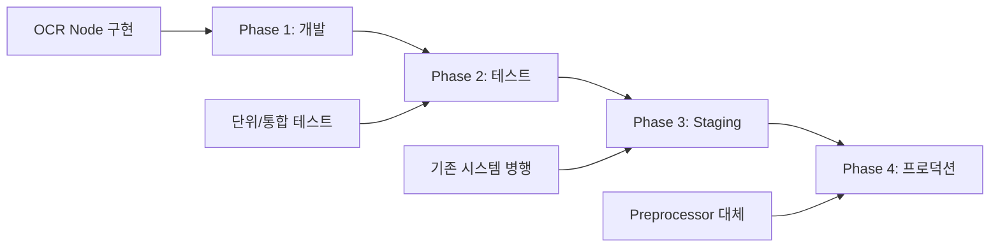

# OCR 노드 아키텍처 설계 v1

> **대상 위치**: `src/proovy_agent/graph/nodes/ocr_node/`  
> **기술 스택**: VLM (Gemini 1.5 Pro) + PIL + OpenCV + Pydantic  
> **이번 작업 범위**: OCR 노드 전체 구현. 기존 Preprocessor 대체.

---

## 0. 핵심 원칙 — Preprocessor → OCR 노드 분리

OCR 기능을 **독립된 노드**로 분리하여 모듈화 및 확장성을 확보합니다.

| 원칙 | 설명 |
|------|------|
| **단일 책임** | OCR 전용 노드로 명확한 역할 분리 (이미지 → 텍스트 + 태그 + 수식) |
| **재사용성** | 다른 노드에서도 OCR 기능 활용 가능 |
| **테스트 용이성** | 독립된 테스트 환경 구축 가능 |
| **확장성** | VLM, 새로운 OCR 기술 추가 용이 |
| **State 호환성** | 기존 ProovyState 필드 구조 유지 |

---

## 1. 설계 변경 배경

### 1.1. 기존 계획 vs 새로운 설계

| 구분 | 기존 계획 | 새로운 구현 | 변경 이유 |
|------|-------------|-------------|-----------|
| **위치** | `Preprocessor` 노드 내부 | 독립된 `OCRNode` | 모듈화, 재사용성 |
| **책임 범위** | 이미지 → 텍스트 변환만 | 이미지 → 텍스트 + 태그 + 수식 | 기능 통합 |
| **OCR 엔진** | 다중 엔진 (Tesseract + Vision API + PaddleOCR) | 단일 VLM 엔진 | 복잡성 제거, 한국어 최적화 |
| **의존성** | Router와 강결합 | 독립적 노드 | 테스트 용이성 |

### 1.2. VLM 엔진 선택 근거

기존 계획된 다중 OCR 엔진에서 **단일 VLM 엔진**으로 변경:

| 엔진 | 장점 | 단점 | 결정 |
|------|------|------|------|
| **PaddleOCR** | 수학 특화 | ❌ 중국 모델, 한국어 인식률 낮음 | 제외 |
| **Tesseract** | 오픈소스, 빠름 | ❌ 수식 인식 한계 | 보류 |
| **Vision API** | 높은 정확도 | ❌ 비용, Structured Output 미지원 | 보류 |
| **VLM (Gemini)** | ✅ 한국어 우수, Structured Output | 비용 | **선택** |

---

## 2. 핵심 설계 결정

### 2.1. 처리 흐름 변경

**기존 흐름**:
```
User Input → Preprocessor (VLM OCR + @커맨드 파싱) → Router
```

**새로운 흐름**:
```
User Input → OCRNode → Router → Planner
            ↓
        [Image Processor → VLM Engine → Math Postprocessor → Command Parser]
```

### 2.2. Structured Output 활용

VLM의 Structured Output을 활용하여 **단일 API 호출**로 모든 정보 추출:

```python
class VLMOCRResponse(BaseModel):
    extracted_text: str           # 추출된 텍스트
    math_expressions: list[str]   # LaTeX 수식 목록
    detected_commands: list[str]  # @커맨드 목록
    confidence_score: float       # 전체 신뢰도
    language_detected: str        # 감지된 언어
```

### 2.3. State 연동 — 기존 호환성 유지

**변경 없음**: 기존 ProovyState 필드 그대로 활용

```python
class ProovyState(BaseModel):
    # OCRNode가 설정하는 필드들
    ocr_text: str = ""                    # VLM 추출 텍스트
    ocr_confidence: float = 0.0           # VLM 신뢰도 점수
    tags: list[str] = Field(default_factory=list)  # 파싱된 @커맨드
    user_solution: str | None = None      # 사용자 제공 풀이
```

---

## 3. 디렉토리 구조

### 3.1. 파일 구성

```
src/proovy_agent/graph/nodes/ocr_node/
├── __init__.py               # 모듈 인터페이스 + __all__
├── models.py                 # ✅ 데이터 모델 (완료)
├── exceptions.py             # ✅ 예외 처리 (완료)
├── image_processor.py        # 🔄 이미지 전처리 (진행중)
├── ocr_engines.py           # ⏳ VLM 기반 OCR 엔진
├── math_postprocessor.py    # ⏳ 수학 표기법 후처리
├── command_parser.py        # ⏳ @커맨드 파싱
├── node.py                  # ⏳ OCRNode 메인 클래스
└── config.py                # ⏳ 설정 관리
```

### 3.2. 테스트 구조

```
tests/ocr_node/
├── __init__.py
├── test_models.py            # ✅ 완료 (34개 테스트)
├── test_exceptions.py        # ✅ 완료 (18개 테스트)
├── test_image_processor.py   # 🔄 진행중
├── test_ocr_engines.py      # ⏳ 예정
├── test_math_postprocessor.py # ⏳ 예정
├── test_command_parser.py    # ⏳ 예정
├── test_node.py             # ⏳ 예정
└── integration/             # ⏳ 예정
    ├── test_full_pipeline.py
    └── benchmark/
        ├── math_images/
        └── test_performance.py
```

---

## 4. 상세 구현 설계

### 4.1. 이미지 전처리 파이프라인

**다단계 최적화**로 VLM 인식률 향상:

| 단계 | 기능 | 구현 |
|------|------|------|
| **품질 분석** | blur, noise, contrast 자동 감지 | ImageQuality 모델 |
| **기본 전처리** | 크기 조정, 색상 변환 | ProcessingOptions 설정 |
| **회전 보정** | Hough 변환으로 텍스트 각도 자동 보정 | auto_rotate() |
| **해상도 최적화** | OCR 최적 DPI (300) 조정 | optimize_resolution() |
| **품질 향상** | 노이즈 제거, 대비 향상, 밝기 조정 | enhance_quality() |
| **최종 처리** | 적응형 이진화 | adaptive_threshold() |

```python
class ImageProcessor:
    async def process(self, image: PIL.Image, options: ProcessingOptions) -> PIL.Image:
        """전체 최적화 파이프라인 실행"""
        
    async def create_multiple_versions(self, image: PIL.Image) -> dict[str, PIL.Image]:
        """VLM용 다중 버전 생성: minimal, standard, aggressive"""
```

### 4.2. VLM OCR 엔진

**Gemini 1.5 Pro** 기반 OCR + Structured Output:

```python
class VLMEngine:
    def __init__(self, model_name: str = "gemini-1.5-pro"):
        # OpenRouter 또는 Anthropic 클라이언트 초기화
    
    async def extract_text(self, image: PIL.Image) -> OCREngineResult:
        """
        Structured Output으로 모든 정보 한 번에 추출:
        - 텍스트 (한국어 + 영어)
        - 수학 표기법 (LaTeX 변환)
        - @커맨드 패턴 감지
        - 신뢰도 자체 평가
        """
```

**프롬프트 엔지니어링 전략**:
- 한국어 + 수학 표기법 특화 지시
- LaTeX 형태 수식 출력 요구
- @커맨드 패턴 명시적 감지 요청
- 신뢰도 자체 평가 포함

### 4.3. 수학 후처리 시스템

OCR 결과를 **수학적으로 의미 있는 표현**으로 정제:

```python
class MathPostProcessor:
    async def process(self, raw_text: str) -> ProcessedMathResult:
        """
        1. 기본 기호 정규화: ×→*, ÷→/, √→sqrt
        2. 복잡한 수식 구조화: 분수, 지수, 적분
        3. 함수 및 연산자 정리: sin, cos, log
        4. 문맥 기반 보정: 변수명, 단위 처리
        """
```

### 4.4. @커맨드 파싱 시스템

명시적 커맨드 + 자연어 의도 동시 처리:

```python
class CommandParser:
    def parse(self, text: str) -> list[str]:
        """
        명시적: "@용어 기각역" → ["term:기각역"]
        자연어: "기각역이 뭐야?" → ["term:기각역"]
        복합: "@용어 기각역 @해설지" → ["term:기각역", "pdf"]
        """
```

### 4.5. OCRNode 메인 통합

**전체 파이프라인 조율**:

```python
class OCRNode:
    async def __call__(self, state: ProovyState) -> dict:
        """
        1. 이미지 추출 및 검증
        2. 이미지 전처리 (다중 버전)
        3. VLM OCR 실행
        4. 수학 후처리
        5. 커맨드 파싱
        6. State 업데이트 반환
        """
        return {
            "ocr_text": final_text,
            "ocr_confidence": confidence_score,
            "tags": parsed_tags,
            "user_solution": user_provided_solution
        }
```

---

## 5. 성능 및 품질 목표

### 5.1. 성능 메트릭

| 메트릭 | 목표 값 | 측정 방법 |
|--------|---------|-----------|
| **인식 정확도** | 95% 이상 | 수학 문제 이미지 벤치마크 |
| **처리 시간** | 3초 이내 | 평균 이미지 크기 기준 |
| **한국어 정확도** | 90% 이상 | 한글 수학 용어 인식 테스트 |
| **수식 정확도** | 85% 이상 | LaTeX 변환 정확도 |
| **메모리 사용량** | 500MB 이하 | 이미지 전처리 포함 |

### 5.2. 에러 처리 전략

| 에러 유형 | 예외 클래스 | 처리 방법 |
|----------|-----------|-----------|
| **이미지 전처리 실패** | `ImageProcessingError` | 원본 이미지로 fallback |
| **VLM API 실패** | `OCREngineError` | 재시도 (최대 3회) |
| **수학 파싱 실패** | `MathParsingError` | 원본 텍스트 반환 |
| **커맨드 파싱 실패** | `CommandParsingError` | 빈 태그 배열 반환 |
| **신뢰도 부족** | `ConfidenceThresholdError` | 사용자에게 재촬영 요청 |

---

## 6. 단계별 구현 계획

### Phase 1: 기반 구조 (현재)
- ✅ **데이터 모델 + 예외 처리** (#46 - 완료)
- 🔄 **이미지 전처리 시스템** (#47 - 진행중)

### Phase 2: 핵심 OCR 엔진
- ⏳ **VLM 기반 OCR 엔진** (#48)
- ⏳ **수학 표기법 후처리** (#49)
- ⏳ **@커맨드 파싱 시스템** (#50)

### Phase 3: 통합 및 최적화
- ⏳ **OCRNode 메인 구현** (#51)
- ⏳ **성능 테스트 및 벤치마킹**
- ⏳ **기존 그래프와의 통합**

---

## 7. 기존 시스템과의 통합

### 7.1. LangGraph 연동

**기존 그래프에 OCRNode 추가**:

```python
# 기존
builder.add_edge(START, "preprocessor")
builder.add_edge("preprocessor", "router")

# 새로운
builder.add_edge(START, "ocr_node")
builder.add_edge("ocr_node", "router")
```

### 7.2. 점진적 마이그레이션



**호환성 보장**:
- ProovyState 필드 구조 동일 유지
- 동일한 출력 형태 보장
- 기존 Router 노드 무수정

---

## 8. 환경 설정 (.env)

```bash
# VLM OCR 설정
OPENROUTER_API_KEY=your-openrouter-key
VLM_MODEL_NAME=google/gemini-1.5-pro
VLM_MAX_TOKENS=4096
VLM_TEMPERATURE=0.1

# 이미지 처리 설정  
OCR_TARGET_DPI=300
OCR_MAX_IMAGE_SIZE=4096
OCR_CONFIDENCE_THRESHOLD=0.8

# 처리 옵션
OCR_ENABLE_PREPROCESSING=true
OCR_ENABLE_MULTIPLE_VERSIONS=true
OCR_PROCESSING_TIMEOUT=30
```

---

## 9. 보안 및 제한사항

### 9.1. 보안 정책

| 항목 | 정책 | 구현 방법 |
|------|------|-----------|
| **이미지 크기 제한** | 50MB 이하 | Pydantic validator |
| **API 키 관리** | 환경변수만 허용 | settings 모듈 |
| **입력 검증** | 이미지 형식 제한 | PIL.Image 검증 |
| **출력 크기 제한** | 텍스트 길이 제한 | 자동 truncation |

### 9.2. 리소스 제한

| 리소스 | 제한 | 이유 |
|--------|------|------|
| **동시 처리** | 10개 요청 | VLM API 속도 제한 |
| **메모리 사용량** | 500MB | 이미지 전처리 메모리 |
| **처리 시간** | 30초 타임아웃 | 사용자 경험 |

---

## 10. 확정 사항

| 항목 | 결정 |
|------|------|
| **핵심 원칙** | Preprocessor → OCR 노드 분리 (모듈화, 재사용성) |
| **OCR 엔진** | 단일 VLM 엔진 (Gemini 1.5 Pro) |
| **State 호환성** | 기존 ProovyState 필드 구조 유지 |
| **처리 방식** | Structured Output 활용 단일 API 호출 |
| **이미지 전처리** | 다단계 최적화 파이프라인 |
| **에러 처리** | Fallback 기반 graceful degradation |
| **테스트 전략** | Mock 기반 단위 테스트 + 실제 이미지 통합 테스트 |
| **성능 목표** | 95% 정확도, 3초 이내 처리 |

---

## 11. MVP 검증 게이트 (구현 전 필수)

| 항목 | 내용 | 필수 |
|------|------|:---:|
| **VLM API 검증** | Gemini 1.5 Pro Structured Output 실제 테스트 | ✅ |
| **이미지 라이브러리** | PIL, OpenCV 의존성 확인 및 설치 | ✅ |
| **Settings 검증** | OCR 관련 환경변수 정의 및 검증 | ✅ |
| **프롬프트 최적화** | 한국어 + 수학 인식 프롬프트 튜닝 | ✅ |
| **통합 테스트** | 실제 수학 문제 이미지로 E2E 테스트 | ✅ |
| **성능 벤치마크** | 처리 속도 및 정확도 측정 | ✅ |
| 비용 모니터링 | VLM API 사용량 추적 | ⬜ Phase 2 |

---

## 12. 향후 확장 계획

### Phase 2: 고도화
- **다중 VLM 지원**: GPT-4V, Claude 3.5 Sonnet 추가
- **특화 프롬프트**: 문제 유형별 최적화된 프롬프트
- **캐싱 시스템**: 동일 이미지 재처리 방지

### Phase 3: 고급 기능
- **실시간 OCR**: 비디오 스트림 처리
- **표/그래프 추출**: 구조화된 데이터 추출
- **다국어 확장**: 중국어, 일본어 수학 문제

### Phase 4: AI 강화
- **품질 자동 개선**: 이미지 전처리 파라미터 자동 조정
- **오류 자동 수정**: OCR 결과 자동 검증 및 보정
- **학습 기반 최적화**: 사용 패턴 기반 성능 향상

---

**문서 버전**: v1.0  
**최종 수정**: 2026-05-20  
**관련 이슈**: #45-51 (OCR 시스템 구현)