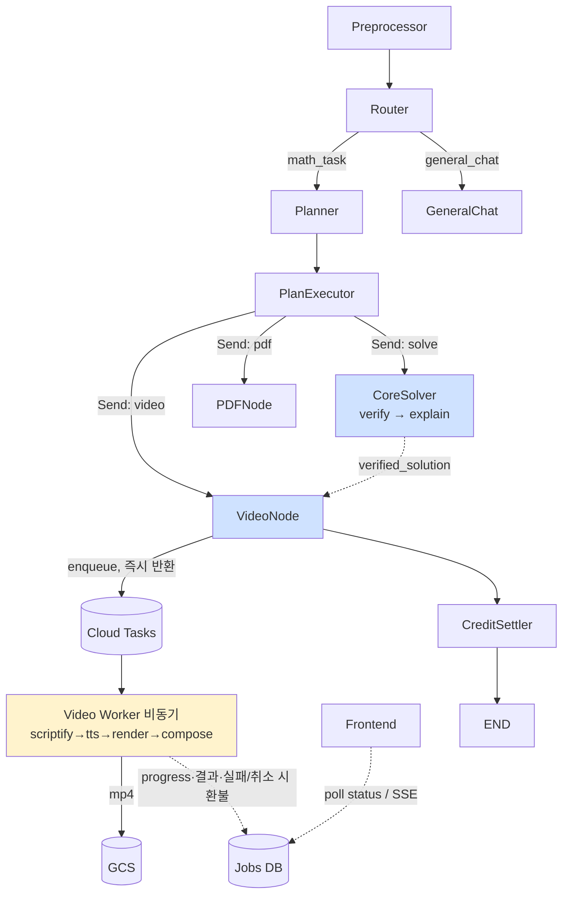
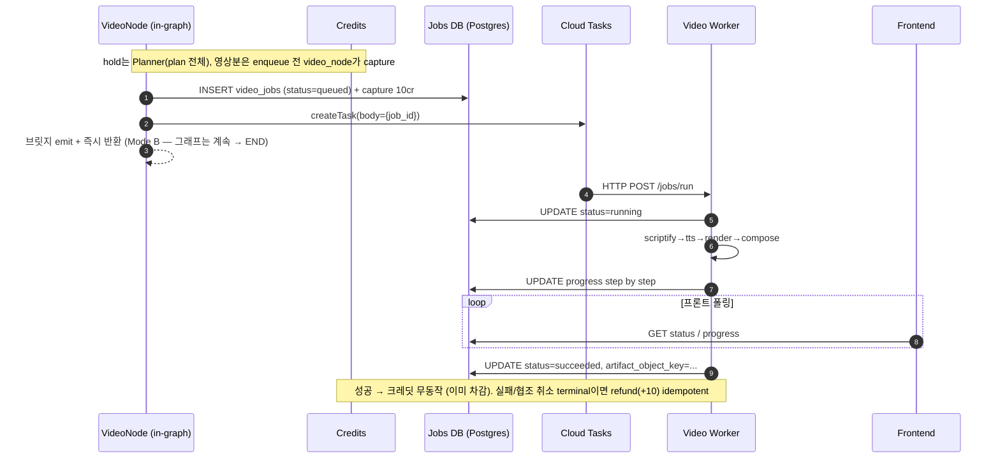

# 해설 영상 생성 설계

> 상태: 초안 (Phase 0 확정 — 입력=`verified_solution` 계약(ADR 0001) / 실행=Mode B 비동기(ADR 0002) / 크레딧=단일 원장·Planner hold·낙관적 차감(ADR 0004, 0002 개정) / 렌더 격리=platform-features, nsjail 제외(ADR 0003) / 워커=Cloud Run gen2 + Cloud Tasks)
> 목적: PoC(`manim-video-gen`)에서 검증한 영상 생성 파이프라인을 `proovy-agent` 본 서비스의 LangGraph 흐름에 통합하기 위한 설계를 정의한다.
> 참고: [`project-structure.md`](./project-structure.md), [`daytona-sandbox-design.md`](./daytona-sandbox-design.md), PoC 분석 문서 [`manim-video-gen/docs/IMPLEMENTATION.md`](../../../manim-video-gen/docs/IMPLEMENTATION.md)

---

## 목차

- [0. 결정 요약](#0-결정-요약)
- [0.5 MVP 성공 기준](#05-mvp-성공-기준-measurable)
- [1. 사용자 흐름과 메인 그래프 통합](#1-사용자-흐름과-메인-그래프-통합)
- [2. VideoNode — 책임·입출력·상태](#2-videonode--책임입출력상태)
- [3. 비동기 잡 인프라 — Cloud Run + Cloud Tasks](#3-비동기-잡-인프라--cloud-run--cloud-tasks)
- [4. Inworld TTS + word-timestamp 동기화](#4-inworld-tts--word-timestamp-동기화)
- [5. 모듈 매핑 — 신규 구현](#5-모듈-매핑--신규-구현)
- [6. 데이터 모델 / Artifact 저장](#6-데이터-모델--artifact-저장)
- [7. 단계별 구현 순서](#7-단계별-구현-순서)
- [8. 보안과 격리 — 3계층 방어](#8-보안과-격리--3계층-방어)
- [9. 테스트 / 품질 회귀 전략](#9-테스트--품질-회귀-전략)
- [10. 부록 — 환경변수·함정·후속 의사결정·템플릿 로드맵](#10-부록--환경변수함정후속-의사결정템플릿-로드맵)

---

## 0. 결정 요약

| # | 항목 | 결정 | 비고 |
|---|---|---|---|
| 1 | 통합 형태 | `graph/nodes/video.py` 단일 노드가 진입점. 실제 파이프라인은 `features/video/` 모듈로 격리. | [project-structure.md](./project-structure.md) 운영 규칙 준수 |
| 2 | 그래프 위치 | Planner가 plan_step에 `video` 단계를 포함시키고 PlanExecutor가 dispatch. CoreSolver 직후. | [§1.2](#12-그래프-진행) |
| 3 | VideoNode 입력 전략 | CoreSolver가 solve마다 검증 풀이를 **`verified_solution`**(프로즈)로 **대화 내역에 남김** + LangGraph 표준대로 code/stdout이 `ToolMessage`에 자동 적재 → video의 hint_extractor가 **2-step**으로 처리: ① **Step 1**(내부 1a 라우팅[`$VIDEO_HINT_TARGET_MODEL`, trim] + 1b 추출[`$VIDEO_HINT_PLAN_MODEL`]) 전체 히스토리에서 대상 짚기 + `SolutionPlan` 구조화 — *1b가 trim 미들웨어 없이 풀 evidence(code+stdout)를 봄*(1a는 trim — §2.2.1) ([ADR 0006](../decisions/0006-evidence-based-video-input.md)), ② **Step 2**(`$VIDEO_HINT_VIDEOHINTS_MODEL`) `VideoHints` 생성. 순수 파서·재-solve fallback **제거**. 영상만 요청 시 `explanation_mode=brief`. | [ADR 0001 Update](../decisions/0001-video-input-contract.md), [ADR 0006](../decisions/0006-evidence-based-video-input.md), [§2.2](#22-입력-계약--하이브리드) |
| 4 | 실행 모델 | **Mode B (논블로킹)** — video_node가 잡 enqueue 후 **즉시 반환**, 그래프 종료(크레딧 hold는 Planner가 plan 전체로 이미 함). 워커가 비동기 렌더 + 결과를 `video_jobs`(DB)에 기록(영상 크레딧은 video_node가 Cloud Tasks enqueue 전에 동기 capture, 실패/취소 terminal에서만 환불 — ADR 0004). 진행률은 MVP 폴링(live-push broker는 후속). 워커 내부는 **stage 명시 분해**(테스트·SSE seam, checkpoint 없음). | [ADR 0002](../decisions/0002-video-async-execution-and-credit.md), [§2.5](#25-비동기-잡-핸드오프) |
| 5 | 잡 큐 | **Cloud Tasks** | [§3.4](#34-잡-큐--cloud-tasks) |
| 6 | 워커 실행 환경 | **Cloud Run 서비스 gen2 (instance concurrency=1) + Cloud Tasks**. 1 instance = 1 job. Daytona 제외 이유는 **동시성/quota**(격리는 Daytona도 가능했으나 동시 렌더 수를 못 받침) — `code_execute`는 계속 Daytona. **gen2 = microVM(풀 Linux, TeX/ffmpeg 호환+CPU); gen1 = gVisor** — 문서 기존 "gen2=gVisor"는 오기였음. | [§3.2](#32-cloud-run-선택-근거-adr), [§3.3](#33-cloud-run-구성--escalation-트리거) |
| 7 | TTS provider | **Inworld TTS** (`inworld-tts-1.5-max`, 한국어 보이스) | PoC와 동일 |
| 8 | timestamp 활용 | Inworld `timestampType=WORD` 응답을 `TTSResult.word_timestamps`로 매핑하고, 시각 강조 동기화(`Indicate(t)`)와 자막 정밀도 향상에 사용 | [§4](#4-inworld-tts--word-timestamp-동기화) |
| 9 | 동영상 생성 그래프 내부 | PoC의 7단계 파이프라인(solve→scriptify→sanitize→TTS→group→codegen/render→compose)을 **워커 안에서 그대로 실행**. graph/agents 형태로 LangGraph 노드화하지 않는다. | 워커 내부는 단순 async pipeline |
| 10 | 보수적 기본값 | `disable_equation_chain=true`, `disable_prev_scene_state=true`, `scene_bridge_enabled=false` 유지 | PoC 시행착오의 결론. PR/회귀 테스트 없이 변경 금지 |
| 11 | Artifact 저장 | 최종 mp4/자막은 **GCS attempt별 경로** + signed URL. `video_jobs.artifact_object_key`는 성공한 attempt의 final만 가리킨다. 잡 메타와 진행도는 PostgreSQL(`features/artifacts/`). | [§6](#6-데이터-모델--artifact-저장) |
| 12 | 크레딧 | **단일 balance 원장(전 작업 공유) + 정액 10cr**. **Planner가 plan 전체 예상치 hold**(부족 시 요청 통째 거절=all-or-nothing) → **영상은 video_node가 Cloud Tasks createTask 전에 동기 차감**(`balance −= 10, hold −= 10`), **동기 작업(solve/pdf)은 CreditSettler가 그래프 끝에 일괄 차감** → **실패/취소 terminal에서만 환불**(job_id idempotent, balance += 10). 영상만 settler 분리 — Mode B의 워커가 그래프 밖에서 도므로 그래프 끝 일괄 차감은 *워커 refund가 capture보다 먼저 도착*하는 race를 만든다. 작은 초과는 마이너스 허용. | [ADR 0004](../decisions/0004-unified-credit-ledger.md) (ADR 0002 개정, refund race로 영상 settler 분리), [§1.3](#13-크레딧-정액-hold) |
| 13 | 자유형 코드 격리 | 트러스트 3계층(API / 워커 / untrusted 렌더)은 유지하되, 렌더 격리는 **platform-features 기반**(nsjail 제외): ① AST allowlist ② gen2+concurrency=1 인스턴스 격리(공짜) ③ 비루트 + 크기제한 in-memory 볼륨 + 인스턴스 일회성 ④ in-process rlimit/timeout ⑤ 렌더 서브프로세스에 시크릿 미전달. **network-off(egress 차단 별도 렌더 서비스)는 Phase B** — AST가 1차 네트워크 차단. | [ADR 0003](../decisions/0003-render-sandbox-platform-features.md), [§8](#8-보안과-격리--3계층-방어) |
| 14 | `graph_plot.func_python` lambda 삽입 | **제거**. expression DSL(`{expr, domain, features[]}`)로 교체. AST allowlist는 자유 영역(`visual_scene`)에만 적용 | [§5.1](#51-매핑-테이블), [§8.3](#83-expression-dsl--graph_plot-lambda-제거) |
| 15 | `visual_scene` 실패 fallback | **intent-preserving (script_repair)**. codegen 3회 재시도 후에도 실패 시 script_repair LLM이 narration에 맞는 visual_type/params로 재작성 → consistency 검증 → 실패면 `equation_write/highlight_result`+SKIPPED. 규칙기반 IntentRouter는 제외(script_repair가 더 유연). | Phase C |
| 16 | visual_type 단일 출처 | **`VisualTypeRegistry`** — visual_type별 **core 5종** metadata(`schema` / `prompt_snippet` / `render_fn` / `fallback_candidates` / `narration_alignment_rule`)를 1군데에 통합. scriptify 프롬프트 합성 · consistency validator · fallback(script_repair)의 단일 출처. **처음부터 통합 구조로 신규 구현**(PoC 흩어진 구조를 재현하지 않음). `example_params`(few-shot 자동생성)·`render_risk_level`(risk-aware 선택)·`template_capability_tags`는 해당 기능 도입 시 추가. | [§5.1](#51-매핑-테이블) |
| 17 | 잡 segment record | **DB `video_job_segments` 테이블 추가** — segment 단위 **관측성** 전용(`llm_retry_count`, `fallback_reason`, 단계별 실패 위치). 캐시 기반 부분 재시도는 MVP 제외 → 잡 실패 시 Cloud Tasks가 전체 재실행([§3.4](#34-잡-큐--cloud-tasks)) | [§6.2.2](#622-videojobsegment) |
| 18 | Diagnostic 2-tier | **internal**(원본 문제·script·생성 코드·stderr — 운영자만) vs **user**(실패 단계·safe error code·재시도 가능 여부·최종 URL — 사용자) 명확히 분리 + redaction | [§6.6](#66-diagnostic-2-tier) |
| 19 | Secret 관리 | secret manager가 원천. `.env` repo root 자동 탐색 금지. provider별 scoped + key rotation + log redaction | [§8.6](#86-secret--로그-redaction), [§10.1](#101-환경변수) |
| 20 | VideoOptions profile | **단일 profile 유지**. quality(`l`/`h`)·voice 같은 개별 옵션만 노출. 멀티 profile은 향후 필요성 입증 후 도입. | [§2.2.3](#223-videooptions) |
| 21 | ffprobe duration 1초 fallback | **제거**. retry → 그래도 실패면 job failed. `VIDEO_DIAGNOSTIC_DUMP=true`일 때만 fallback 허용. | [§10.2 N8](#102-함정-poc--신규) |
| 22 | 프레임 기반 회귀 (overlap/bright_box/tofu) | Phase D nightly E2E set에 도입. PoC `pipeline.diagnostics`의 신호를 nightly metric으로 승격. | [§9.4](#94-프레임-기반-품질-회귀-phase-d) |
| 23 | 워커 내부 구조 | **stage 명시 분해** (checkpoint 없음). `generate_video()`를 `stage_solve/scriptify/tts/render/compose` 함수 + `StageContext`로 분리 — 테스트 seam + SSE progress 지점이 목적. cross-invocation 캐시/재개는 MVP 제외 → 잡 재시도는 전체 재실행([§3.4](#34-잡-큐--cloud-tasks)). 워커는 1개(1잡 = 1워커 호출). | [§3.6](#36-워커-내부-구조--stage-명시-분해) |
| 24 | MVP 성공 기준 | 측정 가능한 7개 항목(생성률 ≥90%, 자유형 복구율 ≥80%, narration-화면 일치 ≥95%, secret 누출 0, sandbox 위반 차단, API thread 점유 0, UserErrorCode coverage 100%). Phase D 회귀 게이트의 pass 기준. | [§0.5](#05-mvp-성공-기준-measurable) |
| 25 | Director brief (scriptify 유도) | hint_extractor가 `DirectorBriefPolicy`(brief 구조 템플릿 + few-shot)를 산출 → scriptify 프롬프트에 주입해 `visual_description` 품질 유도. **deterministic enforcer·forbidden_requirements는 MVP 제외** — 위험 코드 차단은 AST allowlist([§8.2](#82-1차--ast-allowlist-code_validatorpy)) + sandbox가 hard gate. | [§2.2.2](#222-영상-보강-llm-패스-video_hints) |
| 26 | Scene primitive 라이브러리 | **Phase D 이후 보류**. `safe_mathtex / make_axes_with_graph / fade_out_all` 등 재사용 primitive로 visual_scene 실패율 감축이 후보 가치. 도입 트리거: Phase D 실패 원인 분석에서 frame fit/CJK MathTex/cleanup 같은 반복 패턴이 60%+ 비중일 때. | [§10.3](#103-후속-의사결정-트리거) |
| 27 | 최종답 충실성 (evidence-based) | ~~결정적 파서 + sympy 동치 게이트~~ **폐기**. 답 형태가 다양해(조건/주장/성질) 동치 검사가 좁은 케이스만 커버. 대신 **code+stdout이 `ToolMessage`로 messages에 자동 적재**되고 **hint_extractor Step 1이 미들웨어 없이 풀텍스트 LLM에 전달** — 정보량으로 환각률을 낮춤. 측정은 Phase D frame 회귀가 *영상 최종 산출물*에서 잡음. | [ADR 0006](../decisions/0006-evidence-based-video-input.md) (Supersedes [ADR 0005](../decisions/0005-final-answer-faithfulness-anchor.md)), [§0.5](#05-mvp-성공-기준-measurable) |

> ✅ **이번 갱신 확정**: 입력=`verified_solution` + **hint_extractor 2-step** + **evidence-based** (ADR 0001 Update, [ADR 0006](../decisions/0006-evidence-based-video-input.md)) · 실행=**Mode B 논블로킹**(ADR 0002) · 크레딧=**단일 원장·Planner hold·낙관적 차감**(ADR 0004, 0002 개정) · 렌더 격리=**platform-features**, nsjail 제외(ADR 0003) · 워커=Cloud Run **gen2**(concurrency=1) + Cloud Tasks. ~~ADR 0005 최종답 hard anchor~~ → ADR 0006으로 superseded(코드 실행 증거 LLM 전달). 남은 인프라 트리거는 "Service → Cloud Run Jobs 전환"(잡 p95가 dispatch deadline 천장에 근접) 하나 — [§3.3](#33-cloud-run-구성--escalation-트리거). 워커 인터페이스는 abstract(`VideoJobClient`) 유지.
>
> 🔑 #13~15는 본 서비스의 보안 의사결정의 spine — [§8](#8-보안과-격리--3계층-방어) 전체와 직접 맞물려 있다.

---

## 0.5 MVP 성공 기준 (measurable)

Phase D 회귀 게이트가 "pass"로 인정하는 정량 기준. 미달 시 해당 항목을 다음 Phase로 이월 또는 rollback 트리거. PoC 분석 문서의 정성 결론을 본 서비스 구조에 맞춰 측정 가능한 형태로 옮긴다.

| 영역 | 지표 | 임계 | 측정 위치 |
|---|---|---|---|
| **생성 성공률** | curated set(`visual_scene` 포함 10건)의 최종 MP4 생성률 | ≥ 90% | nightly Heavy E2E ([§9.5](#95-fixture-카탈로그-heavy-e2e)) |
| **자유형 복구율** | `visual_scene` 실패 시 script_repair로 잡 전체 실패 없이 복구되는 비율 | ≥ 80% | `VideoJobSegment.fallback_reason` 집계 (Phase D 도입 테이블, [§6.2.2](#622-videojobsegment)) |
| **narration-화면 일치** | 최종 산출물(fallback 포함)에 대한 consistency validator pass율 | ≥ 95% | consistency report 집계 |
| **보안 — secret 누출** | user diagnostic + user-facing 오류 메시지에 API key / raw stderr / 생성 코드 포함 건수 | 0 | CI redaction fuzz test + diagnostic audit ([§8.6](#86-secret--로그-redaction)) |
| **보안 — sandbox 위반** | sub-process가 허용 외 FS write / 자원 한도 초과 시도 시 차단되어 잡 실패로 처리되는 비율 (network-off는 Phase B) | 100% (모두 차단) | sandbox audit (platform-features, [§8.4](#84-2차--sub-process-sandbox)) |
| **잡 인프라** | Mode B — video_node가 enqueue 후 즉시 반환해 API/그래프가 영상 렌더 동안 점유되지 않음 | 100% | 부하 테스트 |
| **사용자 오류 UX** | 사용자 노출 오류 메시지가 `UserErrorCode` enum + 한국어 메시지로만 구성된 비율 | 100% | UserErrorCode coverage 테스트 ([§6.6](#66-diagnostic-2-tier)) |
| **최종답 환각률 (evidence-based)** | 렌더된 최종답이 `code_execute` stdout 어디에도 substring으로 등장하지 않는 잡 비율 — frame OCR로 측정 | < 2% | Phase D nightly frame 회귀 ([ADR 0006](../decisions/0006-evidence-based-video-input.md), supersedes ADR 0005 hard 게이트) |

Phase A~C는 보안 / 구조 항목(secret 누출, sandbox 위반, API thread 점유, UserErrorCode coverage)을 단위 / 통합 테스트로 검증. 생성률 · 복구율 · 일치도는 Phase D nightly에서 본격 측정.

---

## 1. 사용자 흐름과 메인 그래프 통합

### 1.1 사용자 시나리오

```
사용자: "이 수능 수학 문제 풀고, 해설 동영상도 만들어줘 [이미지]"
        ↓
Preprocessor (OCR + @command parse)
        ↓
Router → "math_task"
        ↓
Planner
  - intent 분석: {solve, video}, explanation_mode(brief/full)
  - plan 생성: [solve, video]  (video는 solve에 의존 → solve 완료 후 실행)
  - difficulty → 모델 선택 (flash/sonnet/opus)
        ↓
PlanExecutor (이번 plan에 pending solve 있으면 video gate; 단일 ready=Command(goto), 복수=Send)
        ↓
CoreSolver  →  verify(코드 실행) → verified_solution(구조화 프로즈) → explain(full일 때만 스트리밍)
        ↓
VideoNode   →  잡 enqueue → 즉시 반환 (Mode B — hold는 Planner가 이미 함, 그래프 계속 진행)
        ↓
CreditSettler  →  balance에서 일괄 차감 (동기=실제, 영상=낙관적 정액 — ADR 0004)
        ↓
       END
        ⋮  (그래프 종료 후 — 비동기)
Video Worker → 렌더 → 결과를 video_jobs(DB)에 기록 + 실패 시 크레딧 환불 → 프론트가 폴링/SSE로 수신
```

### 1.2 그래프 진행



PlanExecutor는 video/pdf를 **이번 plan에 pending `solve`가 있을 때만** 막는다(`_DEPENDS_ON_SOLVE`). 단일 ready 스텝이면 `Command(goto=...)`로, 복수면 `Send`로 dispatch한다. 새 문제를 같은 턴에 풀면 `[solve, video]`라 video가 solve를 기다리고, **이전 턴 풀이를 참조하는 `[video]`-단독 plan**(예: "아까 1번 영상으로")은 pending solve가 없어 즉시 진행 — 대상 `verified_solution`은 `messages` 히스토리에서 해소한다(멀티턴, checkpointer 필요). **Mode B**이므로 VideoNode는 enqueue 후 즉시 반환하고 그래프는 CreditSettler→END로 계속 진행한다 — 영상 결과·크레딧 마무리는 그래프 종료 후 워커가 DB에 기록한다([§2.5](#25-비동기-잡-핸드오프)).

> 💡 **왜 영상 생성 자체를 LangGraph 노드 그래프로 다시 만들지 않는가?**
> PoC의 7단계 파이프라인은 결정적 직렬(+세그먼트 단위 병렬)이며 LLM 분기 의존이 적다. 이걸 LangGraph 노드로 다시 쪼개면 (a) checkpoint가 쓸데없이 무거워지고 (b) 워커 안에서의 세그먼트 단위 `asyncio.gather` 병렬화가 LangGraph의 Send 모델과 충돌한다. 따라서 **메인 그래프 입장에서 VideoNode는 Mode B 잡 launcher(enqueue 후 즉시 반환)**로 두고, 워커 내부는 PoC `orchestrator.py`의 async 함수 흐름을 참조해 신규 구현한다.

### 1.3 크레딧 정액 hold

> ⚠️ 크레딧은 **시스템 전반 단일 모델**이다 ([ADR 0004](../decisions/0004-unified-credit-ledger.md) — ADR 0002 크레딧 세부 개정, §9 예약 모델 폐기). solve·pdf·video 모든 유료 작업이 단일 원장 `credits(balance, hold)`를 공유한다. **hold는 video_node가 아니라 Planner가 plan 전체로** 잡고(부족 시 요청 통째 거절=all-or-nothing), 영상 정산은 워커 capture/void가 아니라 **video_node의 enqueue 전 동기 capture + 실패/취소 terminal 환불**이다.

영상은 **정액 10cr**다(implementation_plan.md §9 비용표). 변동 비용(LLM/TTS/렌더 실측)은 `video_jobs.cost`에 **관측용으로만** 기록하고 과금엔 쓰지 않는다.

### 1.3.1 크레딧 스키마 — credit_holds 테이블 + TTL-on-read

**ADR 0004 원안의 `credits(balance, hold)` 단일 행 모델은 cron 기반 hold 정리를 전제**한다. 본 설계는 hold를 개별 행으로 추적해 `expires_at` 필터로 *읽는 시점에 만료를 무시*함으로써 **별도 sweep cron 없이** orphan hold를 자동 회복한다.

```sql
CREATE TABLE credits (
    user_id   VARCHAR PRIMARY KEY,
    balance   NUMERIC NOT NULL DEFAULT 0
);

CREATE TABLE credit_holds (
    id          UUID PRIMARY KEY,
    user_id     VARCHAR NOT NULL REFERENCES credits(user_id),
    amount      NUMERIC NOT NULL,
    status      VARCHAR NOT NULL,    -- 'pending' / 'captured' / 'released'
    created_at  TIMESTAMPTZ NOT NULL DEFAULT NOW(),
    expires_at  TIMESTAMPTZ NOT NULL,  -- 만료 시각 (생성 시 NOW() + CREDIT_HOLD_TTL_SECONDS)
    plan_id     VARCHAR,                -- 어느 plan의 hold인지 (디버깅·audit)
    INDEX (user_id, status, expires_at)
);
```

**가용 잔액**은 항상 *읽는 시점*에 계산:

```sql
SELECT c.balance - COALESCE(
    SUM(h.amount) FILTER (
        WHERE h.status = 'pending' AND h.expires_at > NOW()    -- ⭐ 만료된 건 자동 제외
    ), 0
) AS available
FROM credits c LEFT JOIN credit_holds h ON h.user_id = c.user_id
WHERE c.user_id = :user_id
GROUP BY c.balance;
```

`expires_at < NOW()`인 pending row는 *사용자의 가용 잔액에 영향을 주지 않는다* — sweep 없이도 자동 회복.

### 1.3.2 크레딧 흐름

0. **사용자 재시도 preflight는 hold 전에 수행** — 최신 `HumanMessage.additional_kwargs.action == "video_retry"`이면 Planner가 plan hold를 만들기 전에 `retry_source_job_id`를 먼저 검증한다. source job이 존재하지 않거나, 다른 사용자/스레드의 job이거나, `failed/canceled`가 아니거나, 이미 사용자 재시도 1회를 소비했거나, source 자체가 retry로 만들어진 job이거나, `input_snapshot`이 없으면 **hold를 만들지 않고** "이 영상은 다시 만들 수 없어요" 계열의 안전한 오류를 반환한다. 통과한 요청만 아래 hold 흐름으로 진입한다. VideoNode와 DB unique 제약은 같은 검증을 방어적으로 한 번 더 수행한다. preflight 통과 후 더블클릭 race 등으로 VideoNode/DB 재검증에서 막히면, job 생성/capture 전이므로 현재 plan hold를 즉시 `released`로 바꾸고 사용자 오류를 반환한다(TTL 20분 대기 없음).

1. **Planner가 plan 전체 예상치를 hold** — 한 트랜잭션 안에서 가용 검사 + INSERT를 원자적으로 수행:
   ```sql
   -- 트랜잭션 시작 (SERIALIZABLE 또는 SELECT FOR UPDATE)
   SELECT balance FROM credits WHERE user_id = :u FOR UPDATE;
   SELECT COALESCE(SUM(amount), 0) AS held FROM credit_holds
     WHERE user_id = :u AND status = 'pending' AND expires_at > NOW();
   -- if (balance - held) >= :est:
   INSERT INTO credit_holds (id, user_id, amount, status, expires_at, plan_id)
     VALUES (:hold_id, :u, :est, 'pending', NOW() + INTERVAL ':ttl_s seconds', :plan_id);
   -- COMMIT — 성공 시 hold_id 반환
   ```
   가용 부족이면 아무 작업도 시작하지 않고 "N cr 필요" 안내(all-or-nothing). video_node는 hold하지 않는다(Planner가 plan 전체로 함). **TTL은 `CREDIT_HOLD_TTL_SECONDS` = 1200(20분)** — 그래프 worst case(~7~8분)의 2.5배 안전 마진. orphan hold(그래프 크래시)는 20분 후 가용 잔액 계산에서 자동 제외.

   ```sql
   -- retry preflight는 통과했지만 VideoNode/DB 방어 재검증에서 막힌 경우:
   UPDATE credit_holds
      SET status = 'released'
    WHERE id = :hold_id
      AND user_id = :u
      AND status = 'pending';
   -- idempotent. capture 전 실패에만 사용한다. capture 후 실패/취소는 job refund 경로.
   ```

2. **영상 capture는 video_node 안에서 동기로 — DB 작업과 single transaction, Cloud Tasks는 그 외부** — 분산 작업(DB + Cloud Tasks)을 하나의 트랜잭션에 묶을 수 없으므로 *DB 부분만* atomic하게 처리하고, 외부 시스템(Cloud Tasks)은 보상 가능한 별도 호출로 분리. 시퀀스:
   ```sql
   -- (1) 그래프 안: single DB transaction (atomic)
   -- task_name은 job_id로 결정적으로 만든다:
   --   queues/{queue}/tasks/video-{job_id}
   BEGIN;
   INSERT INTO video_jobs (id, user_id, thread_id, status, cloud_tasks_name, retry_source_job_id, ...)
     VALUES (:job_id, :u, :tid, 'queued', :task_name, :retry_source_job_id, ...);  -- createTask 응답 뒤 DB UPDATE 없음
   UPDATE credit_holds SET amount = amount - 10
     WHERE id = :hold_id AND status = 'pending' AND amount >= 10;   -- plan의 단일 hold에서 영상분(정액 10)만 부분 차감 (status는 pending 유지)
   UPDATE credits SET balance = balance - 10 WHERE user_id = :u;
   COMMIT;

   -- (2) 그래프 안: 외부 시스템 호출 (best-effort, 보상 가능)
   try:
     await cloud_tasks.create_task(name=:task_name, target=worker_url, body={"job_id": :job_id})
   except AlreadyExists:
     -- deterministic task name이라 같은 job_id의 중복 enqueue는 성공으로 간주
     pass
   except CloudTasksError:
     log.error(...)
     -- 관측된 enqueue 실패는 즉시 보상하되, 실제 task가 만들어졌을 수 있는 timeout류는 먼저 getTask(:task_name)로 확인한다.
     -- task가 존재하거나 job이 이미 running/succeeded면 enqueue 성공으로 간주한다.
     -- NOT_FOUND이고 아직 워커가 lease를 못 잡은 queued 잡만 terminal 처리한다. 확인 불가면 다음 lazy detection에서 재확인한다.
     BEGIN;
     WITH marked AS (
       UPDATE video_jobs SET status='failed',
                             user_error_code='infrastructure_enqueue_failed',
                             finished_at=NOW()
       WHERE id=:job_id
         AND status='queued'
         AND cloud_tasks_name = :task_name
         AND lease_holder_instance_id IS NULL
         RETURNING id
     )
     SELECT refund_if_not_succeeded(:job_id, 10) FROM marked;
     COMMIT;
     -- marked row가 없으면 job 상태를 재조회한다. 이미 running/succeeded면 enqueue 성공으로 간주하고 anchor를 만든다.
   ```
   - (1) 실패(rare DB blip): 전체 rollback. hold는 TTL 만료로 자동 회복. **돈 손실 0**.
   - (1) 성공 + (2) 성공: 정상. `cloud_tasks_name`은 이미 DB에 있으므로 post-create UPDATE 실패 모드가 없다.
   - (1) 성공 + (2) `AlreadyExists`: deterministic task name이므로 같은 job의 중복 enqueue로 보고 성공 처리한다.
   - (1) 성공 + (2) 실패를 video_node가 관측했고 `getTask(task_name)` 결과가 `NOT_FOUND`이며 job이 아직 `queued + lease_holder=NULL`: capture는 이미 끝났으므로 **즉시 failed + 환불을 같은 transaction으로 처리**한다. anchor 메시지는 만들지 않는다. 실제 task가 뒤늦게 도착해도 `failed`가 terminal이라 워커는 lease를 못 잡고 ack 종료한다([§3.4](#34-잡-큐--cloud-tasks)). `getTask` API 오류처럼 확인 불가인 경우에는 실패 처리하지 않고 다음 사용자 활동의 lazy detection에서 재확인한다.
   - (1) 성공 + (2) 실패를 video_node가 관측했지만 `getTask(task_name)`이 존재하거나 job이 이미 `running/succeeded`: 실제 task가 생성된 것. **환불하지 않고 enqueue 성공으로 간주**하고 anchor 메시지를 만든다.
   - (1) 성공 후 (2) 호출 또는 보상 전에 프로세스가 죽음: video_jobs row는 `queued + cloud_tasks_name=deterministic task_name`으로 남는다. lazy detection이 임계 후 `getTask(task_name)`을 조회해 task가 없을 때만 failed + refund를 같은 transaction으로 처리한다. task가 있거나 확인 불가면 정상 queue backlog/일시 오류로 보고 건드리지 않는다.
   - 모두 성공: 정상 흐름.

   **왜 INSERT + capture를 한 transaction에**: INSERT만 단독 성공하면 *capture 없는 stuck 잡*이 됨(돈은 안 받았는데 row 존재). 같은 transaction에 두어 *둘 다 성공 or 둘 다 실패*로 단순화. Cloud Tasks는 외부 시스템이라 같은 transaction에 못 묶음 — 별도 보상 패턴.

   사용자 재시도 버튼으로 만든 job은 `retry_source_job_id`에 원본 failed/canceled job id를 저장한다. 일반 job은 `NULL`이다. DB에는 `UNIQUE (retry_source_job_id) WHERE retry_source_job_id IS NOT NULL`을 둬서 같은 원본 job에서 사용자 재시도는 **정확히 1회만** 통과시킨다. retry로 만들어진 job(`retry_source_job_id IS NOT NULL`)은 다시 사용자 재시도 원본이 될 수 없다. unique 위반이나 이미 retry child가 있는 원본은 새 job 생성/10cr capture 전에 거절한다.

3. **CreditSettler가 그래프 끝에 같은 hold를 finalize(동기 작업 capture)** — 영상분은 이미 video_node가 차감(`balance −10`, `hold.amount −10`)했고, 남은 hold amount는 동기작업(solve/pdf) 예상분이다. settler가 그 **같은 단일 hold row**를 종료하며 동기 실제 비용을 capture:
   ```sql
   UPDATE credit_holds SET status = 'captured'
     WHERE id = :hold_id AND status = 'pending';     -- video_node가 amount를 이미 −10 한 그 row를 finalize
   UPDATE credits SET balance = balance - :actual_sync_cost
     WHERE user_id = :u;
   ```
   초과예상은 자동 환불(hold가 captured 되어 가용 계산에서 빠짐 → 남은 hold amount보다 동기 실제비용이 작으면 그 차이만큼 가용잔액 회복). split row가 아니라 **단일 hold row의 amount를 부분 차감(video) → 종료(settler)** 하는 한 줄 흐름이다 ([ADR 0004](../decisions/0004-unified-credit-ledger.md) `hold −= 10`).

4. **영상 환불은 *permanent* 실패에서만** — transient 실패는 환불하지 않고 Cloud Tasks가 retry하도록 둔다([§3.4.2](#342-permanent-vs-transient-실패-분류)). `video_jobs.refund_applied_at` + `status != 'succeeded'` 가드로 race-safe:
   ```sql
   UPDATE video_jobs SET refund_applied_at = NOW()
     WHERE id = :job_id
       AND refund_applied_at IS NULL          -- ① 이중 환불 금지
       AND status != 'succeeded'              -- ② retry가 이미 성공했으면 환불 안 함 (무료 영상 race 차단)
     RETURNING user_id;
   -- affected_rows = 1 (처음 환불 + 미성공)인 경우에만:
   UPDATE credits SET balance = balance + 10 WHERE user_id = :user_id;
   -- affected_rows = 0 (이미 환불됐거나 retry 성공함) → skip
   ```
   성공 시 워커는 크레딧을 건드리지 않는다(video_node가 이미 차감, 보장된 순서). Cloud Tasks 재배달이 와도 위 UPDATE의 idempotency + 성공 가드로 안전. 분류 코드는 [§3.4.2](#342-permanent-vs-transient-실패-분류).

> 💡 **왜 영상만 settler 분리?** Mode B는 워커가 그래프 종료 후 비동기로 도므로, capture가 그래프 끝(CreditSettler)에 남아 있으면 *워커가 capture보다 먼저 실패할 때* refund(+10)가 uncaptured balance에 적용돼 공짜 10cr 발생. 영상은 **정액**이라 settler가 합칠 게 없고(동기 작업은 변동 비용이라 합치는 가치가 있다), enqueue 시점이 명확한 capture 지점이라 video_node 동기 차감이 자연스럽다. CreditSettler는 동기 작업의 변동 비용 합산만 담당.

### 1.3.3 orphan hold — sweep 없이 자동 회복

| 시나리오 | 결과 |
|---|---|
| 그래프가 Planner 직후 사망(예: CoreSolver OOM) | hold는 pending 상태로 남음. 20분 후 가용 잔액 계산에서 자동 제외 → 사용자 가용 자동 회복. *돈 손실 0* (capture 안 됨). |
| 그래프가 video_node *후* CreditSettler *전* 사망 | 영상분 10은 이미 차감됨(`balance −10`, `hold.amount −10`, 워커 진행). hold row는 남은 동기분만 안고 pending → 20분 후 자동 회복(solve 무료 — 사소 누수). 워커 환불은 capture가 happen-before라 안전. |
| 그래프가 12분 이상 걸리는 healthy long-running | TTL(20분) 안에 끝나므로 안전. 20분 초과는 사실상 stuck graph — 별도 처리 (없음, 매우 드묾). |
| 사용자 동시 요청 2건 | 각 요청이 독립 hold INSERT, 가용 검사 시 *둘 다 살아있으면 합산*. 동시성 정상. |

작은 초과(solve 변동 비용이 추정을 넘김)는 **마이너스 허용** — cap이나 최악값 예약 로직 없음(단순화).

### 1.4 ProovyState 변경

`graph/state.py`에 추가:

```python
class VideoJobRef(BaseModel):
    job_id: str
    status: Literal["queued", "running", "succeeded", "failed", "canceled"]
    progress: dict[str, int] = Field(default_factory=dict)  # {segments_done, segments_total}
    artifact_url: str | None = None       # signed URL (TTL 있음 — DB의 원본 키가 진실의 원천)
    error_stage: str | None = None        # stage 이름 (안전)
    user_error_code: str | None = None    # 안전한 사용자 코드 (operator-internal은 DB/internal.json에만)

class ProovyState(BaseModel):
    # ... 기존 필드 ...
    # verified_solution은 state 필드가 아니라 messages(대화 내역)에 solve마다 적재 — 멀티턴 다중 문제 (ADR 0001 Update)
    explanation_mode: Literal["full", "brief"] = "full"    # Planner가 결정 — brief면 Phase2 설명 생략
    hold_id: str | None = None                             # Planner가 잡은 plan 전체 hold(단일 row) id. video_node가 영상분 amount −10, CreditSettler가 finalize (ADR 0004)
    video_jobs: Annotated[list[VideoJobRef], add_reducer]  # 한 thread에서 여러 번 영상 생성 가능
```

> `explanation_mode`는 Planner가 채우는 입력 계약 필드다([ADR 0001](../decisions/0001-video-input-contract.md)). **`verified_solution`은 CoreSolver가 solve마다 `messages`에 깨끗한 산출물로 남기고**(단일 필드 아님 — 멀티턴 다중 문제), **`code_execute` 호출의 code(`AIMessage.tool_calls.args.code`)와 stdout(`ToolMessage.content`)도 LangGraph 표준대로 messages에 자동 적재**된다 ([ADR 0006](../decisions/0006-evidence-based-video-input.md)) — hint_extractor Step 1이 이를 evidence로 사용. video는 전체 히스토리에서 대상을 해소한다. 영상의 문제 원문도 '최신 HumanMessage'가 아니라 히스토리에서 짚는다(멀티턴에선 최신 메시지가 명령일 수 있음). **문제 원문 출처**: 텍스트 입력은 HumanMessage가 곧 문제, 이미지 입력은 Preprocessor VLM이 텍스트+그림 caption을 **per-turn `ocr_text`로 해당 턴 메시지에 동반**시킨다(단일 state 필드 아님 — 멀티턴 다중 문제, `verified_solution`과 같은 교훈). 이미지 자체는 비영속(VLM 결과 신뢰·토큰 절약). 텍스트 노드(hint_extractor 등)는 HumanMessage(의도/명령)+`ocr_text`(문제 내용)를 *함께* 읽는다. → **영상 파이프라인은 입력 modality에 무관**(항상 messages의 텍스트를 소비) — 이미지→영상은 video-side 분기 없이 상류 VLM이 `ocr_text`를 내면 그대로 동작(MVP는 VLM 미구현이라 텍스트 입력으로 검증, 이미지는 VLM 상류 추가 시 자동 지원).

**Mode B에서 messages 처리 (영상 박스 UX 패턴)**: video_node는 enqueue 직후 messages에 **anchor 메시지 1건**만 in-graph로 추가하고, 워커는 messages를 일절 건드리지 않는다 — 결과·진행률·실패 모두 `video_jobs`(DB)로만 기록되고 **프론트가 status API 폴링**으로 박스 UI를 갱신·URL fetch한다. anchor 메시지 구조:

```python
AIMessage(
  content=f"'{target_label}' 해설 영상을 만들고 있어요",  # target_label = SolutionPlan.title + problem_text 미리보기 — 해소된 대상 echo(출력 점검: 1a/1b 오타겟이면 사용자가 즉시 보고 cancel)
  id=f"video-job-{job_id}",
  additional_kwargs={
    "display":       "tool",                  # 박스 UI로 렌더
    "tool_name":     "video_generate",
    "click_action":  "open_video_viewer",     # 완료 후 클릭 → 뷰어 팝업
    "job_id":        job_id,                  # 프론트 status API에 쓸 핸들
  },
)
```

새로고침 시: 프론트가 `messages`를 받아 anchor를 박스 UI로 복원 → `metadata.job_id`로 status API 1회 호출 → succeeded면 응답의 `artifact_url`을 박스 state에 저장(messages에 박지 않음 — signed URL TTL 1시간이라 어차피 stale). 사용자가 박스 클릭하면 비디오 뷰어 팝업. 프론트는 `succeeded/failed/canceled` terminal 응답을 받는 즉시 polling을 멈추고, 오래 열린 뷰어에서 URL이 만료되면 status API를 다시 호출해 URL을 재발급받는다. **"messages 단일 소스" 원칙의 문서화된 예외**: video 박스는 *messages = 박스 존재의 anchor + job_id 핸들*, *DB = 휘발성 상태(URL/progress/만료)의 truth*. PdfNode와의 차이는 의도된 것 — PDF는 동기로 끝나 messages에 URL까지 박지만, 영상은 비동기 15분이라 URL을 messages에 박아둘 의미가 없다.

사용자 재시도 버튼도 같은 턴 모델을 탄다. 프론트는 별도 retry endpoint를 직접 호출하지 않고, 사용자가 버튼을 누른 사실을 새 `HumanMessage`로 저장해 표준 그래프 요청을 시작한다. 이 메시지는 숨겨진 내부 이벤트가 아니라 **사용자에게 보이는 채팅 말풍선**으로 남긴다. content는 버튼 액션처럼 짧은 문구(`"이전 영상 다시 만들기"`)로 고정하고, 실제 동작은 metadata로 고정한다:

```python
HumanMessage(
    content="이전 영상 다시 만들기",
    additional_kwargs={
        "action": "video_retry",
        "retry_source_job_id": failed_or_canceled_job_id,
    },
)
```

`retry_source_job_id`는 **새 job_id가 아니다**. 사용자가 다시 만들고 싶은 기존 failed/canceled job의 id, 즉 "재시도 원본 job id"다. Planner는 `action="video_retry"`를 명시적 video intent로 보고, credit hold를 잡기 전에 `retry_source_job_id`를 preflight 검증한다. VideoNode와 DB unique 제약은 새 job을 만들거나 10cr을 capture하기 전에 같은 검증을 방어적으로 반복한다. 존재하지 않거나, 다른 사용자/스레드의 job이거나, status가 `failed/canceled`가 아니거나, 이미 사용자 재시도가 1번 소비됐거나, 원본 자체가 사용자 재시도로 만들어진 job이거나, `input_snapshot`이 현재 `VideoJobInput` schema로 검증되지 않으면 사용자에게 "이 영상은 다시 만들기를 이미 시도했어요" 또는 "이 영상은 다시 시도할 수 없어요" 계열의 안전한 오류를 반환한다. preflight 단계에서 막히면 **hold도 capture도 발생하지 않는다**. preflight 뒤 동시성 때문에 VideoNode/DB에서 막히면 job/capture 전에 현재 hold를 즉시 `released` 처리한다.

사용자 재시도는 **원본 job당 1회**만 허용한다. 프론트는 retry 요청을 보낸 직후 해당 박스의 `다시 만들기` 버튼을 비활성화하고, status API가 `can_user_retry=false`를 반환하면 버튼을 숨기거나 비활성 상태로 둔다. 백엔드는 `video_jobs.retry_source_job_id` unique 제약으로 더블클릭·중복 요청을 최종 차단한다. retry로 새로 만들어진 job이 다시 failed/canceled가 되어도 `다시 만들기` 버튼을 노출하지 않는다(MVP 단순화).

이미 `succeeded`인 job은 retry 대상이 아니다. 성공한 영상은 이미 결과를 만들고 과금까지 끝난 terminal job이므로, 사용자가 같은 입력으로 새 버전을 원하면 그것은 retry가 아니라 regenerate/new video request다. 그 경우 새 `job_id`를 만들고 새로 10cr capture한다. MVP에서는 succeeded 영상에 별도 재생성 버튼을 두지 않고, 사용자가 새 요청을 보내는 흐름으로 둔다.

### 1.5 CoreSolver 생산 계약 — verified_solution과 evidence

> 영상·PDF 입력은 모두 CoreSolver가 messages에 남기는 산출물에서 나온다. **소비자 측**(video가 SolutionPlan으로 구조화)은 [§2.2.1](#221-solutionplan-구성-verified_solution--solutionplan), 본 절은 **생산자 측**(CoreSolver가 무엇을·어떻게 남기나)을 정의한다 — 신규 구현 시 **Phase A의 실질 첫 작업**([§7](#7-단계별-구현-순서)). PoC 코드 이식이 아니라 이 계약대로 신규 작성.

#### 1.5.1 한 solve 턴이 messages에 남기는 것

CoreSolver Phase 1은 `create_agent`(implementation_plan §3.1) 도구 루프다. 도구 호출·결과는 LangGraph 표준대로 messages에 적재되고 **state.messages(DB checkpoint)에 풀텍스트로 영구 저장**된다([ADR 0006](../decisions/0006-evidence-based-video-input.md)). trim은 *LLM 전달 시점*에만 `before_model` 미들웨어(ToolMessage 500자 cap) — state 원본은 그대로.

```
■ full 모드 (텍스트 풀이가 결과물):
   HumanMessage(문제)                                              ← 사용자 입력 (이미지면 ocr_text 동반)
   AIMessage(tool_calls=[code_execute(code="...")])                ┐ code execution evidence
   ToolMessage(content="stdout:\n...")                             │ 검증 실패 시 재시도(최대 5회)
   …(code_generate→code_execute 반복 가능)…                         ┘ ← state에 풀텍스트 영구(ADR 0006)
   AIMessage(content=「verified_solution 프로즈」,
             metadata={kind:"verified_solution", display:"hidden"}) ← Phase 1 종료 메시지(=마지막 메시지)
   AIMessage(content=「학생용 설명 스트림」, display:"content")        ← Phase 2 explain (full만)

■ brief 모드 (영상이 결과물):
   HumanMessage(문제)
   AIMessage(tool_calls=[…]) / ToolMessage(…)  …                    ← evidence 동일
   AIMessage(content=「verified_solution 프로즈」,
             metadata={kind:"verified_solution", display:"content"}) ← 이게 곧 사용자 노출. Phase 2 생략
```

- **code execution evidence** = `code_execute` 호출의 `args.code`(실행한 코드) + 그 `ToolMessage.content`(stdout/stderr). hint_extractor Stage 1b가 *풀텍스트로* 읽어 환각률을 낮춘다([§2.2.1](#221-solutionplan-구성-verified_solution--solutionplan), ADR 0006). (`code_generate`는 코드 초안을 ToolMessage로 내고, 실행된 코드는 `code_execute.args.code`에 박힌다.)
- **verified_solution** = Phase 1 도구 루프의 **마지막 메시지**(도구 호출 없는 최종 AIMessage). 별도 요약 LLM 호출이 아니라 *검증 agent가 스스로 내는 종료 메시지*라 **추가 호출 0**([ADR 0001](../decisions/0001-video-input-contract.md)) — 단 verify 시스템 프롬프트가 이 마지막 메시지를 "단계+수식+답" 프로즈로 내도록 유도해야 한다([§1.5.2](#152-verified_solution에-들어갈-내용)).

#### 1.5.2 verified_solution에 들어갈 내용

검증 끝난 풀이를 **중립 프로즈**로 요약. video·pdf가 공통 소비한다.

| 들어감 | 안 들어감 |
|---|---|
| 풀이 **단계**(각 단계가 하는 일, 1~2문장) | 도구 호출 나레이션("코드를 돌려보겠습니다") |
| 각 단계 **핵심 수식·값**(코드로 검증된 값) | 학생용 전체 설명(= Phase 2 explain) |
| **최종답**(형태 무관: 수식·조건·논리결론·성질) | 영상 시각화 단서(= VideoHints) |
| | 영상 전용 구조 `steps[]`(= SolutionPlan, video가 만듦) |

예시 (유의수준 5% 기각역):
```
t-분포 단측검정.
1) 표본 t-통계량 = 3.78 (코드 검증값)
2) 자유도 22, α=0.05 단측 임계값 t_crit = 1.717
3) 3.78 > 1.717 → 귀무가설 기각
최종답: 유의수준 5%에서 귀무가설 기각, 기각역 t > 1.717
```

> 답 **형태 자유**가 핵심 — `x=3`이든 `k>5`든 `귀무가설 기각`이든 프로즈로 남기면 된다(ADR 0006이 sympy 동치 게이트를 폐기한 이유). 충실성은 *evidence(code+stdout)를 hint_extractor가 함께 보는 것*으로 확보하지 강제 게이트가 아니다.

#### 1.5.3 태깅·턴 경계

- verified_solution AIMessage에 식별 메타데이터(`kind="verified_solution"`)를 단다 → hint_extractor가 target 턴의 verified_solution을 이 태그로 짚는다.
- `display`는 모드별: **full=hidden**(다운스트림 전용, 화면엔 Phase 2 explain만) / **brief=content**(verified_solution이 곧 화면, Phase 2 생략).
- **턴 경계**: state.messages는 `HumanMessage`로 분절 — 한 턴 = `[그 HumanMessage … 다음 HumanMessage 직전)`. `build_target_slice(messages, target_turn_idx)`는 이 구간에서 verified_solution AIMessage + evidence(code_execute AIMessage/ToolMessage)를 모은다([§2.5](#25-비동기-잡-핸드오프)).

#### 1.5.4 Phase A 선결 작업 (신규 구현)

영상 입력 계약 전체가 이 위에 선다 → **video 노드·hint_extractor보다 먼저** 구현:

1. CoreSolver Phase 1 = `create_agent`(tools=[code_generate, code_execute], max_iter=5, `before_model` trim). **도구 메시지(code/stdout)를 state.messages에 풀텍스트 persist**(ADR 0006 evidence).
2. verify 시스템 프롬프트가 **마지막 메시지를 "단계+수식+답" 프로즈**로 유도 + `kind="verified_solution"` 태깅.
3. Planner가 `explanation_mode`(full/brief) 분류 → CoreSolver가 brief면 Phase 2 생략 + verified_solution을 `display="content"`로.
4. **(회귀 가드)** 한 solve 후 state.messages에 ① `code_execute.args.code` ② stdout ToolMessage ③ `kind="verified_solution"` AIMessage 셋 다 존재하는지 — ADR 0006 evidence + 입력계약의 핵심 테스트.

---

## 2. VideoNode — 책임·입출력·상태

### 2.1 책임 경계

| 책임 | VideoNode | 워커 | sub-process sandbox | 어디서도 안 함 |
|---|:-:|:-:|:-:|:-:|
| 입력 빌드 (verified_solution → SolutionPlan + VideoHints, hint_extractor 2-step = LLM 3콜: 1a Flash + 1b Sonnet + 2 Flash) | ✅ | | | |
| 크레딧 hold (plan 전체) | | | | **Planner**가 함 (이 표의 셋 다 아님) |
| **영상 크레딧 capture (enqueue 직전 동기 `balance −= 10, hold −= 10`)** | ✅ | | | |
| 잡 enqueue + DB record + 브릿지 emit, **즉시 반환** (Mode B) | ✅ | | | |
| 진행률·결과·**permanent 실패/협조 취소 시** 크레딧 환불 (그래프 밖) — transient 실패는 환불 안 함 ([§3.4.2](#342-permanent-vs-transient-실패-분류)) | | ✅ | | video_node는 running 잡 환불 안 함 |
| lease release (transient·permanent 실패 시 자발적 양보, 다음 retry가 즉시 받도록) | | ✅ | | |
| 7단계 파이프라인 orchestration (solve...→compose) | | ✅ | | |
| LLM 호출 (scriptify, manim_gen), TTS 호출, FFmpeg 합성 | | ✅ | | |
| Artifact 업로드 (GCS) | | ✅ | | |
| 잡/segment 상태 업데이트 (DB) | | ✅ | | |
| **`manim render` subprocess 실행 (LLM 생성 코드 포함)** | | | ✅ 비루트 + 크기제한 볼륨 + rlimit/timeout (network-off는 Phase B) | |
| 크레딧 | ✅ 영상 capture(enqueue 직전 동기), queued 취소 환불 | ✅ 실패/협조 취소 환불 | | hold=Planner, 동기작업 차감=CreditSettler |
| LLM 생성 Python을 워커 프로세스 메모리 안에서 import/eval | | | | **금지** ([§8](#8-보안과-격리--3계층-방어)) |

> 🔑 워커는 LLM 생성 코드를 직접 실행하지 않는다. 코드는 항상 별도 sub-process(**platform-features 격리** — 비루트·크기제한 볼륨·rlimit, nsjail 제외 — [§8.4](#84-2차--sub-process-sandbox)) 안에서 `manim render` CLI로 실행되고, 워커는 그 stdout/stderr와 결과 mp4 경로만 받는다. PoC `manim_renderer.py`의 `subprocess.run([...])` 호출도 워커 컨테이너 안의 unprivileged sandbox process를 경유해야 한다.

### 2.2 입력 계약 — 하이브리드

VideoNode가 워커에 보내는 잡 payload는 다음 세 묶음으로 구성된다.

```python
class VideoJobInput(BaseModel):
    # 1. 원본 문제 (hint_extractor가 전체 히스토리에서 대상 문제 해소; scriptify가 intro 등에 참조)
    problem_text: str

    # 2. CoreSolver 결과 매핑 (재사용 — solve LLM 호출 1회 절감 + 일관성 보장)
    solution_plan: SolutionPlan | None = None       # 히스토리의 verified_solution에서 구조화

    # 3. 영상 보강 패스 산출물 (시각화 단서 — script 생성 전 1회만 호출)
    video_hints: VideoHints | None = None

    # 4. 사용자/시스템 옵션
    options: VideoOptions
```

#### 2.2.1 SolutionPlan 구성 (verified_solution → SolutionPlan)

CoreSolver는 solve마다 검증된 풀이를 **`verified_solution`**(단계+수식+답이 든 프로즈)로 **대화 내역에 남긴다**([ADR 0001](../decisions/0001-video-input-contract.md) 멀티턴 Update). video는 전체 히스토리에서 대상 `verified_solution`을 짚어("아까 1번") `SolutionPlan`으로 구조화한다.

```python
class SolutionPlan(BaseModel):           # features/video/models.py — video 소유
    title: str
    steps: list[SolutionStep]
    final_answer: str | None = None

class SolutionStep(BaseModel):
    step_number: int
    explanation: str                     # 이 단계가 하는 일 (검증된 내용, 1~2문장)
    latex_expression: str | None = None  # 이 단계 핵심 수식 (verify에서 나온 값)
```

**구성 방식**: 순수 파서가 아니라, hint_extractor LLM이 **2-step** (Step 1은 내부 1a + 1b로 분리)으로 처리한다 ([ADR 0001 Update 2·3](../decisions/0001-video-input-contract.md), [ADR 0006](../decisions/0006-evidence-based-video-input.md)):

- **Step 1 — SolutionPlan + 대상 해소** (외부 인터페이스는 단일 step, 내부적으로 1a + 1b):
  - **Stage 1a** (`$VIDEO_HINT_TARGET_MODEL`, Flash 권장): 라우팅. 입력은 `state.messages` 풀텍스트이되 **`before_model: trim_tool_messages_strict`로 ToolMessage.content ≤100자 trim**(code/stdout 거의 제거된 메타뷰). verified_solution 프로즈와 HumanMessage는 풀텍스트 유지. 출력: `TargetSelection { target_turn_idx: int | None, problem_text: str, target_confidence: float, reasoning: str }`. "아까 1번" → target_turn_idx 식별. `None`이면 "현재 turn에 새 문제"(Planner는 이 경우 `[solve, video]` plan을 만들었으므로 pending solve로 막힘 → 도달 안 함).
  - **Stage 1b** (`$VIDEO_HINT_PLAN_MODEL`, Sonnet 권장): 추출. video_node가 `target_turn_idx`로 잘라낸 **슬라이스**(target turn의 HumanMessage + 그 turn의 **모든** code_execute 쌍[AIMessage(`tool_calls.args.code`) + ToolMessage(stdout)] + verified_solution AIMessage[tool_calls 없는 마지막] + 현재 HumanMessage)를 입력으로. **미들웨어 미부착** — 슬라이스가 작아(~3500 tok) 풀텍스트 evidence를 LLM이 본다. 출력: `SolutionPlan` (problem_text는 Stage 1a 결과 그대로 전달, Stage 1b는 plan만 책임).
  - **왜 1a+1b 분리**: 라우팅과 추출이 다른 종류의 추론 + thread 길이에 비례한 비용을 막기 위해. 10턴 thread에서 1-step Sonnet ≈ $0.135 → 1a Flash + 1b Sonnet(target slice만) ≈ $0.012 (10x↓). 자세히는 ADR 0001 Update 3.
- **Step 2** ([§2.2.2](#222-영상-보강-llm-패스-video_hints)): `problem_text + solution_plan`만 받아 `VideoHints` 생성. messages 다시 안 봄.

**evidence-based 충실성** ([ADR 0006](../decisions/0006-evidence-based-video-input.md), supersedes ADR 0005): ~~`verified_values` 결정적 파싱 + sympy 동치 hard 게이트~~ 폐기. 답 형태가 단일 수식·숫자(`x=3`)일 때만 동치 검사가 잘 작동하고, *조건/논리적 결론/성질 주장* 형태(`k>5`, `귀무가설 기각`, `f는 증가`)에는 적용 불가능 — 수학 답 다수 형태를 못 받쳐서. 대신 hint_extractor Step 1이 **`verified_solution` 프로즈와 *실제 실행 코드·stdout*을 함께** 본다 → 환각이 일어나려면 *두 곳에 동시에 같은 왜곡*이 필요해 빈도가 매우 낮음. 측정은 Phase D frame 회귀에서 (§9.4).

`target_confidence`는 Step 1 출력만 하고 가드 게이트로 쓰지 않는다 — 로그 메트릭 용도.

> 🔑 **폐기된 접근**: ① explain 텍스트를 `\n\n`로 쪼개는 순수 파서 `solver_adapter` + "변환 실패/<2 step이면 워커가 `solve` LLM 재호출" fallback — 단일 프로즈라 파서 깨지고 재-solve가 화면-설명 불일치 유발. ② `verified_values` + sympy 동치 hard 게이트 — 답 형태 다양성에 안 맞음 (ADR 0005 supersede). 대신 검증 시점 산출물(`verified_solution`)을 LLM이 구조화하고 **코드 실행 증거를 같이 본다**. `visualization_hints`는 `SolutionPlan`에서 빼 `VideoHints`로 옮겼다(시각화는 video 소관).

#### 2.2.2 영상 보강 LLM 패스 (`video_hints`)

CoreSolver는 풀이의 정확성에 최적화돼 있어 시각화 단서를 명시적으로 만들지 않는다. 그러나 PoC scriptify의 정합성은 `visualization_hints` 품질에 크게 의존한다. 따라서 **VideoNode 안에서 Step 2로** 다음 LLM 패스를 돌린다.

```python
# features/video/hint_extractor.py
class DirectorBriefPolicy(BaseModel):
    """visual_scene segment의 `visual_description`이 따라야 할 규약.
    scriptify 프롬프트에 주입해 brief 품질을 유도한다 (LLM 가이드 전용)."""
    brief_template: str                 # "objects / layout / animation order" 형식의 brief 구조
    examples: list[str] = []            # 좋은/나쁜 brief few-shot

class VideoHints(BaseModel):
    visualization_hints: list[str]      # PoC SolutionPlan.visualization_hints와 동일 시맨틱
    suggested_segments: int | None = None  # 길이 band 가이드 (예: 6~10)
    emphasis_targets: list[str] = []    # word-timestamp 동기화 대상 (정답값, 핵심 변환 등)
    director_policy: DirectorBriefPolicy   # visual_scene brief 구조 유도 (scriptify 프롬프트용)

# Step 1a: 대상 식별 (모델 env: VIDEO_HINT_TARGET_MODEL — Flash)
async def select_target_turn(
    *, messages: list[AnyMessage], client: OpenRouterClient
) -> TargetSelection:
    """state.messages 풀텍스트 — 단 before_model: trim_tool_messages_strict로
    ToolMessage.content ≤100자 trim (메타뷰). 라우팅만 — '아까 1번' → turn idx.
    반환: TargetSelection { target_turn_idx, problem_text, target_confidence, reasoning }."""

# Step 1b: SolutionPlan 추출 (모델 env: VIDEO_HINT_PLAN_MODEL — Sonnet)
async def extract_solution_plan(
    *, target_slice: list[AnyMessage], client: OpenRouterClient
) -> SolutionPlan:
    """target_turn_idx로 잘라낸 슬라이스 — target turn의 HumanMessage +
    AIMessage(verified_solution + tool_calls.args.code) + ToolMessage(stdout)
    + 현재 요청 HumanMessage. 미들웨어 미부착 → 풀텍스트 evidence (ADR 0006).
    슬라이스가 작아 thread 길이와 비용 무관."""

# Step 2: VideoHints (모델 env: VIDEO_HINT_VIDEOHINTS_MODEL — Flash)
async def extract_video_hints(
    *, problem_text: str, solution_plan: SolutionPlan, client: OpenRouterClient
) -> VideoHints:
    """짚어낸 problem_text + solution_plan만 받아 시각화 단서를 생성.
    messages 다시 안 봄 — 가벼움. flash 같은 저비용 모델로 가능."""
```

비용 어림 (단일 문제 기준): **Stage 1a** = Flash(messages 메타뷰, ToolMessage trim) ~$0.001~0.005 — thread 길이에 약하게만 비례(30턴도 <$0.005), **Stage 1b** = Sonnet(target slice 풀텍스트 ~3500 tok) ~$0.011 — thread 길이와 무관, **Step 2** = Flash(작은 입력) ~$0.001~0.003. 10턴 thread 기준 1-step Sonnet 원안(~$0.135) 대비 ~10x↓ ([ADR 0001 Update 3](../decisions/0001-video-input-contract.md)). 결과는 scriptify 프롬프트에 그대로 주입된다.

**`director_policy` 활용** — `visualization_hints`와 함께 워커의 scriptify 입력에 주입해, segment 생성 시점부터 `visual_description`이 `brief_template`을 따르도록 LLM을 유도한다. 비용 0(프롬프트 텍스트), 품질 향상이 목적.

순서: **Step 1(SolutionPlan) → Step 2(VideoHints) → scriptify 프롬프트 → scriptify LLM 출력 → codegen → AST allowlist ([§8.2](#82-1차--ast-allowlist-code_validatorpy))**.

> 💡 **deterministic enforcer는 MVP에서 두지 않는다.** "network / file IO / asyncio 금지"는 AST allowlist(import를 `{manim, numpy, math}`로 제한)가 1차로 막고, platform-features 격리([§8.4](#84-2차--sub-process-sandbox): 비루트·FS 봉쇄·자원제한)가 받친다. brief 텍스트를 keyword/regex로 한 번 더 거르는 층(`director_brief.py`)은 그 보장과 결과가 겹치는 중복이므로 제외. 나쁜 brief가 sandbox 시간을 낭비하는 게 *실측으로* 문제가 되면 그때 효율 최적화로 도입.

#### 2.2.3 VideoOptions

```python
class VideoOptions(BaseModel):
    quality: Literal["l", "h"] = "h"
    voice_id: str = "Hyunwoo"
    speaking_rate: float = 0.95
    diagnostic_dump: bool = False
```

사용자 노출 가능한 옵션(quality, voice)과 시스템 옵션(diagnostic_dump)을 같이 둔다. 기본값은 `Settings`에서 주입. `timestamp_type`은 word-sync가 필수라 잡 옵션이 아닌 Settings 상수(WORD)로 고정([§10.1](#101-환경변수) `VIDEO_TTS_TIMESTAMP_TYPE`).

### 2.3 ProovyState / messages 업데이트

Mode B라 **in-graph(video_node)** 와 **그래프 종료 후(워커)** 를 구분한다. 영상 박스 UX 패턴([§1.4](#14-proovystate-변경) 참조)에 따라 **워커는 messages를 일절 건드리지 않고** 모든 갱신은 `video_jobs` DB로만 — 프론트가 status API 폴링으로 박스 UI를 갱신.

| 시점 | 주체 | state / DB 변경 | messages 변경 | 사용자 표시 |
|---|---|---|---|---|
| enqueue 성공 직후 | video_node (in-graph) | createTask 전 `balance −= 10, hold −= 10`(동기 capture) + createTask 성공 후 `video_jobs.append(queued)` | **anchor AIMessage 1건** (`display=tool, tool_name=video_generate, click_action=open_video_viewer, job_id`; **content=해소된 대상 echo** = title+문제 미리보기) | 박스 UI 로딩 + **무슨 문제 영상인지 표시**(오타겟 즉시 확인·cancel) |
| (크레딧 부족) | Planner (in-graph, 사전) | hold 실패 → 요청 통째 거절 (video_node 도달 안 함, all-or-nothing) | — | "이 요청엔 N cr가 필요해요" |
| stage 전환 | 워커 (post-graph) | `video_jobs` status·progress 갱신(DB) | **변경 없음** | 프론트 status API 폴링으로 박스 UI 진행률 갱신 |
| 성공 | 워커 (post-graph) | `video_jobs` succeeded + artifact_object_key (크레딧은 video_node가 이미 차감) | **변경 없음** | 프론트가 status API에서 받은 `artifact_url`을 박스 state에 저장 → 박스 `>` 아이콘 + 클릭 시 뷰어 팝업 |
| 실패 | 워커/lazy detection (post-graph) | `video_jobs` failed + user_error_code, 크레딧 **환불(+10)** (`balance += 10`, job_id idempotent)을 같은 transaction으로 처리 | **변경 없음** (anchor content는 영구) | 프론트가 박스 UI를 ⚠️로 갱신 + 다시 만들기 버튼 |
| 취소 | API/워커 | queued는 API가 `canceled + refund`를 한 트랜잭션으로 처리. running은 API가 `cancel_requested=true`만 세우고 워커가 10초 cancel poll 또는 stage 경계에서 `canceled + refund`를 한 트랜잭션으로 처리 | **변경 없음** | 박스 UI를 🛑로 갱신 |
| 새로고침 | 프론트 | — | (DB 조회) anchor 메시지 발견 → 박스 UI 복원 | metadata.job_id로 status API 1회 호출 → 현재 상태 적용 |

> 💡 anchor 메시지의 `content`(예: "'이차함수 그래프…' 해설 영상을 만들고 있어요" — **해소된 대상을 echo**)는 **영구**다. 이 content는 *enqueue 시점에 1a/1b가 짚은 대상의 스냅샷*이라 오타겟이면 사용자가 곧장 보고 cancel할 수 있고(렌더 15분을 기다릴 필요 없음), 기록으로도 남는다. 박스의 *시각적 상태*(로딩/완료/실패)는 프론트가 status API 응답으로 결정 — messages의 content를 *갱신*하지 않는다 (워커가 LangGraph state를 그래프 밖에서 만지면 race + lock 필요해 복잡). signed URL TTL이 1시간이라 messages에 박아도 곧 stale이라는 점도 같은 결론을 가리킨다. PdfNode(동기)는 messages에 URL까지 박지만 video(비동기)는 anchor + DB가 자연스럽다.

### 2.4 SSE 이벤트

```text
event: video_status
data: {"job_id": "...", "status": "queued"}

event: video_progress
data: {"job_id": "...", "stage": "tts", "segments_done": 3, "segments_total": 8}

event: video_status
data: {"job_id": "...", "status": "succeeded", "artifact_url": "https://storage.googleapis.com/..."}

event: video_status
data: {"job_id": "...", "status": "failed", "error_stage": "render", "user_message": "..."}

event: node_result       # 완성 메시지(브릿지·brief 풀이 요약 등) — 토큰 스트림이 아닌 1건
data: {"display": "content", "text": "이 풀이를 바탕으로 해설 영상을 만들고 있어요 🎬"}
```

이벤트 타입은 `common/sse/events.py`의 `EventType` Literal에 추가한다(설계 초안이 말한 `constants.py`는 오기 — 실제 위치는 `events.py`). `video_status`/`video_progress`와, **완성 메시지용 `node_result`**(현재 선언만 있고 미사용)를 배선한다 — 브릿지·brief 풀이 요약은 `token` 스트림이 아니라 `node_result`로 1건 emit.

> ⚠️ **Mode B 주의**: `/solve`의 SSE 스트림은 그래프 실행에 묶여 있어 그래프가 끝나면(Mode B는 즉시) 닫힌다. 그래서 이후 렌더 진행률을 그 스트림으로 계속 보낼 수 없다. **MVP는 프론트가 job 상태를 폴링**한다. 워커가 publish하는 thread/job 단위 **broker(live-push)** 는 후속.

### 2.5 비동기 잡 핸드오프

영상은 긴 비동기 잡이라 **Mode B(논블로킹)** 를 택한다([ADR 0002](../decisions/0002-video-async-execution-and-credit.md)). video_node는 enqueue 후 **즉시 반환**하고(크레딧 hold는 Planner가 plan 전체로 이미 함), 렌더·결과·크레딧 환불은 워커가 그래프 종료 후 처리한다.

| | Mode A (블로킹 — 채택 안 함) | **Mode B (논블로킹 — 채택)** |
|---|---|---|
| video_node | 완료까지 폴링하며 대기 | enqueue 후 즉시 반환 |
| 결과·크레딧 마무리 | in-graph(settler) | 차감=settler(그래프 끝), 환불=워커(실패 시) |
| 배포 중 | 폴링 그래프 죽으면 hold 고아(상시) | 워커가 독립 → 영향 없음 |
| 동시성 | 동시 렌더 수만큼 그래프 상태 보유 | API는 상태 ~0, 워커 fleet이 autoscale |

> webhook 그래프 재진입은 **쓰지 않는다.** 결과·크레딧은 워커가 DB에 기록하고([§2.3](#23-proovystate--messages-업데이트)) 프론트가 폴링/재접속으로 받는다. 이 "워커→DB→프론트" 경로는 Mode A에서도 "페이지 이탈 복구"용으로 어차피 필요하므로 Mode B의 추가 배관은 작다.

```python
# graph/nodes/video_node.py — 골격 (Mode B + hint_extractor 2-step(1a+1b+2) + 영상 박스 UX)
async def video_node(state: ProovyState) -> dict:
    emitter = current_emitter.get()
    job_client = get_video_job_client()

    retry_action = latest_human_action(state.messages, action="video_retry")
    if retry_action:
        retry_source_job_id = retry_action["retry_source_job_id"]
        # Planner already ran retry preflight before credit hold.
        # Re-read defensively before job creation/capture because state can change concurrently.
        try:
            source_job = await job_client.get_retry_source_job(
                retry_source_job_id, owner=state.user_id
            )
            # Validate before creating a new job or capturing credit:
            # source must exist, belong to this user/thread, be failed/canceled,
            # have no existing retry child, not be a retry-created job itself,
            # and have a valid input_snapshot. succeeded는 retry가 아니라 별도 new request/regenerate.
            job_input = VideoJobInput.model_validate(source_job.input_snapshot)
        except (InvalidRetrySource, ValidationError) as e:
            await credits.release_hold(state.hold_id, reason="invalid_retry_after_hold")
            return user_visible_video_retry_error(e)
        problem_text = job_input.problem_text
        solution_plan = job_input.solution_plan
    else:
        # Step 1a: 라우팅 — 대상 turn 식별 (Flash, 메타뷰)
        #   trim_tool_messages_strict로 ToolMessage.content ≤100자 (code/stdout 거의 제거)
        target = await hint_extractor.select_target_turn(
            messages=state.messages,
            client=get_llm(settings.video_hint_target_model),  # env: VIDEO_HINT_TARGET_MODEL (Flash)
        )
        log_target_confidence(target.target_confidence)        # 가드 게이트 아님 — 메트릭 용도

        # Step 1b: 추출 — target slice의 풀텍스트 evidence로 SolutionPlan (Sonnet, ADR 0006)
        #   slice = target turn의 HumanMessage + AIMessage(verified_solution + code) + ToolMessage(stdout) + 현재 HumanMessage
        target_slice = build_target_slice(state.messages, target.target_turn_idx)
        solution_plan = await hint_extractor.extract_solution_plan(
            target_slice=target_slice,
            client=get_llm(settings.video_hint_plan_model),    # env: VIDEO_HINT_PLAN_MODEL (Sonnet)
        )
        problem_text = target.problem_text

        # Step 2: VideoHints (입력 가벼움 — messages 다시 안 봄)
        video_hints = await hint_extractor.extract_video_hints(
            problem_text=problem_text, solution_plan=solution_plan,
            client=get_llm(settings.video_hint_videohints_model),  # env: VIDEO_HINT_VIDEOHINTS_MODEL (Flash)
        )

        job_input = VideoJobInput(problem_text=problem_text, solution_plan=solution_plan,
                                  video_hints=video_hints, options=VideoOptions.from_state(state))

    # === (1) Single DB transaction: video_jobs INSERT + credits capture ===
    # 크레딧 hold는 Planner가 plan 전체로 이미 함. 여기서 영상분 capture(동기).
    # 두 작업을 한 transaction에 묶어 "INSERT만 성공 + capture 실패" 같은 부분 실패를 차단.
    job_id = generate_ulid()
    task_name = job_client.task_name_for_job(job_id)  # deterministic: queues/{queue}/tasks/video-{job_id}
    try:
        async with db.transaction():
            job = await job_client.create_video_job_row(
                job_id=job_id,
                input_snapshot=job_input.model_dump(mode="json"),  # immutable job 입력 스냅샷 — 사용자 재시도 버튼이 복사
                thread_id=state.thread_id, owner=state.user_id,
                status='queued', cloud_tasks_name=task_name,
                retry_source_job_id=retry_source_job_id if retry_action else None,
            )
            await credits.capture_video_flat(
                user_id=state.user_id, hold_id=state.hold_id, job_id=job_id, amount=10,
            )  # plan 단일 hold의 amount를 −10 + balance −10 (split row 아님 — ADR 0004 hold −= 10)
    except DuplicateRetrySourceError as e:
        # Unique partial index blocked a concurrent/double-click retry before capture committed.
        await credits.release_hold(state.hold_id, reason="duplicate_retry_after_hold")
        return user_visible_video_retry_error(e)
    # (1) 실패 시: 전체 rollback. hold는 TTL 만료로 자동 회복. raise → 그래프 에러.

    # === (2) Cloud Tasks createTask (best-effort, 보상 가능) ===
    try:
        await job_client.enqueue_to_cloud_tasks(
            job_id=job_id, task_name=task_name, payload={"job_id": job_id}
        )
    except CloudTasksAlreadyExists:
        pass  # deterministic task name: same job already queued
    except CloudTasksError as e:
        log.error(f"enqueue failed for job {job_id}: {e}")
        # createTask 실패를 관측했으면 task_name으로 존재 여부를 먼저 확인한다.
        # task가 NOT_FOUND이고 아직 queued/lease 없음일 때만 failed+refund를 같은 transaction으로 처리.
        # getTask 확인 불가는 실패 처리하지 않고 다음 lazy detection에서 재확인한다.
        # timeout 뒤 실제 task가 만들어져 있거나 워커가 먼저 running으로 바꿨다면 환불하면 무료 영상이 된다.
        compensated = await job_client.try_mark_enqueue_failed_and_refund_if_unleased(
            job_id=job_id, task_name=task_name, error=e, refund_amount=10
        )
        if compensated:
            # mark failed + refund는 같은 DB transaction 안에서 완료됨.
            # anchor 메시지는 박지 않아 사용자 혼란 방지. lazy detection은 보상 전 프로세스 사망 백스톱만 담당.
            raise   # → 그래프 에러 경로
        # task가 존재하거나 이미 running/succeeded면 실제 enqueue 성공으로 간주하고 anchor 메시지를 만든다.

    # 영상 박스 anchor 메시지 (display=tool + click_action=open_video_viewer)
    # 해소된 대상을 anchor content에 echo — 1a/1b 오타겟을 사용자가 렌더 전에 눈으로 확인·cancel (출력 점검)
    target_label = build_target_label(solution_plan.title, problem_text)  # title + 문제 앞부분 미리보기
    anchor = AIMessage(
        content=f"'{target_label}' 해설 영상을 만들고 있어요",
        id=f"video-job-{job.id}",
        additional_kwargs={
            "display": "tool",
            "tool_name": "video_generate",
            "click_action": "open_video_viewer",
            "job_id": job.id,
        },
    )
    await emitter.emit("tool_start", {"tool_name": "video_generate", "job_id": job.id})

    return {
        "messages": [anchor],                              # add_messages reducer가 누적
        "video_jobs": [VideoJobRef(job_id=job.id, status="queued")],
        "plan": _mark_step_done(state),
    }
    # 그래프는 CreditSettler→END로 진행. 워커는 video_jobs DB만 갱신(messages 무관여).
    # 프론트가 status API로 박스 UI를 갱신·URL을 fetch. 실패/취소 terminal을 잡은 주체가 환불(job.id idempotent).
```

> 영상 차감은 video_node가 Cloud Tasks enqueue 전에 동기로 끝낸다(동기 solve/pdf만 CreditSettler가 그래프 끝에 일괄). **환불은 실패/취소 terminal을 실제로 잡은 주체**가 job_id 기준 idempotent하게 호출한다([§1.3](#13-크레딧-정액-hold), [§3.4](#34-잡-큐--cloud-tasks), [§3.5.1](#351-취소와-환불)). 성공이면 크레딧을 건드리지 않는다.

---

## 3. 비동기 잡 인프라 — Cloud Run + Cloud Tasks

### 3.1 요구사항

| 요구사항 | 임계값 | 비고 |
|---|---|---|
| 1잡 실행 시간 | 5~15분 (8세그먼트 기준 PoC 33분 → 4-way 병렬 시 10분 추정) | 단일 컨테이너 |
| 동시 잡 처리 | 10~50건 동시 (초기), 100+ (성장) | 사용자 동시성 |
| LLM 코드 실행 격리 | 필수 (LLM이 생성한 Manim Python 실행) | 보안 |
| TeX Live + ffmpeg + CJK 폰트 | 이미지 1~2GB | 무거운 의존성 |
| 잡 취소 | 사용자 취소 시 보통 10초 내 반응(외부 LLM/TTS 호출 중이면 해당 call timeout까지 지연 가능) | UX |
| Idempotency | 재시도 안전 | 큐 재배달 |

### 3.2 Cloud Run 선택 근거 (ADR)

워커 실행 환경은 **Cloud Run 서비스 + Cloud Tasks**로 확정. 아래 비교는 의사결정 기록(왜 Daytona가 아닌가)으로 보존한다.

| 항목 | Daytona (`process.exec`) | **Cloud Run + Cloud Tasks (채택)** |
|---|---|---|
| **동시 실행** | 계정 quota에 강하게 의존 (현 quota: 수 건). 부하 차단 가능성 큼 | `max_instances`로 직접 제어. 동시 잡 100+ 무리 없음 |
| **컨테이너 부팅** | snapshot 미리 만들면 빠름 (수 초) | cold start 10~30s, `min_instances` + startup CPU boost로 완화 |
| **장시간 실행** | `auto_stop` 15분 — 더 길어지면 강제 종료 | request timeout 최대 60분 (단, Cloud Tasks dispatch deadline 30분이 **실질 천장** — [§3.3.2](#332-타임아웃-사다리-필수)) |
| **격리** | sandbox 단위 (network-off + 자원제한; 이미 충분) | gen2 microVM + 인스턴스 간 하드웨어 VM 경계 + concurrency=1(잡마다 자기 VM) + 컨테이너 내부 platform-features ([§8.4](#84-2차--sub-process-sandbox)) |
| **이미지 관리** | snapshot 빌드 파이프라인 별도 | Artifact Registry + 표준 Cloud Build |
| **비용 모델** | sandbox-time 과금 | 요청 처리 시간 × 인스턴스 크기 (idle 0, `min_instances`만 예외) |
| **취소** | sandbox.delete() / process.kill | dispatch 전 task는 Cloud Tasks delete, 진행 중은 DB cancel flag → 워커 협조 종료 ([§3.5](#35-공통--잡-모델취소재시도)) |
| **관측성** | Daytona 자체 대시보드 | Cloud Logging/Trace/Monitoring 표준 |
| **`code_execute` 도구와의 공유** | ✅ 같은 인프라 재사용 (`code_execute`는 계속 Daytona) | ❌ 영상 워커 전용 인프라 (의도된 분기) |

**결정 이유**: 영상 1건은 무겁고(5~15분, 최대 20분) 동시성 요구가 빠르게 증가한다. Daytona의 binding constraint는 **동시성/quota**다([§10.2 N7](#102-함정-poc--신규)) — 격리는 Daytona도 충분히 한다(network-off + 자원 제한, `code_execute`가 이미 사용)지만 쓸 만한 tier에서 동시 렌더 수를 못 받친다. Cloud Run **gen2**(microVM + 인스턴스 간 VM 경계 + concurrency=1 → 잡마다 자기 VM)가 동등 격리를 주면서 오토스케일·관측성·이미지 파이프라인에서 우위. → Cloud Run 채택.

> ⚠️ **정정**: gen1 = gVisor / **gen2 = microVM(풀 Linux)** 다. 초안 곳곳의 "gen2 = 플랫폼 gVisor"는 오기. 렌더는 TeX/ffmpeg 풀 syscall 호환 + CPU 성능 때문에 **gen2**를 쓴다. 커널 격리는 gen2의 microVM + 인스턴스 VM 경계가 담당한다([§8.4](#84-2차--sub-process-sandbox)).

**Service vs Cloud Run Jobs**: Cloud Run에는 요청 구동 **Service**와 run-to-completion **Jobs** 두 형태가 있다. 본 설계는 **Service**를 택한다 — Cloud Tasks가 `/jobs/run`으로 직접 HTTP push 가능해 디스패처 홉이 없고, 잡(5~20분)이 타임아웃 천장 아래에 들어온다. Cloud Run **Jobs**(최대 24h, 타임아웃 압박 없음)는 Cloud Tasks가 직접 트리거하지 못해 디스패처(Cloud Tasks→Service/Function→`executions.run`)가 한 홉 추가되므로 현 시점에는 과설계. escalation 트리거로만 남긴다([§3.3.3](#333-escalation-트리거--service--cloud-run-jobs)). (큐는 per-task 재시도·dedup·rate 제어가 강한 Cloud Tasks가 Pub/Sub push보다 적합 — [§3.4](#34-잡-큐--cloud-tasks).)

### 3.3 Cloud Run 구성 + escalation 트리거

#### 3.3.1 서비스 구성

| 항목 | 값 | 근거 |
|---|---|---|
| 실행 형태 | Cloud Run **서비스** (HTTP, gen2) | Cloud Tasks HTTP push 직접 수신 |
| **instance concurrency** | **1** | 렌더가 CPU·메모리 포화형 — 1잡이 인스턴스 독점. 활성 잡 N = 인스턴스 N, OOM/크래시 격리 |
| CPU 할당 | 요청 처리 중 할당 (request-based) | 잡이 요청 핸들러 안에서 동기 실행되므로 await(LLM/TTS I/O) 중에도 CPU 확보. instance-based(항상 할당)는 idle 낭비라 불필요 |
| `min_instances` | **0** (scale-to-zero) | idle 비용 0. 한참 잡이 없던 뒤 첫 잡은 cold start(이미지 1~2GB + 부팅 시 CJK smoke render — [§8.8](#88-runtime-health-check)) ~1분 감수. 잡이 분 단위라 비중 작음. 첫-잡 지연이 문제되면 1로 상향 |
| `max_instances` | **10** (초기 보수값) | concurrency=1이라 곧 동시 잡 상한. Cloud Tasks `max_concurrent_dispatches`와 **반드시 정렬**(안 그러면 429/503 churn). 다운스트림(OpenRouter/Inworld) quota도 이 값 이상이어야. 부하 테스트 후 상향 |
| vCPU / memory | **~4 vCPU / 8GB** (초기, `RENDER_CONCURRENCY=2` 기준) | concurrency=1이라 인스턴스 = 1잡 전용 렌더 박스. 크기 = `VIDEO_RENDER_CONCURRENCY × (sandbox max_cpus·rlimit_as)` + 워커·FFmpeg 여유. 4-way로 올리면 ~8 vCPU / 8~16GB (Cloud Run vCPU 상한 8 근접) |
| startup CPU boost | on | cold start 단축 |

#### 3.3.2 타임아웃 사다리 (필수)

세 시점은 **서로 다른 주체가 본다.** 하위가 상위보다 **먼저** 터지도록 단조 증가로 고정한다.

```text
 600s  sandbox wall (VIDEO_SANDBOX_WALL_SECONDS)   렌더 wall-timeout이 sub-process 1개를 죽이는 한계
1200s  JOB_MAX_RUNTIME (20분)                       워커가 스스로 멈추는 시점 — 정상 경로(graceful)
1500s  dispatchDeadline (25분)                      Cloud Tasks가 응답을 기다려주는 한계 — 워커 먹통 시 backup
1500s  request timeout (≥ dispatchDeadline)         Cloud Run 요청 강제 종료
─────  ─────────────────────────────────────────
1800s  (30분) = dispatchDeadline 설정 최댓값         우리가 쓰는 값 아님. 잡이 넘으면 Cloud Run Jobs (§3.3.3)
```

- **20분 (JOB_MAX_RUNTIME)** — 워커가 자기에게 건 예산. **hard wall로 강제**(`run_job` 전체를 `asyncio.wait_for`로 감싸기)해야 실제로 ~20분에 멈춘다. 정상이면 이게 먼저 작동해 "성공/실패"를 응답하므로 아래 둘은 발동조차 안 함.
- **25분 (dispatchDeadline)** — 워커가 **응답 자체를 못 하는**(silent hang) 경우만을 위한 backstop. `20분 + 정리·응답·skew 마진 5분`. 크래시·eviction은 커넥션이 끊겨 Cloud Tasks가 빨리 재배달(progress-staleness가 죽은 잡 판정 — [§3.4](#34-잡-큐--cloud-tasks))하므로 dispatchDeadline은 "조용히 멈춘" 희귀 케이스만 담당 → 30분까지 키울 이유 없이 25분으로 둔다(회복이 더 빠름).
- **30분** — 설정값이 아니라 dispatchDeadline의 플랫폼 상한. 잡이 이걸 넘기면 Service로는 어떤 값으로도 불가 → Cloud Run Jobs ([§3.3.3](#333-escalation-트리거--service--cloud-run-jobs)).

> ⚠️ `dispatchDeadline` 기본값은 **10분**이라 잡 20분과 충돌(워커가 도는 중 DEADLINE_EXCEEDED → 중복 디스패치)한다. 반드시 1500s로 명시 설정.

#### 3.3.3 escalation 트리거 — Service → Cloud Run Jobs

다음 중 하나면 **Cloud Run Jobs**로 전환 검토 (디스패처 홉 추가 감수):

1. 잡 **p95 실행 시간 > 25분** (Cloud Tasks dispatch deadline 30분 하드 천장에 근접)
2. segment 수·품질 상향으로 worst-case가 30분을 구조적으로 초과

> ⚠️ **순서 주의**: 초기 `RENDER_CONCURRENCY=2`는 의도적으로 보수적이라 잡이 느리다. p95가 25분에 닿는 게 *잡이 느려서*라면 **1차 대응은 Jobs 전환이 아니라 `VIDEO_RENDER_CONCURRENCY`를 2→4로 올려 인스턴스를 키우고 잡을 빠르게** 하는 것(Service 안에서 해결). Cloud Run Jobs는 **4-way로도 단일 잡이 구조적으로 30분을 넘길 때**(트리거 2)의 최후 수단.

그 외(동시성·비용)는 `max_instances` / `max_concurrent_dispatches` 조정으로 Service 안에서 흡수한다. 부하 테스트([§7 Phase D](#phase-d--운영--품질-회귀))는 인프라 선택이 아니라 **concurrency=1 사이징 검증 + 이 escalation 필요 여부 확인**이 목적.

### 3.4 잡 큐 — Cloud Tasks

워커 실행 환경이 무엇이든 큐는 Cloud Tasks로 확정.



**Cloud Tasks 설정**:
- queue: `video-jobs-prod` (+ `-stg`, `-dev`)
- **`rate_limits.max_concurrent_dispatches`**: **Cloud Run `max_instances`와 정렬** (concurrency=1이므로 이 값이 곧 동시 잡 상한). 긴 잡에서 실질 동시성 제어 knob.
- `rate_limits.max_dispatches_per_second`: 버스트 완화용 (prod 5/s, dev 1/s) — 긴 잡에선 부차적
- **`dispatchDeadline`**: **1500s(25분) 명시 설정** = JOB_MAX_RUNTIME(20분) + 5분 backstop 마진. 기본 10분은 잡과 충돌하므로 반드시 변경. 타임아웃 사다리 [§3.3.2](#332-타임아웃-사다리-필수) 준수
- `retry_config.max_attempts`: 3 (idempotent + progress-staleness 재실행이므로 안전)
- `retry_config.min_backoff`: 30s
- HTTP target: 워커의 `/jobs/run` endpoint
- 인증: OIDC 토큰 (Cloud Tasks → 워커)
- **task name**: deterministic `video-{job_id}`. `video_jobs.cloud_tasks_name`은 createTask 전에 DB row에 먼저 저장한다. createTask 응답 뒤 DB UPDATE가 필요 없고, retry 중 `ALREADY_EXISTS`는 같은 job enqueue 성공으로 간주한다.

**Idempotency — lease 기반 heartbeat** (DEADLINE_EXCEEDED·인스턴스 eviction·연결 끊김·long-stage healthy worker 모두 대비):

`video_jobs`에 두 컬럼이 lease를 표현한다:
- `lease_holder_instance_id`: 현재 잡을 소유한 Cloud Run instance ID (Cloud Run의 `K_REVISION` + 인스턴스 unique ID 결합 — 인스턴스 일회성)
- `progress_updated_at`: 마지막 heartbeat 시각 (lease 만료 판단 기준)

**왜 dedicated heartbeat가 필요한가** — 원안은 "progress 갱신을 생존 신호로 재사용"이었지만 **stage 내부에 segment가 없는 long-running stage**(특히 `stage_scriptify` LLM 1회 호출, edge case 5~9분)에서 progress write 간격이 임계(8분)를 넘을 수 있다. 그 사이 instance lifecycle event(노드 drain·네트워크 blip)로 HTTP 연결이 끊기면 Cloud Tasks 재배달 → 두 번째 instance가 stale로 오판 → **healthy worker가 도는 동안에도 false-positive double dispatch**. heartbeat task를 60s마다 돌려 progress write와 *독립적인* 생존 신호를 만든다.

**워커 lifecycle**:

```sql
-- 1) 시작 시: lease 획득 또는 탈취 (원자적)
UPDATE video_jobs
SET lease_holder_instance_id = :my_instance_id,
    active_attempt_id        = CASE
                                 WHEN lease_holder_instance_id = :my_instance_id THEN active_attempt_id
                                 ELSE :attempt_id
                               END,
    progress_updated_at      = NOW(),
    started_at               = COALESCE(started_at, NOW()),
    status                   = 'running'
WHERE id = :job_id
  AND status NOT IN ('succeeded', 'failed', 'canceled')     -- 종료된 잡은 다시 안 함 (failed도 terminal)
  AND (
    lease_holder_instance_id IS NULL                         -- 처음 받는 잡 (queued)
    OR lease_holder_instance_id = :my_instance_id            -- 내가 이미 들고 있음 (안전한 재진입)
    OR progress_updated_at < NOW() - INTERVAL ':stale_s seconds'  -- 이전 holder의 lease 만료 → 탈취
  )
RETURNING id, active_attempt_id;
-- affected_rows = 1 → lease 획득 → 잡 진행
-- affected_rows = 0 → 살아있는 다른 holder 존재 또는 잡 종료 → ack 종료 (nack 아님; 재배달 의미 없음)
```

```sql
-- 2) 60초마다: heartbeat (lease 갱신)
UPDATE video_jobs
SET progress_updated_at = NOW()
WHERE id = :job_id
  AND lease_holder_instance_id = :my_instance_id;           -- "내 lease만 갱신"
-- affected_rows = 0 → 누군가 lease 탈취함(내가 죽었다 살아난 것처럼 보였거나 stale 판정)
-- → self-fence: 즉시 작업 중단(asyncio.CancelledError로 stage 코루틴 취소). 이중 처리 방지.
```

워커 entrypoint는 `asyncio.TaskGroup`으로 (a) heartbeat 갱신 task, (b) cancel watcher task, (c) stage orchestrator를 함께 돌린다. (a)가 self-fence하거나 (b)가 `cancel_requested=true`를 감지하면 공통 `cancel` event를 set하고 (c)도 같이 취소된다. heartbeat 간격은 `VIDEO_JOB_HEARTBEAT_INTERVAL_SECONDS`(기본 60s), cancel watcher 간격은 `VIDEO_CANCEL_POLL_INTERVAL_SECONDS`(기본 10s). progress write (stage/segment 경계)는 그대로 — *진행 표시*가 목적이며, 생존 신호는 heartbeat가 담당.

**상태 전이**:
- `status == succeeded/failed/canceled` → 재실행 거부 — **종료 상태는 모두 terminal**. 특히 createTask timeout처럼 enqueue 성공 여부가 애매한 뒤 video_node가 `failed+refund` 처리한 잡에 늦은 Cloud Tasks delivery가 도착해도 실행하지 않는다.
- lease 살아있음(`progress_updated_at` < 8분 stale) → 다른 인스턴스가 처리 중 → ack 종료
- lease 만료(`progress_updated_at` ≥ 8분 stale) → 이전 holder 사망 → 새 instance가 원자적 탈취 → stage_solve부터 **전체 재실행** (cross-invocation 재개 없음 — [§3.6](#36-워커-내부-구조--stage-명시-분해))

**deadlock이 구조적으로 불가능**: stale → 탈취 → 재실행이므로 죽은 잡이 영구 `running`에 갇히지 않는다. dispatchDeadline(25분) > JOB_MAX_RUNTIME(20분)이라 건강한 잡은 응답 전에 재배달되지 않으며 — 재배달이 와도 heartbeat가 살아있어 거부된다 → **healthy long-stage false positive 해소**.

**전제**: 워커의 크레딧 **환불**(실패/협조 취소 terminal)이 `job_id` 기준 idempotent(이미 환불했으면 skip — 이중 환불 금지) + artifact는 attempt별 경로에 쓴다([§6.4](#64-artifact-저장-gcs--키-구조)). stale worker가 늦게 GCS에 써도 `video_jobs.artifact_object_key`는 현재 lease/attempt가 성공한 객체만 가리키므로 사용자 결과가 섞이지 않는다. 드문 spurious 이중배달의 중복 렌더는 무해(max_attempts=3 한계, TTL까지 저장공간만 추가 사용).

### 3.4.1 Stuck job 정리 — lazy detection (외부 cron 없음)

워커가 죽고 Cloud Tasks max_attempts(3 × min_backoff=30s ≈ 1.5분)를 모두 소진했을 때, lease 만료 임계(8분)에 도달하기 전이라면 *불러줄 워커가 없는 stuck 상태*가 된다 (`status='running'`, lease holder는 죽은 인스턴스, 큐에 task 없음). 이 상태는 **사용자 활동 시점에 lazy하게 정리**한다 — 별도 Cloud Scheduler cron 없이.

**정리 트리거** (사용자 활동 endpoint 3곳):

```python
# api/v1/video_jobs.py — 영상 박스 polling (기본 2초 단위 hot endpoint)
@router.get("/video_jobs/{job_id}/status")
async def get_video_job_status(job_id: str, current_user: User, db, cloud_tasks):
    await _check_single_stuck_job(job_id, current_user.id, db, cloud_tasks)   # ⭐ 폴링 중인 그 잡 1건만 (이미 읽는 row) — 광역 sweep 안 함
    return _build_status_response(...)

# api/v1/threads.py — thread 목록 / 메시지 조회 (저빈도 = 페이지 네비게이션급 → 광역 sweep)
@router.get("/threads")
async def list_threads(current_user: User, db, cloud_tasks):
    await _sweep_user_stuck_jobs(current_user.id, db, cloud_tasks)
    return _build_thread_list(...)

@router.get("/threads/{thread_id}/messages")
async def get_messages(thread_id: str, current_user: User, db, cloud_tasks):
    await _sweep_user_stuck_jobs(current_user.id, db, cloud_tasks)
    return _build_messages(...)


async def _sweep_user_stuck_jobs(user_id: str, db, cloud_tasks) -> int:
    """Lazy cleanup — 사용자가 접근할 때마다 자기 stuck 잡 정리. idempotent.

    두 가지 stuck 패턴을 검출 (§1.3.2 step 2 + §3.4.2 race):
    (i)   running + heartbeat 8분 임계 훨씬 넘음 → 워커 사망 + Cloud Tasks 소진
    (ii)  queued + 오래됨 + deterministic task_name이 Cloud Tasks에 없음 → createTask 호출 전 사망/큐 유실

    queued가 오래된 것만으로는 실패 처리하지 않는다. max_instances/rate limit 때문에 정상 backlog가
    15분 이상 쌓일 수 있으므로, 임계 초과 시 Cloud Tasks getTask(task_name)으로 실제 task 존재를 확인한다.

    `(user_id, status, progress_updated_at)` + `(user_id, status, created_at)` 인덱스로 후보 row만 본다."""
    running_refunded = db.execute(text("""
        WITH terminal AS (
          UPDATE video_jobs
          SET status=CASE WHEN cancel_requested THEN 'canceled' ELSE 'failed' END,
              user_error_code=CASE WHEN cancel_requested THEN NULL ELSE 'infrastructure_timeout' END,
              error_stage=stage,
              finished_at=NOW()
          WHERE user_id=:uid
            AND status='running'
            AND progress_updated_at < NOW() - INTERVAL '30 minutes'
          RETURNING id
        )
        SELECT id, refund_if_not_succeeded(id, 10) FROM terminal
    """), {"uid": user_id}).fetchall()

    queued_candidates = db.execute(text("""
        SELECT id, cloud_tasks_name
        FROM video_jobs
        WHERE user_id=:uid
          AND status='queued'
          AND created_at < NOW() - INTERVAL '15 minutes'
    """), {"uid": user_id}).fetchall()

    queued_missing = []
    for row in queued_candidates:
        if await cloud_tasks.get_task_missing(row.cloud_tasks_name):  # NOT_FOUND만 true, API 오류면 false로 두고 다음 활동 때 재시도
            queued_missing.append(row.id)

    queued_refunded = []
    if queued_missing:
        queued_refunded = db.execute(text("""
            WITH terminal AS (
              UPDATE video_jobs
              SET status='failed',
                  user_error_code='infrastructure_enqueue_failed',
                  finished_at=NOW()
              WHERE user_id=:uid
                AND status='queued'
                AND id = ANY(:ids)
              RETURNING id
            )
            SELECT id, refund_if_not_succeeded(id, 10) FROM terminal
        """), {"uid": user_id, "ids": queued_missing}).fetchall()

    # terminal 전환과 refund_if_not_succeeded는 같은 DB statement/transaction에서 처리한다.
    # refund_if_not_succeeded: refund_applied_at IS NULL AND status != 'succeeded' 가드 (§1.3.2 step 4)
    return len(running_refunded) + len(queued_refunded)


async def _check_single_stuck_job(job_id: str, user_id: str, db, cloud_tasks) -> bool:
    """status 폴링(기본 2초 hot endpoint)용 — 광역 sweep 대신 *폴링 중인 그 잡 1건*만 stuck 체크.
    _sweep_user_stuck_jobs와 같은 조건((i)~(ii))을 `AND id=:job_id`로 좁힌 단일행 체크.
    status endpoint가 어차피 이 row를 읽으므로 추가 비용 ≈ 0. idempotent·race-safe.
    1건 stuck이면 terminal 전환 + refund helper를 같은 transaction으로 호출."""
```

> 💡 **왜 status는 광역 sweep이 아니라 단일행 체크인가**: status는 영상 1건당 ~450회(2초 폴링 × 15분) 불리는 hot endpoint다. 매 호출에 유저 전체 잡 UPDATE를 얹으면, 임계가 *분 단위*(10/15/30분)인 청소를 *2초마다* 헛도는 쓰기 증폭이 된다. 폴링 중인 잡의 stuck은 그 1건만 봐도 충분하고(이미 읽는 row), 유저의 *다른* 잡은 thread 목록·messages 조회(페이지 네비게이션급 저빈도)의 광역 sweep이 잡는다. 임계가 분 단위라 검출 지연은 동일하고, hot endpoint의 반복 쓰기 트랜잭션만 ~450배 → 수 회로 준다.

**보호**:
- **race 안전**: 동시 polling 2건이 같은 stuck 잡 발견 시, 첫 UPDATE만 `affected_rows=1`, 두 번째는 status='failed'로 이미 변경됨을 보고 분기 진입 안 함. terminal 전환과 refund는 같은 statement/transaction이고 refund도 idempotent.
- **running threshold 30분**: lease 만료 임계(8분)의 ~4배. Cloud Tasks retry window(~3분)와도 충분히 분리 → false-positive 0.
- **queued backlog 보호**: queued가 오래됐다는 이유만으로 실패 처리하지 않고, deterministic task name으로 `getTask`가 NOT_FOUND일 때만 환불한다.
- **사용자 손실 없음**: stuck 발견 시 즉시 환불 + UX 갱신. 취소 요청이 있던 running stuck은 🛑, 그 외 stuck은 ⚠️.

**한계 — abandoned 사용자 (영영 안 옴)**:
- 사용자가 다시 안 오면 cleanup 안 일어남 → DB에 `status='running'` row 누적 + 환불 미발생
- 양 추정: MAU 1000명·영상 5건/월·실패 1%·stuck 10%·abandoned 5% = **연 ~3건**, 미환불 ~30cr/년
- MVP 수용. Phase D에서 metric 모니터링([§10.3](#103-후속-의사결정-트리거)) 임계 초과 시 Cloud Scheduler cron 추가.

### 3.4.2 Permanent vs Transient 실패 분류

워커가 모든 실패에서 환불하면 **transient(일시) 실패 → Cloud Tasks retry → 성공** 시 capture는 그대로지만 환불은 이미 일어나 *무료 영상*이 됨. 실패를 두 종류로 명시 분류해 *환불 가능한 실패*만 환불한다.

| 분류 | 의미 | 워커 동작 | HTTP 응답 | Cloud Tasks |
|---|---|---|---|---|
| **Permanent** | retry해도 같은 결과 (AST 위반, script_repair 3회 실패 등) | status=failed + 환불 + lease clear를 한 transaction으로 처리 | 200 (ack — 종료 신호) | retry 안 함 |
| **Transient** | 일시 — retry 시 성공 가능 (LLM rate limit, OOM, 네트워크) | **환불 안 함** + lease release | 503 (서버 일시 오류) | retry |
| **Hard crash** | 프로세스 강제 종료 (워커가 못 함) | (어떤 동작도 못 함) | (연결 끊김) | retry; max_attempts 소진 시 stuck → lazy detection이 정리 |

**분류 매핑** (운영 중 발견 시 추가):

```python
# features/video/worker/exceptions.py
class PermanentFailure(PipelineError):
    user_error_code: UserErrorCode
    stage: StageName

class TransientFailure(PipelineError):
    pass

_PERMANENT_TYPES = (
    ASTAllowlistViolation,         # LLM 코드 검증 실패
    ScriptRepairExhausted,         # script_repair 3회 모두 실패
    InvalidSolutionPlanError,      # 입력 계약 오류 (재-solve 불가)
    SympyParseError,               # expression DSL 파싱 실패
    TeXFontMissingError,           # 워커 이미지 자체 결함 (build-time health check가 막아야 정상)
)

_TRANSIENT_TYPES = (
    OpenRouterRateLimit,           # LLM API rate limit
    InworldTTSTimeout,             # TTS provider 일시 장애
    GCSTransientError,             # GCS 업로드 일시 실패
    DBFinalizeTransientError,      # GCS 업로드 후 succeeded finalize DB write 실패/타임아웃
    asyncio.TimeoutError,          # stage wall timeout
    MemoryError,                   # in-process rlimit 초과 (새 인스턴스에서 retry 가능)
)


def classify_failure(exc: Exception) -> Literal["permanent", "transient", "unknown"]:
    if isinstance(exc, _PERMANENT_TYPES): return "permanent"
    if isinstance(exc, _TRANSIENT_TYPES): return "transient"
    return "unknown"   # 분류 안 됨 → 보수적으로 permanent 처리 (env에 알람 + 운영자가 분류 추가)
```

**워커 entrypoint 골격**:

```python
# features/video/worker/http_handler.py
async def run_job_handler(request) -> Response:
    job_id = request.json()["job_id"]
    my_id  = get_instance_id()

    if not await acquire_lease(job_id, my_id):
        return Response(200, "ack: not my lease")

    try:
        async with heartbeat_task(job_id, my_id):
            await run_pipeline(job_id, ...)
        await mark_status_succeeded(job_id, ...)
        await release_lease(job_id, my_id)
        return Response(200, "succeeded")

    except Exception as e:
        kind = classify_failure(e)

        if kind == "transient":
            log.warn(f"transient failure: {e}")
            await release_lease(job_id, my_id)              # ⭐ 자리 양보 (다음 retry가 즉시 받음)
            # refund 호출 안 함! Cloud Tasks가 retry → 성공하면 capture 유지
            return Response(503)

        # permanent or unknown
        user_code = e.user_error_code if isinstance(e, PermanentFailure) else UserErrorCode.UNKNOWN
        stage    = e.stage             if isinstance(e, PermanentFailure) else current_stage_name()
        await mark_failed_and_refund(job_id, user_error_code=user_code, error_stage=stage, lease_holder=my_id)
        # mark_failed_and_refund: status='failed' + refund_if_not_succeeded + lease clear를 한 transaction으로 처리
        return Response(200, "ack: permanent failure")            # Cloud Tasks retry 안 함
```

**lease release SQL** (transient + permanent 양쪽에서 호출):

```sql
-- 자발적 lease 해제 — "내가 비킨다, 다음 retry가 즉시 받을 수 있게"
UPDATE video_jobs
SET lease_holder_instance_id = NULL
WHERE id = :job_id AND lease_holder_instance_id = :my_instance_id;
-- affected_rows = 1 이면 정상 해제, 0 이면 누가 이미 탈취함 (self-fence 상황)
```

**왜 lease release가 필요한가** — transient 실패 후 워커가 lease를 그대로 두고 503 반환하면, Cloud Tasks가 30초 후 retry 보내도 다음 워커가 `progress_updated_at` 8분 stale 기다려야 lease 탈취 가능. max_attempts=3을 lease 만료 전에 다 써버려 **stuck job**이 됨. lease release는 "다음 attempt가 즉시 받을 수 있게" 자리를 비우는 행위 — self-fence(타의)와 반대로 자의로 양보.

**미분류 예외 → 보수적 permanent 처리** — `Exception`이 위 두 패턴 어디도 안 맞으면 `kind="unknown"` → permanent 분기로 환불 + 종료. 운영자가 stacktrace 보고 `_PERMANENT_TYPES`/`_TRANSIENT_TYPES`에 추가. 환불·무료영상 둘 중에 환불 쪽이 안전(돈 손해 < 무료 영상 손해).

### 3.5 공통 — 잡 모델·취소·재시도

워커 실행 환경과 무관한 부분(모델, 상태, 취소)은 [§6.2](#62-videojob)에서 정의. 어느 쪽을 택해도 이 인터페이스는 동일.

```python
# features/video/jobs/__init__.py
class VideoJobClient(Protocol):
    async def create_and_enqueue(self, input: VideoJobInput, *, thread_id: str, owner: str, retry_source_job_id: str | None = None) -> VideoJob: ...
    async def get_status(self, job_id: str) -> VideoJob: ...   # 프론트 폴링 / 재접속 복구
    async def finalize(self, job_id: str, outcome: Literal["succeeded", "failed", "canceled"]) -> None: ...
    async def cancel(self, job_id: str) -> None: ...

# 구현체 (확정): CloudRunVideoJobClient
#   create_and_enqueue: DB record + deterministic task_name + 영상 10cr capture 후 Cloud Tasks enqueue (hold는 Planner가 이미 함)
#   finalize: video_jobs 갱신 + 실패/취소면 환불(성공은 크레딧 무동작) — terminal을 잡은 주체가 호출, job_id 기준 idempotent
#   cancel: queued는 API가 terminal+refund, running은 DB cancel flag → 워커 협조 종료 + 크레딧 환불
# Mode B라 wait_until_done(노드 폴링)은 없다 — 진행률·결과는 get_status 폴링/재접속으로.
# Protocol 유지 — 테스트용 Fake 구현 + 향후 Cloud Run Jobs 전환([§3.3.3](#333-escalation-트리거--service--cloud-run-jobs)) 대비
```

#### 3.5.1 취소와 환불

취소는 “누가 terminal 상태를 잡았는가”를 기준으로 환불 주체를 나눈다. **terminal 전환(`canceled`)과 환불은 항상 같은 DB transaction** 안에서 처리한다. 그래야 “환불은 됐는데 워커가 성공 처리”하는 무료 영상 race를 막을 수 있다.

| 현재 상태 | API 동작 | 환불 주체 | 비고 |
|---|---|---|---|
| `queued` + lease 없음 | `status='canceled'` + refund를 한 transaction으로 처리 | API | commit 후 best-effort로 Cloud Tasks delete. delete 실패/이미 dispatch여도 terminal이라 워커는 lease 획득 실패 후 ack |
| `running` | `cancel_requested=true`만 set | 워커 | 워커가 10초 cancel poll 또는 stage 경계에서 감지해 `status='canceled'` + refund를 한 transaction으로 처리 |
| `succeeded/failed/canceled` | no-op | 없음 | 이미 terminal. 환불 중복 금지 |

```sql
-- queued 취소: API가 직접 terminal + refund
BEGIN;
WITH canceled AS (
  UPDATE video_jobs
  SET status='canceled',
      cancel_requested=true,
      finished_at=NOW()
  WHERE id=:job_id
    AND user_id=:user_id
    AND status='queued'
    AND lease_holder_instance_id IS NULL
  RETURNING id, cloud_tasks_name
)
SELECT refund_if_not_succeeded(:job_id, 10) FROM canceled;
COMMIT;
-- canceled row가 있으면 commit 후 cloud_tasks.delete_task(cloud_tasks_name) best-effort.
-- delete 실패/이미 dispatch여도 worker acquire_lease가 terminal canceled를 보고 ack.
-- canceled row가 없으면 이미 running/succeeded/failed/canceled일 수 있으므로 상태를 재조회하고,
-- running이면 아래 cancel_requested 업데이트로 넘어간다.
```

```sql
-- running 취소 요청: API는 플래그만 세움(아직 환불 안 함)
UPDATE video_jobs
SET cancel_requested=true
WHERE id=:job_id
  AND user_id=:user_id
  AND status='running';
```

워커는 heartbeat와 별도로 `VIDEO_CANCEL_POLL_INTERVAL_SECONDS=10`마다 `cancel_requested`를 확인한다. 100개 running job이어도 약 10 reads/s 수준이라 MVP 기준 충분히 낮고, 5초 poll 대비 사용자가 체감하는 차이는 최대 5초 지연뿐이라 기본값은 10초로 둔다. stage 시작/종료와 segment 경계에서도 같은 `cancel` event를 확인한다.

렌더 중 취소를 감지하면 sandbox runner는 `manim render` sub-process group에 `SIGTERM`을 보내고, `VIDEO_RENDER_CANCEL_GRACE_SECONDS=10` 안에 종료하지 않으면 `SIGKILL`한다. LLM/TTS 같은 외부 HTTP 호출은 중간 강제 종료 대신 per-call timeout까지 기다릴 수 있다. 따라서 일반적인 렌더 구간은 10초 안팎에 멈추고, 외부 provider 호출 중인 구간은 해당 timeout 경계에서 취소 terminal을 잡는다.

```sql
-- worker cooperative cancel
BEGIN;
WITH canceled AS (
  UPDATE video_jobs
  SET status='canceled',
      finished_at=NOW()
  WHERE id=:job_id
    AND status='running'
    AND cancel_requested=true
    AND lease_holder_instance_id=:my_instance_id
  RETURNING id
)
SELECT refund_if_not_succeeded(:job_id, 10) FROM canceled;
COMMIT;
```

running cancel 요청 후 워커가 죽으면 lazy detection이 `cancel_requested=true`를 보고 `failed`가 아니라 `canceled`로 terminal 처리 + 환불한다. 사용자가 취소 의사를 명시했으므로 UX는 “실패”보다 “취소됨”이 맞다.

### 3.6 워커 내부 구조 — stage 명시 분해

워커는 1개로 유지 (1잡 = 1워커 호출 = Cloud Run instance concurrency=1과 정합 — [§3.3.1](#331-서비스-구성)). PoC `generate_video()` 단일 함수는 **stage별 함수로 명시 분해**한다 — 목적은 **테스트 seam(stage별 단위 테스트) + SSE progress emit 지점 + 가독성**이지 cross-invocation 재개가 아니다. 잡이 죽으면 Cloud Tasks가 처음부터 전체 재실행([§3.4](#34-잡-큐--cloud-tasks)) — stage 캐시·checkpoint·부분 재개는 MVP에서 두지 않는다.

#### 3.6.1 stage 함수

```python
# features/video/pipeline/stages/__init__.py
from .solve     import stage_solve
from .scriptify import stage_scriptify
from .tts       import stage_tts
from .render    import stage_render
from .compose   import stage_compose

# features/video/pipeline/orchestrator.py
async def run_job(job: VideoJob, *, settings: Settings, ctx: StageContext) -> Path:
    plan        = await stage_solve(job, ctx=ctx)
    script      = await stage_scriptify(plan, job=job, ctx=ctx)
    tts_results = await stage_tts(script, job=job, ctx=ctx)       # segment 단위 병렬
    chains, merged_paths = await stage_render(script, tts_results, job=job, ctx=ctx)
    final_path  = await stage_compose(merged_paths, job=job, ctx=ctx)
    return final_path
```

각 stage 함수의 시그니처는 통일:

```python
async def stage_solve(job: VideoJob, *, ctx: StageContext) -> SolutionPlan:
    # SolutionPlan은 video_node가 verified_solution에서 구조화해 주입한다 (ADR 0001).
    # 워커는 재-solve하지 않는다 — 주입이 없으면 입력 계약 오류(잡 실패 처리).
    return SolutionPlan.model_validate(job.input_snapshot["solution_plan"])
```

#### 3.6.2 StageContext

stage 간 공유되는 외부 리소스 묶음. 테스트 시 mock 주입을 단순화.

```python
@dataclass
class StageContext:
    settings: Settings
    llm: LLMClient
    tts: TTSProvider
    db: JobDB                  # 잡/segment CRUD + progress·결과 write → 프론트가 폴링/재접속으로 수신 (워커는 직접 SSE 안 함)
    workspace: SessionWorkspace
    sandbox: SandboxRunner     # 렌더 sub-process 실행기 (platform-features: 비루트·크기제한 볼륨·rlimit, nsjail 아님)
    cancel: asyncio.Event      # 취소·self-fence 합쳐 듣는 신호. heartbeat/cancel watcher가 set → stage 코루틴과 render sub-process 종료
```

#### 3.6.3 재시도 = 전체 재실행

시스템 retry에서 잡이 죽으면(크래시/eviction/타임아웃) Cloud Tasks가 같은 `job_id`를 재배달하고, 워커는 **처음(stage_solve)부터 전체를 다시 실행**한다. `last_completed_stage`·`stage_artifacts` 같은 재개 포인터나 stage 캐시는 두지 않는다 — [§3.4](#34-잡-큐--cloud-tasks)의 progress-staleness가 죽은 잡만 골라 재실행하므로 살아있는 잡과 충돌하지 않는다. 사용자가 영상 박스에서 누르는 재시도 버튼은 별도 새 `job_id` 흐름이다([§6.4.1](#641-artifact-만료-ux-db-영구--gcs-30일)).

> 💡 재시도 비용(드문 죽음 시 처음부터 재렌더)을 줄이는 stage/segment 캐시는 MVP 제외 — 재시도가 잦거나 비싸지면 Phase C 이후 도입 검토. `VideoJobSegment`는 재시도 도구가 아니라 **관측성**(어느 segment가 어디서 실패했나, fallback 사유)으로만 쓴다 ([§6.2.2](#622-videojobsegment)).

#### 3.6.4 PoC 대비 변화

| PoC `generate_video()` | 본 서비스 stage 분해 |
|---|---|
| 1개 async 함수 안에 7단계 inline | 5개 stage 함수 (sanitize/group은 stage_scriptify/stage_render 안에 흡수) |
| `on_progress` 콜백 | stage 시작/완료 시 DB에 progress write → **프론트가 폴링**으로 받음. 생존 신호는 별도 heartbeat가 담당([§3.4](#34-잡-큐--cloud-tasks)) |
| run_id로 진단 dump만 | `video_job_segments`로 segment 단위 관측성(실패 위치·fallback 사유) |
| 실패 시 `SessionWorkspace` cleanup만 | 동일 — 실패 시 Cloud Tasks가 전체 재실행 |

리팩터링 비용은 약 +0.5일. 테스트 seam · SSE progress 지점 · 운영 관측성이 stage 단위로 올라가는 가치.

---

## 4. Inworld TTS + word-timestamp 동기화

### 4.1 기본 인터페이스

PoC `tts/inworld_tts.py`를 `common/tts/inworld.py`로 옮기되, **응답의 `timestampInfo`를 반드시 매핑**하도록 보강한다.

```python
# common/tts/base.py — PoC와 동일
class TTSProvider(ABC):
    @abstractmethod
    async def synthesize(self, text: str, *, output_path: Path) -> TTSResult: ...

# common/tts/inworld.py — PoC 인용 + timestamp 매핑 (PoC IMPLEMENTATION.md §7.3 권장 패치)
def _parse_inworld_timestamps(timestamp_info: dict | None) -> list[WordTimestamp]:
    if not timestamp_info: return []
    out: list[WordTimestamp] = []
    for w in timestamp_info.get("words") or []:
        word_str = w.get("word") or w.get("token")
        start = float(w.get("startTime") or w.get("start") or 0)
        end = float(w.get("endTime") or w.get("end") or 0)
        if word_str:
            out.append(WordTimestamp(word=word_str, start=start, end=end))
    return out
```

> ⚠️ Inworld 응답의 정확한 키 이름은 SDK 버전에 따라 다르다. 첫 통합 시 실제 응답을 dump해서 키 매핑 확정 + 단위 테스트 고정. PoC와 마찬가지로 retry는 5회 지수 백오프(`1.5s → 30s`).

### 4.2 timestamp 활용 시나리오

PoC IMPLEMENTATION.md §7.3의 3가지 활용 시나리오 중 두 가지를 1차 도입한다.

#### 4.2.1 자막 정밀 동기 (낮은 위험)

기존 ASS Dialogue는 segment 전체를 한 줄로 표시한다. word_timestamps가 있으면 segment 내부에서 단어 단위로 줄을 쪼개고, 현재 발화 단어에 `{\b1}…{\b0}` 같은 강조 효과 부여. `common/video/subtitle.py`에 `generate_word_synced_ass(...)` 추가.

#### 4.2.2 시각 강조와 단어 동기 (핵심 가치)

> "이 그래프의 빨간색 부분이 ~~~"라는 말이 나올 때 그 장면이 진행되도록 한다.

scriptify에서 segment의 `emphasis_targets` (예: `["빨간색", "교점", "-3"]`)을 채우고, 워커의 코드 생성 단계에서:

1. TTS 합성 → `word_timestamps` 확보
2. `emphasis_targets`의 각 토큰이 `word_timestamps`에 등장하는 시간 `t_emph`를 찾음
3. Manim 코드 생성 시 `self.wait(t_emph)` → `self.play(Indicate(target_mobject, color=RED), run_time=...)` → 나머지 wait 삽입

이를 위해 PoC `video/anim_timing.py`의 단순 시간 분배를 **timeline 기반**으로 확장한다.

```python
# common/video/timeline.py (신규)
@dataclass
class AnimEvent:
    at_seconds: float          # 절대 시점 (segment 시작 = 0)
    op: Literal["play", "wait", "indicate", "fade_in", "fade_out"]
    target_id: str | None = None
    duration: float = 0.0

def build_timeline_from_word_ts(
    *, total_duration: float, word_timestamps: list[WordTimestamp],
    emphasis_targets: list[str], visual_targets: dict[str, str],  # word -> mobject id
) -> list[AnimEvent]:
    """word_timestamps + emphasis_targets → AnimEvent 시퀀스."""
```

코드 생성 시 LLM에 시간 분배를 맡기지 않고, `AnimEvent` 시퀀스를 결정적으로 만든 뒤 템플릿에 주입하는 방식. **이는 PoC의 TTS-first + adjust_duration을 한 단계 진화시킨 형태**다.

#### 4.2.3 (보류) TTS 속도 자동 조정

word/sec가 band 밖이면 speakingRate 조정 후 재합성. 비용 2배가 들 수 있으므로 Phase D로 미룬다.

### 4.3 emphasis_targets는 누가 만드는가?

- scriptify가 1차로 만든다 (visualization_hints에서 추출하거나, 명시적 LLM 출력 필드로 추가)
- 워커 단계에서 word_timestamps의 실제 단어 분리와 매칭한다 (한국어 형태소 차이 보정 — 예: scriptify가 "빨간색"을 넣었는데 TTS가 "빨간"으로 끊어 발화한 경우)
- 매칭 실패하면 emphasis는 무시하고 기존 시간 분배로 fallback. 즉 timestamp 동기는 **선택적 보강**.

### 4.4 인라인 큐(Inworld 부록)

PoC §7.4의 인라인 큐 (`[pause]`, `<emphasis>`) 활용은 scriptify 프롬프트에 Inworld 부록을 추가하는 것으로 충분. PoC IMPLEMENTATION.md §7.5의 부록 텍스트를 그대로 가져와 `llm/prompts/scriptify.py`에 `INWORLD_TTS_TAG_APPENDIX`로 추가하고, `settings.tts_provider == "inworld"`일 때 합성.

---

## 5. 모듈 매핑 — 신규 구현

> 본 서비스는 PoC(`manim-video-gen`)를 **참조하되 코드를 verbatim 이식하지 않고** 설계 기반으로 **신규 구현**한다. 단 시행착오로 얻은 *내용*(LaTeX/JSON sanitize regex, `polish_tts_text` 규칙, consistency 규칙, AST 금지 목록, 프롬프트 few-shot, Manim API ref)은 재발명하면 함정([§10.2](#102-함정-poc--신규))을 다시 밟으므로 PoC에서 그대로 가져온다. 아래 표의 "PoC 모듈"은 *어떤 내용을 어디서 참조하는가*의 지도다.

### 5.1 매핑 테이블

설계 기반 신규 구현의 모듈 배치를 정한다. 원칙: **외부 의존성 + 재사용 가능성이 큰 것 → `common/`**, **수학 해설 영상이라는 도메인 특이 로직 → `features/video/`**, **visual_type 관련 자산은 처음부터 `VisualTypeRegistry`로 통합**(PoC의 흩어진 구조를 재현하지 않음).

| PoC 모듈 (`manim_video_gen/...`) | proovy_agent 위치 | 비고 |
|---|---|---|
| `config.py` | (해체) | env 키만 `common/config.py`에 합치고 env_file=None |
| `exceptions.py` | `features/video/exceptions.py` | PipelineError 계열은 도메인 예외 |
| `models/problem.py` | `features/video/models.py` (MathProblem 통합) | |
| `models/solution.py` | `features/video/models.py` (SolutionPlan, SolutionStep) | adapter 입출력 |
| `models/script.py` | `features/video/models.py` (Segment, VideoScript, TTSResult 등) | |
| `llm/client.py` | `common/llm/openrouter.py` | PoC의 4계층 escape repair는 그대로 |
| `llm/prompts/solve.py` | `features/video/prompts/solve.py` | fallback 경로 (CoreSolver 매핑 실패 시) |
| `llm/prompts/scriptify.py` | `features/video/prompts/scriptify.py` | Inworld 부록 합성 |
| `llm/prompts/manim_gen.py` + `manim_api_ref.py` | `features/video/prompts/manim_gen.py` | |
| `tts/base.py`, `inworld_tts.py` | `common/tts/base.py`, `common/tts/inworld.py` | timestamp 매핑 추가. 다른 provider는 보류 |
| `tts/factory.py` | `common/tts/factory.py` | provider 1개여도 abstract 유지 |
| `utils/file_manager.py` | `features/video/workspace.py` | 영상 잡 전용 임시 디렉터리 |
| `utils/math_notation.py` | `features/video/text.py` | polish_tts_text 등 |
| `video/anim_timing.py` | `features/video/anim_timing.py` | timeline 기반 확장 |
| `video/chain_renderer.py` | `features/video/chain_renderer.py` | 기본 OFF 유지 |
| `video/code_validator.py` | `features/video/code_validator.py` | + AST 거부 검사 (§9.1) |
| `video/composer.py` | `features/video/composer.py` | FFmpeg 합성 |
| `video/consistency_validator.py` | `features/video/consistency_validator.py` | |
| `video/duration_adjuster.py` | `features/video/duration_adjuster.py` | timeline 통합 |
| `video/error_extract.py` | `features/video/error_extract.py` | |
| `video/latex_json_sanitize.py` | `features/video/latex_json_sanitize.py` | |
| `video/latex_korean.py` | `features/video/latex_korean.py` | |
| `video/manim_renderer.py` | `features/video/manim_renderer.py` | subprocess 호출 — 워커 안에서만 |
| `video/script_quality.py` | `features/video/script_quality.py` | |
| `video/subtitle.py` | `features/video/subtitle.py` | word-sync 추가 |
| `video/tex_template.py` | `features/video/tex_template.py` | CJK 자동 주입 |
| `video/templates/` (참조) | `features/video/visual_types/<visual_type>.py` | **처음부터 `VisualTypeRegistry` 구조로 신규 구현**. 각 visual_type 모듈이 schema + prompt snippet + render fn + fallback rule + narration_alignment_rule을 함께 export |
| (PoC에 없음) | `features/video/visual_types/registry.py` | 신규. `register(visual_type, schema, prompt_snippet, render_fn, fallback_candidates, narration_alignment_rule)` 단일 entry — **core 5종 metadata**가 scriptify prompt 합성 · consistency validator · fallback(script_repair)의 단일 소스. `example_params`·`render_risk_level`·`template_capability_tags`는 해당 기능(자동 few-shot·risk-aware 선택) 도입 시 추가. |
| (PoC에 없음) | `features/video/visual_types/graph_plot/dsl.py` | 신규. `func_python` lambda 제거하고 `{expr, domain, features[]}` parser. `sympy` 기반 안전 평가. [§8.3](#83-expression-dsl--graph_plot-lambda-제거) |
| (PoC에 없음) | `features/video/fallback/script_repair.py` | 신규. visual_scene 실패 시 segment를 narration에 맞는 visual_type/params로 재작성하는 LLM 패스. [§5.4](#54-intent-preserving-fallback) |
| `pipeline/chain_grouper.py` | `features/video/pipeline/chain_grouper.py` | stage_render 내부에서 호출 |
| `pipeline/diagnostics.py` | `features/video/pipeline/diagnostics.py` | **2-tier 분리** ([§6.6](#66-diagnostic-2-tier)). PoC summary.json은 internal에 해당 |
| `pipeline/orchestrator.py` | `features/video/pipeline/orchestrator.py` | **`run_job()`로 재구성** — 5개 stage 함수 호출만. `generate_video()`의 inline 로직은 stage 함수로 분해 ([§3.6](#36-워커-내부-구조--stage-명시-분해)) |
| (PoC에 없음) | `features/video/pipeline/stages/{solve,scriptify,tts,render,compose}.py` | 신규. 각 stage 함수 (테스트 seam + SSE progress write). `generate_video()`의 해당 구간을 함수로 분해 |
| (PoC에 없음) | `features/video/pipeline/stage_context.py` | 신규. `StageContext` dataclass — stage 간 공유 리소스(LLM/TTS/db/workspace/sandbox) |

### 5.2 계층 배치 원칙

- `graph/nodes/video.py` — 그래프 노드 자체. 매우 얇음 (입력 빌드, enqueue, 영상분 capture, 즉시 반환 — Mode B; plan hold는 Planner 담당).
- `graph/tools/` — 영상 관련 도구 없음. video는 노드 단위 동작이지 tool 호출이 아니다.
- `features/video/` — 영상 도메인 본체. 모델, 파이프라인, visual_types(registry), 워커 핸들러, fallback router.
- `common/llm/`, `common/tts/`, `common/sandbox/` — 외부 서비스 abstract + 구현. video 외에서도 재사용 가능.
- `features/artifacts/` — GCS 업로드, signed URL 발급. video/pdf/image 결과물 공통.

`VisualTypeRegistry`는 **처음부터 통합 구조로 신규 구현**한다 (흩어진 채 만들었다 합치는 2단계를 하지 않는다 — 어차피 신규 작성이므로). PoC `templates/registry.py`의 dispatch 로직 + `consistency_validator.py`의 visual_type별 규칙 + `scriptify.py`의 카탈로그 텍스트 + fallback selector에 해당하는 내용이, 신규 코드에서는 visual_type별 1파일(core 5종 metadata)로 처음부터 모인다.

### 5.3 의존성 격리

VideoNode 프로세스(메인 API)는 다음을 직접 import하지 않는다:
- `manim`, `subprocess` 호출 코드
- TeX Live 의존 코드
- ffmpeg subprocess

이들은 모두 **워커 프로세스 안에서만** 실행된다. 워커 이미지에만 시스템 의존성을 설치하고, 메인 API 이미지는 가볍게 유지. `features/video/pipeline/`는 워커 entrypoint(`features/video/worker/main.py`)에서만 import.

```text
src/proovy_agent/
├── graph/nodes/video.py                          # 메인 API (얇음)
├── features/video/
│   ├── models.py                                 # 양쪽 모두 import (Segment, VideoJob 등)
│   ├── jobs/                                     # 메인 API (Cloud Tasks 클라이언트, segment record)
│   ├── hint_extractor.py                         # 메인 API — 2-step (Step 1: messages → SolutionPlan + 대상해소, Step 2: VideoHints). solver_adapter 폐기. before_model 미들웨어 미부착(evidence 풀텍스트).
│   ├── visual_types/                             # 양쪽 모두 import (schema는 메인 API도 필요)
│   │   ├── registry.py
│   │   ├── equation_write.py                     # schema + prompt snippet + template fn + fallback rule
│   │   ├── equation_transform.py
│   │   ├── graph_plot/
│   │   │   ├── __init__.py
│   │   │   ├── dsl.py                            # expression DSL parser (워커도 같이 사용)
│   │   │   └── template.py
│   │   └── ... (12종)
│   ├── fallback/script_repair.py                 # 워커 안에서만 (visual_scene 실패 시 LLM 재작성)
│   ├── pipeline/                                 # 워커 안에서만
│   │   ├── orchestrator.py                       # run_job(): 5개 stage 순차 호출
│   │   ├── stage_context.py                      # StageContext dataclass
│   │   ├── stages/
│   │   │   ├── solve.py                          # stage_solve (SolutionPlan 외부 주입 분기 포함)
│   │   │   ├── scriptify.py                      # stage_scriptify (consistency/quality guard 포함)
│   │   │   ├── tts.py                            # stage_tts (segment 단위 병렬)
│   │   │   ├── render.py                         # stage_render (codegen + manim render + script_repair fallback)
│   │   │   └── compose.py                        # stage_compose (FFmpeg merge/concat/BGM)
│   │   ├── chain_grouper.py
│   │   └── diagnostics.py                        # internal 덤프 (user diag은 jobs/에서)
│   ├── manim_renderer.py                         # 워커 안에서만 — sub-process sandbox 경유
│   ├── composer.py                               # 워커 안에서만
│   ├── code_validator.py                         # 워커 안에서만 — AST allowlist 포함
│   └── worker/
│       ├── main.py                               # 워커 entrypoint
│       ├── http_handler.py                       # /jobs/run endpoint (Cloud Run)
│       ├── runner.py                             # generate_video() 실행 + DB 갱신
│       └── sandbox/                              # platform-features 래퍼 (비루트·크기제한 볼륨·rlimit/timeout)
```

> 워커가 같은 monorepo 안에 있어도 import 경계로 분리. CI에서 메인 API 이미지 빌드 시 `features/video/pipeline/`, `features/video/manim_renderer.py`, `features/video/composer.py`, `features/video/worker/` 를 누락시켜도 빌드가 통과해야 한다 (smoke test로 검증). `visual_types/`는 schema·prompt·fallback rule이 메인 API의 `hint_extractor`와 `scriptify` 프롬프트 합성에서도 쓰이므로 양쪽 모두 포함.

### 5.4 intent-preserving fallback

PoC의 fallback은 `visual_scene` 실패 시 `equation_write`로 직행이라 narration이 "그래프를 보면" 같은 문장일 때 화면과 불일치한다. 본 서비스는 **script_repair LLM 패스로 narration에 맞는 visual_type/params로 재작성**해 intent를 보존한다.

```python
# features/video/fallback/script_repair.py
async def repair_segment(
    *, segment: Segment, failure_reason: str, ctx: StageContext
) -> Segment | None:
    """visual_scene 실패 segment를 narration과 일치하는 visual_type/visual_params로
    재작성. 해당 segment만 변경하고 다른 segment는 건드리지 않는다.
    재작성 실패(또는 consistency 불일치)면 None → 호출부가 equation_write로 폴백."""
```

흐름:

```
visual_scene 실패 (AST/render/타임아웃)
  ↓
codegen 3회 재시도 (prior_errors 주입 — 같은 visual_scene 코드 오류 교정, §8.2)
  ↓ 여전히 실패
script_repair LLM 1회: "이 segment를 narration과 일치하는 visual_type/visual_params로 재작성"
  → consistency validator
  ├ 통과 → 채택
  └ 실패/불일치 → 최후 수단
  ↓
최후 수단: equation_write / highlight_result + segment SKIPPED 마킹
```

- `script_repair`는 `_scriptify_with_consistency_repair`와 동일한 패턴 — **해당 segment만** 변경 허용, 다른 segment 변경 거부.
- 규칙 기반 IntentRouter(narration 키워드 → 후보 visual_type)는 두지 않는다 — script_repair가 같은 "intent 보존" 목표를 LLM 유연성으로 더 잘 달성하고, 키워드 규칙·다중 후보 루프·무한루프 가드가 불필요해진다. fallback이 잦아 LLM 비용이 실측 문제가 되면 그때 싼 사전 필터로 추가.

---

## 6. 데이터 모델 / Artifact 저장

### 6.1 ProovyState 변경 ([§1.4](#14-proovystate-변경) 참조)

`video_jobs: list[VideoJobRef]` 추가. reducer는 `add_reducer`로 누적. 사용자에게는 잡 단위 표시면 충분하므로 ProovyState 안에는 segment 단위 정보를 두지 않는다(DB 직접 조회).

### 6.2 잡 / segment 테이블

#### 6.2.1 VideoJob

PoC IMPLEMENTATION.md §3.2의 `VideoJob`을 그대로 채택하되 GCP 환경에 맞춰 보강.

```python
# features/video/models.py
from datetime import datetime
from enum import Enum
from pydantic import BaseModel, Field

class VideoJobStatus(str, Enum):
    QUEUED = "queued"
    RUNNING = "running"          # 워커 픽업 후 모든 중간 단계 통합
    SUCCEEDED = "succeeded"
    FAILED = "failed"
    CANCELED = "canceled"

class StageName(str, Enum):
    SOLVE = "solve"
    SCRIPTIFY = "scriptify"
    TTS = "tts"
    RENDER = "render"
    COMPOSE = "compose"

class VideoJob(BaseModel):
    id: str                                  # ulid
    thread_id: str
    problem_hash: str                        # sha256 — 입력 식별(분석·중복 감지용)
    input_snapshot: dict                     # immutable JSONB. VideoJobInput.model_dump() — 디버깅·사용자 재시도 버튼 입력 복사용
    retry_source_job_id: str | None = None    # 사용자 재시도로 생성된 job이면 원본 failed/canceled job id. NULL이면 일반 job. unique partial index로 원본당 1회만 허용.
    status: VideoJobStatus = VideoJobStatus.QUEUED
    stage: StageName | None = None           # 현재 진행 중인 stage (SSE 표시용)
    progress: dict[str, int] = Field(default_factory=dict)  # {segments_done, segments_total}
    # Lease (idempotency — heartbeat 기반, §3.4)
    lease_holder_instance_id: str | None = None  # 현재 lease 소유 인스턴스 ID (Cloud Run K_REVISION + instance unique). NULL = 미할당
    progress_updated_at: datetime | None = None  # 마지막 heartbeat 시각 — lease 만료 판단 기준 (8분 stale → 탈취 가능)
    active_attempt_id: str | None = None     # lease 획득 때 생성한 attempt UUID — GCS attempt prefix + finalize fence
    artifact_object_key: str | None = None   # 성공한 attempt의 최종 mp4 GCS 객체 키
    error_stage: StageName | None = None
    user_error_code: str | None = None       # 사용자에게 보여줄 안전한 코드 (user diagnostic)
    error_detail: str | None = None          # 운영자용 (redaction 적용 — internal diagnostic)
    cost: dict[str, float] = Field(default_factory=dict)
    cloud_tasks_name: str                    # deterministic task name (queues/.../tasks/video-{job_id}); 취소·중복 방지
    cancel_requested: bool = False           # 메인 API가 set, 워커가 10초 cancel poll/stage 경계에서 확인 → 협조 종료
    created_at: datetime
    started_at: datetime | None = None
    finished_at: datetime | None = None
```

**왜 status 5종 + stage 별도 필드인가**: 9종 status (`queued/solving/scriptifying/tts/rendering/composing/uploading/succeeded/failed`)는 사용자/UI 표시는 명확하지만 상태 전이 그래프가 복잡해진다. 우리는 status를 "잡 생애주기의 큰 상태"로만 두고(5종), 진행률은 `stage` 텍스트 필드로 분리한다. SSE/UI에서 `stage` 값을 한국어 메시지로 매핑.

#### 6.2.2 VideoJobSegment

segment 단위 **관측성**을 위한 별도 테이블 (재시도 도구 아님 — [§3.6.3](#363-재시도--전체-재실행)).

> 📌 **Phase D로 미룸 (MVP 제외)**: 이 테이블의 유일한 고유 가치는 *여러 잡을 가로지른 집계 쿼리*(visual_type별 fallback율·retry율)인데, 그 소비처가 §0.5 자유형 복구율 metric = **Phase D nightly**다. MVP가 필요로 하는 ① 진행률은 `video_jobs.progress`(잡 행의 dict 컬럼), ② 한 잡 실패 원인은 `diagnostics/internal.json`(GCS, segment별 code·stderr·consistency 이미 포함, [§6.6](#66-diagnostic-2-tier))이 커버한다. → MVP(Phase A/B)는 테이블/마이그레이션/per-segment write 없이 가고, 집계가 실제로 필요해지는 Phase D에 도입한다. 아래 스키마는 그 Phase D 도입 시 기준.

```python
class SegmentRenderStatus(str, Enum):
    PENDING = "pending"
    TTS_DONE = "tts_done"
    RENDERED = "rendered"
    COMPOSED = "composed"
    FAILED = "failed"
    SKIPPED = "skipped"            # 잡 정책상 스킵 허용

class VideoJobSegment(BaseModel):
    job_id: str
    segment_id: int                        # script Segment.id (0..N-1)
    narration: str
    tts_text: str
    visual_type: str
    visual_params: dict
    selected_renderer: Literal["template", "freeform_visual_scene", "fallback"]
    duration_seconds: float | None = None  # TTS 합성 후 채움
    render_status: SegmentRenderStatus = SegmentRenderStatus.PENDING
    llm_retry_count: int = 0
    fallback_reason: str | None = None     # script_repair 적용/실패 사유
    artifact_refs: dict[str, str] = Field(default_factory=dict)  # 진단용 {"code": gcs_key, ...} — internal diagnostic에서 참조
    error_detail: str | None = None
    started_at: datetime | None = None
    finished_at: datetime | None = None
```

**Postgres**: `video_job_segments`. PK `(job_id, segment_id)`. 인덱스 `(job_id)`, `(render_status)`.

활용 (**관측성 전용** — 재시도 도구 아님):
- **관측성**: `SELECT visual_type, AVG(llm_retry_count), COUNT(*) FILTER (WHERE selected_renderer='fallback') FROM video_job_segments WHERE created_at > ...` 으로 fallback rate / retry rate를 visual_type별로 본다.
- **장애 분석**: 어떤 segment가 어떤 단계에서 실패했는지, fallback 사유까지 한 행에서 본다.
- **부분 성공 표시**: `render_status`로 완료된 segment 수를 사용자 progress로 보여줄 수 있다.

#### 6.2.3 마이그레이션 / 인덱스

alembic으로 관리. 인덱스:
- `video_jobs`: `(thread_id, created_at desc)`, `(status)`, `(problem_hash)`, `(cloud_tasks_name)`, `(status, progress_updated_at)`, `(user_id, status, created_at)` — lease 만료 sweep / queued task 존재 확인용
- `video_job_segments`: `(job_id)`, `(render_status)`, `(visual_type)` (운영 쿼리용)

### 6.3 재시도 시 동작 (캐시 없음)

MVP는 cross-invocation 캐시를 두지 않는다. **시스템 retry**(Cloud Tasks 재배달)는 같은 `job_id` 안에서 새 `active_attempt_id`를 잡고 워커가 **처음부터 전체 재실행**한다 ([§3.4](#34-잡-큐--cloud-tasks) progress-staleness, [§3.6.3](#363-재시도--전체-재실행)).

반대로 **사용자 재시도 버튼**은 같은 `job_id`를 살리지 않는다. failed/canceled job은 terminal로 불변이며, 버튼을 누르면 기존 job의 `input_snapshot`을 `VideoJobInput`으로 검증해 새 `video_jobs` row와 새 Cloud Task를 만든다. hint_extractor는 다시 돌리지 않는다. 이전 failed/canceled job은 이미 환불됐고 새 job이 다시 10cr capture하므로, 크레딧 관점의 최종 결과는 “성공한 시도 1번만 과금”이다.

- 워커 죽음(배포 eviction/OOM/타임아웃)은 드물고, 캐시는 그 드문 재시도의 비용/시간 최적화일 뿐 정확성 요건이 아니다 → MVP 제외.
- stage/segment 캐시, `cache/` GCS 트리, `force_regenerate`, Redis는 모두 보류. 재시도가 잦거나 비싸지면 Phase C 이후 도입(트리거 — [§10.3](#103-후속-의사결정-트리거)).

> 참고: 같은 문제(예: 수능 기출)가 사용자 간 반복되는 dedup이 가치 있다면, stage 캐시보다 **최종 mp4를 `problem_hash`로 content-addressed 캐싱**하는 별도 기능이 효과가 크다. 이는 재시도 resume과 다른 사안이라 별도 결정으로 둔다.

### 6.4 Artifact 저장 (GCS) — 키 구조

```text
gs://proovy-artifacts-{env}/
└── video-jobs/{job_id}/
    └── attempts/{attempt_id}/
        ├── final.mp4                            # 최종 결과 (사용자 노출; 성공 attempt만 DB가 가리킴)
        ├── final.srt                            # SRT 자막 (사용자 다운로드 옵션)
        ├── subtitle.ass                         # ASS 자막 (내부)
        ├── segments/{segment_id:03d}/
        │   ├── audio.wav                        # TTS 결과
        │   ├── video.mp4                        # 자막 없는 segment mp4
        │   ├── merged.mp4                       # 자막 + 음성 합쳐진 segment
        │   └── code.py                          # 생성된 Manim 코드 (internal diagnostic)
        └── diagnostics/
            └── internal.json                    # 운영자 전용 (전체 상세). user diagnostic은 DB 필드에서 즉석 구성
```

> `thread_id` 기반 prefix를 쓰지 않는 이유: 같은 thread 안에서 video job이 여러 번 생성될 수 있고, lifecycle 정책(TTL)을 job 단위로 다르게 가져갈 가능성이 있다. thread → job 매핑은 DB(`video_jobs.thread_id`)에서 본다.

`attempt_id`는 lease 획득 때 생성한 UUID다. 워커는 모든 중간/최종 산출물을 자기 attempt prefix에만 쓴다. 성공 finalize는 `WHERE id=:job_id AND lease_holder_instance_id=:my_instance_id AND active_attempt_id=:attempt_id AND status='running'` 조건으로 `artifact_object_key`를 해당 attempt의 `final.mp4`로 업데이트한다. 이전 attempt가 늦게 GCS에 쓰거나 실패/취소 후 일부 파일을 남겨도 DB 포인터가 바뀌지 않으므로 사용자에게 섞이지 않는다.

GCS upload는 성공했지만 DB finalize(`status='succeeded'`, `artifact_object_key=...`)가 실패하면 **transient**로 처리하고 503을 반환한다. 이미 업로드된 attempt 산출물은 orphan artifact로 남기며 즉시 삭제하지 않는다. Cloud Tasks retry가 새 attempt로 전체 재실행하고, DB가 성공한 attempt만 사용자에게 노출한다. 만약 DB finalize가 실제로 commit됐지만 워커가 timeout으로 실패처럼 관측한 경우에도, 다음 delivery는 `status='succeeded'`를 보고 ack 종료하므로 중복 성공 처리는 일어나지 않는다.

**signed URL**: status API가 `video_jobs.artifact_object_key`로 `features/artifacts/gcs.py`의 `generate_signed_url(object_key, ttl)`를 호출해 즉석 발급한다. TTL 기본 1시간. URL은 DB나 messages에 저장하지 않는다. 프론트는 terminal 상태를 받으면 polling을 멈추고, 오래 열린 뷰어에서 URL이 만료되면 status API를 다시 호출해 새 URL을 받는다(MVP는 URL cache 없음).

**라이프사이클**:
- `video-jobs/`: **GCS 30일 TTL** (운영 정책 — 조정 가능). 잡 record(`video_jobs` DB 행)는 **영구** (audit + 재생성 input 소스).
- attempt별 산출물은 성공/실패/취소와 무관하게 같은 30일 TTL을 따른다. 실패 attempt 즉시 삭제는 MVP에서 하지 않는다(삭제 race보다 저장공간 낭비가 싸다).
- orphan artifact(GCS에는 있지만 `video_jobs.artifact_object_key`가 가리키지 않는 attempt 산출물)도 같은 TTL로 정리된다. 별도 cleanup job은 MVP에서 두지 않는다.

**저장공간 영향**:
- 정상 1회 성공 잡은 기존 단일 경로와 거의 동일하다. attempt 디렉터리는 prefix만 다를 뿐 같은 파일을 저장한다.
- 추가 저장공간은 실패/취소/탈취된 attempt가 이미 `segments/` 또는 `final.*`을 만든 경우에만 발생한다.
- Cloud Tasks `max_attempts=3` 기준 이론상 상한은 한 job이 TTL 기간 동안 **최대 3 attempt 분량**을 보관하는 것(기존 대비 추가 +2 attempt). 실제로는 대부분의 permanent/transient 실패가 render 전에 끝나므로 이 상한까지 가는 잡은 드물다.
- 운영 산정식: `월 영상 수 × 추가 full-attempt 비율 × attempt당 평균 GB × (TTL일/30)`. 예: 평균 full attempt 0.5GB, 월 1,000건, 추가 full-attempt 5%, TTL 30일이면 약 25GB 추가. 월 10,000건이면 같은 조건에서 약 250GB 추가.

**ACL**:
- `video-jobs/.../final.*`, `final.srt`: signed URL로만 접근. 객체 자체는 private.
- `video-jobs/.../segments/`, `diagnostics/internal.json`: 서비스 계정만 접근 (운영자 도구 경유).
- user diagnostic: 별도 GCS 파일 없이 `video_jobs` DB 필드(`status`/`user_error_code`/`error_stage`/`progress`/`artifact_object_key`)에서 잡 상태 API가 즉석 구성해 응답.

### 6.4.1 Artifact 만료 UX (DB 영구 + GCS 30일)

DB record는 영구지만 GCS artifact는 30일 후 lifecycle로 삭제됨 — *succeeded이지만 artifact가 없는 잡* 상태가 자연스럽게 발생. status API가 GCS 존재 여부를 검사해 프론트에 명시:

```python
# api/v1/video_jobs.py — GET /video_jobs/{job_id}/status
async def get_video_job_status(job_id, current_user, db, cloud_tasks, gcs_client):
    await _check_single_stuck_job(job_id, current_user.id, db, cloud_tasks)  # 폴링 중 그 잡 1건만 (§3.4.1)
    job = db.query(VideoJob).filter_by(id=job_id, user_id=current_user.id).one()

    artifact_url = None
    artifact_expired = False
    can_user_retry = False
    if job.status == "succeeded" and job.artifact_object_key:
        # GCS HEAD 1회 (TTL 1h signed URL 발급 직전에 존재 확인)
        if await gcs_client.exists(job.artifact_object_key):
            artifact_url = await gcs_client.generate_signed_url(job.artifact_object_key, ttl=3600)
        else:
            artifact_expired = True
    elif job.status in ("failed", "canceled"):
        retry_child_exists = await db.exists(VideoJob.retry_source_job_id == job.id)
        can_user_retry = job.retry_source_job_id is None and not retry_child_exists

    return {
        "job_id": job.id, "status": job.status, "stage": job.stage,
        "progress": job.progress, "user_error_code": job.user_error_code,
        "artifact_url": artifact_url, "artifact_expired": artifact_expired,
        "can_user_retry": can_user_retry,
    }
```

status API는 `succeeded` 응답마다 signed URL을 새로 발급해도 된다. 프론트가 terminal 상태에서 polling을 멈추므로 일반 경로의 발급 횟수는 성공 직후 1회 + 새로고침/뷰어 재개 시점 정도다.

**프론트 박스 상태 매핑**:

| 상태 응답 | 박스 표시 | 클릭 동작 |
|---|---|---|
| `status=queued/running` | "해설 영상을 만들고 있어요" + spinner | 비활성 |
| `status=succeeded, artifact_url, !expired` | `>` 아이콘 + thumbnail (있으면) | 비디오 뷰어 팝업 |
| `status=succeeded, artifact_expired=true` | 📼 "보관 기간이 지났어요" | 안내 모달 — *원본 문제로 점프 ↑ 버튼* (스크롤). 같은 문제를 새 메시지로 다시 보내면 새 잡 시작. **MVP에선 재생성 버튼 없음.** |
| `status=failed, user_error_code, can_user_retry=true` | ⚠️ 한국어 에러 메시지 (UserErrorCode 매핑) | 다시 만들기 버튼 (기존 job은 불변, 새 job 생성) |
| `status=canceled, can_user_retry=true` | 🛑 "취소됨" | 다시 만들기 버튼 (기존 job은 불변, 새 job 생성) |
| `status=failed/canceled, can_user_retry=false` | 기존 상태 표시 + "이미 다시 만들기를 시도했어요" 보조 문구(선택) | 버튼 없음/비활성 |

**사용자 재시도 버튼**: failed/canceled job은 terminal이라 다시 `queued/running`으로 되살리지 않는다. UI 버튼 문구는 실패/취소 모두 `다시 만들기`로 통일한다. 버튼은 기존 job의 `input_snapshot`을 복사·검증해 **새 `job_id`**, 새 Cloud Task, 새 artifact attempt tree를 만든다. 사용자 재시도는 원본 job당 1회만 허용한다. retry로 만들어진 job이 다시 failed/canceled가 되어도 `다시 만들기` 버튼을 주지 않는다. 크레딧은 새 job에서 다시 10cr capture되지만, 이전 failed/canceled job은 terminal 전환 시 이미 환불됐으므로 최종적으로 성공한 시도 1번만 비용이 남는다. 이미 `succeeded`인 영상을 다시 만들면 retry가 아니라 별도 regenerate/new video request이며 새 과금이다.

**재생성 버튼 미도입 이유** (MVP):
- 별도 endpoint(POST /video_jobs/{id}/regenerate) + 그래프 외부 크레딧 처리 + LangGraph state 외부 update_state + 프론트 모달 = ~1일 작업
- 만료 박스가 *드물게만* 클릭됨(30일+ 지난 thread를 *영상 보러* 다시 여는 경우)
- 사용자가 같은 메시지를 다시 보내면 표준 그래프 흐름으로 처리 가능 → MVP 우회로 충분

[§10.3](#103-후속-의사결정-트리거)에 후속 트리거 등재 — 만료 박스 클릭 비율 metric이 임계 넘으면 정식 재생성 도입.

### 6.5 features/artifacts/ 책임 분리

| 모듈 | 책임 |
|---|---|
| `features/artifacts/storage.py` | GCS upload/download 추상화 |
| `features/artifacts/signed_url.py` | signed URL 발급 |
| `features/artifacts/lifecycle.py` | TTL/cleanup (정기 잡) |
| `features/artifacts/models.py` | `ArtifactRef` (type=video/pdf/image, object_key, mime, size, created_at) |

`video_jobs.artifact_object_key`가 가리키는 곳이 결국 `ArtifactRef`. 다른 노드(`pdf`, `image_generate`)도 같은 인터페이스를 쓴다.

### 6.6 Diagnostic 2-tier

PoC `pipeline/diagnostics.py`의 `summary.json`은 **internal**로만 본다. 사용자에게는 별도 **user diagnostic**만 노출.

| 계층 | 포함 내용 | 접근 권한 | 보관 위치 |
|---|---|---|---|
| **internal** | 원본 문제, SolutionPlan, VideoScript, segment별 생성 코드, manim stderr, consistency report, script quality report | 운영자 전용 | `gs://.../video-jobs/{job_id}/diagnostics/internal.json` + `code.py`들 |
| **user** | `{stage_failed, user_error_code, retriable: bool, final_video_url: str?, partial_segments_completed: int?}` | 사용자 (잡 상태 API) | DB(`video_jobs`) 필드 — 잡 상태 API가 즉석 구성(별도 GCS 파일 없음) |

**redaction 룰** (internal → user 전환 시 자동 적용):
- API key, signed URL의 query string 토큰
- 사용자 OAuth ID
- 파일 시스템 경로 (`/var/tmp/...` 같은 워커 내부 경로)
- stderr 전체 traceback (user는 ErrorCategory enum + 한국어 메시지만)

```python
# features/video/jobs/user_diagnostic.py
class UserErrorCode(str, Enum):
    QUEUE_DELAY = "queue_delay"               # Cloud Tasks 지연
    LLM_TIMEOUT = "llm_timeout"
    TTS_PROVIDER_DOWN = "tts_provider_down"
    RENDER_RESOURCE_LIMIT = "render_resource_limit"
    RENDER_UNRECOVERABLE = "render_unrecoverable"  # AST 거부, 3회 재시도 모두 실패
    UNKNOWN = "unknown"

USER_ERROR_MESSAGES = {
    UserErrorCode.RENDER_UNRECOVERABLE: "영상 일부를 만드는 데 실패했어요. 잠시 후 다시 시도해 주세요 🔄",
    # ...
}
```

worker가 `error_detail`(internal)을 기록할 때 동시에 `UserErrorCode`(user)를 매핑해서 두 곳 모두 채운다.

---

## 7. 단계별 구현 순서

### Phase A — VideoNode 골격 + 동기 PoC 호출 (1~2 PR)

목표: 메인 그래프에 VideoNode를 끼우고, 워커 없이 노드 안에서 PoC 파이프라인을 직접 호출하는 형태로 end-to-end가 도는 것을 본다. 실제 비동기 인프라가 없어도 가치 검증 가능.

1. `features/video/models.py` — Pydantic 모델 5종 (PoC §3 그대로 + VideoJobInput, VideoOptions, UserErrorCode).
2. `features/video/exceptions.py` — PipelineError 계열.
3. **CoreSolver 생산 계약 리워크 ([§1.5](#15-coresolver-생산-계약--verified_solution과-evidence)) — Phase A 실질 첫 작업.** Phase 1을 `create_agent`(tools=[code_generate, code_execute], max_iter=5, `before_model` trim)로 + **도구 메시지(code/stdout)를 state.messages에 풀텍스트 persist**(ADR 0006 evidence) + 마지막 메시지를 "단계+수식+답" 프로즈로 유도 + `kind="verified_solution"` 태깅. Planner가 `explanation_mode`(full/brief) 분류 → brief면 Phase 2 생략·verified_solution=`display:content`. **순수 파서 solver_adapter·재-solve fallback 없음.** (계약 상세·회귀 가드는 [§1.5](#15-coresolver-생산-계약--verified_solution과-evidence).)
4. `features/video/hint_extractor.py` — **2-step (Step 1 내부 1a+1b)** ([ADR 0001 Update 3](../decisions/0001-video-input-contract.md)): **Stage 1a** `select_target_turn(messages)` → `TargetSelection{target_turn_idx, problem_text, target_confidence, reasoning}` (Flash, `before_model: trim_tool_messages_strict`로 ToolMessage ≤100자 메타뷰 — 라우팅만), **Stage 1b** `extract_solution_plan(target_slice)` → `SolutionPlan` (Sonnet, target turn 슬라이스 풀텍스트 — **미들웨어 미부착**으로 code/stdout evidence 노출, [ADR 0006](../decisions/0006-evidence-based-video-input.md)), **Step 2** `extract_video_hints(problem_text, solution_plan)` → `VideoHints` (Flash). 단위 테스트 + **Stage 1b** 환각 회귀(stdout 숫자가 final_answer에 보존되는지) + **Stage 1a** 대상 식별 정확도 포함.
5. `features/video/` 파이프라인 **신규 구현** (§5.1 매핑 참조 — PoC 코드를 옮기지 않고 설계대로 작성, 검증된 *내용*은 PoC 참조). 처음부터 **visual_types를 `VisualTypeRegistry` 통합 구조**(core 5필드)로 + `generate_video()` 대신 **stage 함수 5개 + StageContext** ([§3.6](#36-워커-내부-구조--stage-명시-분해)). `stage_solve`는 주입된 SolutionPlan 검증만(재-solve 없음) + ffprobe 1초 fallback 제거. cross-invocation 캐시/checkpoint는 두지 않음(잡 실패 시 전체 재실행). **Phase A visual_type 세트는 deterministic 템플릿 소수만** (예: `intro_problem`/`equation_write`/`equation_derivation`/`highlight_result`/`outro_summary`) — LLM-codegen+AST가 필요한 `visual_scene`과 expression DSL이 필요한 `graph_plot`은 **Phase C**([§5.4](#54-intent-preserving-fallback), [§8.3](#83-expression-dsl--graph_plot-lambda-제거)). 나머지는 점진 추가([§10.5](#105-템플릿-카탈로그-로드맵)).
6. `common/tts/inworld.py` — timestamp 매핑 보강. 단위 테스트 (실제 응답 dump 기반).
7. `graph/state.py` — `explanation_mode`, `hold_id`(plan 단일 hold row id — ADR 0004), `video_jobs: list[VideoJobRef]` 추가. **`verified_solution`은 state 필드 아님** — `messages`에 solve마다 적재([ADR 0001 Update](../decisions/0001-video-input-contract.md)). 죽은 `reservation_id`/`credit_reserved` 제거([ADR 0004](../decisions/0004-unified-credit-ledger.md)).
8. `graph/nodes/video.py` — Phase A 한정 **임시 inline 스캐폴드**(워커·크레딧 인프라 전). enqueue 부분은 `inline_runner.run_now(...)` mock. (Mode B 논블로킹은 Phase B에서 — 여긴 검증용이라 잠깐 blocking 허용) ⚠️ inline runner는 파이프라인(manim/TeX/ffmpeg)을 **메인 API 프로세스에서 import**한다 — [§5.3](#53-의존성-격리) 격리 경계의 *Phase A 한정 예외*(throwaway). 함의: Phase A E2E엔 dev 머신에 manim/TeX Live/CJK 폰트 필요. Phase B에서 워커 분리하며 §5.3 경계 적용.
9. `graph/builder.py` — Planner에 video plan_step 인식 추가, PlanExecutor가 VideoNode dispatch.
10. 샘플 문제 1건으로 E2E 스모크.

이 시점 산출물(임시 inline): 실제 mp4가 GCS에 올라가고 결과가 표시됨. 단 inline이라 그래프 노드가 5~10분 blocking이고 보안 격리는 약함 — 둘 다 Phase B(Mode B + platform-features + 크레딧)에서 해소.

### Phase B — 비동기 잡 인프라

11. `features/video/models.py` — VideoJob (progress_updated_at, `retry_source_job_id` + unique partial index 포함, checkpoint 필드 없음) + alembic migration. **VideoJobSegment 테이블은 Phase D로 미룸** — 집계 소비처가 §0.5 Phase D metric, MVP는 `video_jobs.progress` + `internal.json`으로 충분 ([§6.2.2](#622-videojobsegment)).
12. `features/video/jobs/` — `VideoJobClient` Protocol + Cloud Tasks 클라이언트 + user_diagnostic 매핑 + progress write/조회 API. (segment record CRUD는 Phase D)
13. visual_types `VisualTypeRegistry`는 **Phase A에서 이미 통합 구조(core 5필드)로 구현** — Phase B 추가 작업 없음(신규 visual_type은 동일 패턴으로 등록만).
14. `features/video/worker/` — http_handler(`/jobs/run`, Cloud Run gen2), runner. 잡 시작 시 **progress-staleness 체크**(succeeded면 skip / progress 오래 멈췄으면 전체 재실행 — [§3.4](#34-잡-큐--cloud-tasks)), 10초 cancel poll + stage 경계 `cancel_requested` 확인, stage/segment마다 progress write.
14b. **platform-features 격리 검증** ([§8.4](#84-2차--sub-process-sandbox)) — Cloud Run에서 비루트·크기제한 in-memory 볼륨·rlimit/timeout이 실제 적용되는지 확인(read-only rootfs 노브 없음 → 볼륨+일회성으로 대체). nsjail 채택 안 함. **Phase B 선결.**
15. `features/video/worker/sandbox/` — `manim render`를 platform-features sub-process로 실행(비루트 + 크기제한 볼륨 + rlimit/timeout). network-off(egress 차단 별도 서비스)는 후속 — AST가 1차 차단.
16. Cloud Tasks 큐 생성 + IAM (OIDC).
17. `graph/nodes/video.py` — Phase A inline runner 제거, **잡 enqueue + 즉시 반환(Mode B)** 로 전환(크레딧 hold는 Planner가 함). 진행률·결과는 프론트 폴링.
17b. `features/credits/` — **단일 원장(balance+hold)** + 원자적 hold/capture/**refund**. Planner hold(부족 시 요청 거절) · CreditSettler 일괄 차감(영상 낙관적) · 실패/취소 terminal 주체의 idempotent refund. **solve/pdf도 같은 balance에서 차감하도록 배선**(시스템 전반) ([ADR 0004](../decisions/0004-unified-credit-ledger.md)).
18. 워커 이미지 Dockerfile (PoC §9.2 + 비루트 + 폰트). CI에서 빌드/푸시.
19. **Runtime health check** ([§8.8](#88-runtime-health-check)) — 워커 컨테이너 build-time + startup probe.
20. 잡 취소 경로: 사용자 cancel API → queued는 API terminal+refund, running은 `cancel_requested=true` → 워커 10초 cancel poll/stage 경계 감지 → 렌더 sub-process 종료 + 협조 종료+refund.
21. 재접속 복구: `api/v1/threads.py`가 `video_jobs[-1]` 읽어 현재 상태 응답.

### Phase C — 보안 강화 + 강건화

22. `features/video/code_validator.py` — AST 거부 검사 강화 (PoC §9.1 + 자유 영역 import allowlist 화이트리스트화 — manim/numpy만 허용).
23. **`features/video/visual_types/graph_plot/dsl.py`** — `func_python` lambda 제거. expression DSL (`sympy`-backed parser). 기존 `graph_plot` 호출부 마이그레이션.
24. **`features/video/fallback/script_repair.py`** — intent-preserving fallback. visual_scene 실패 시 script_repair LLM이 narration에 맞는 visual_type/params로 재작성 → consistency 검증 → 실패면 equation_write+SKIPPED.
25. 관측성: OpenTelemetry span (stage 단위), 메트릭(`render_fallback_rate`, `llm_codegen_failure_rate`, `visual_type_distribution`).
26. word-timestamp 기반 시각 강조 동기 (`common/video/timeline.py` 신규, [§4.2.2](#422-시각-강조와-단어-동기-핵심-가치)).
27. TTS-first 양방향 적응 (PoC §5.3~5.5 — 미세 동작, 압축 화이트리스트, narration 길이 band).
28. Diagnostic 2-tier 정착 — internal/user JSON 둘 다 GCS에 기록, user는 잡 상태 API로 즉시 조회.

> 캐시·부분 재시도(이전 설계의 25·26)는 MVP 제외 — 재시도가 잦거나 비싸지면 이 Phase에서 도입 검토([§6.3](#63-재시도-시-동작-캐시-없음)).

### Phase D — 운영 / 품질 회귀

31. 부하 테스트 → **concurrency=1 인스턴스 사이징 검증** + Cloud Run Jobs escalation 필요 여부 확인 ([§3.3.3](#333-escalation-트리거--service--cloud-run-jobs)). `max_concurrent_dispatches`↔`max_instances` 정렬 실측.
32. **Nightly E2E set + 프레임 기반 회귀** (§9.4): overlap/bright_box/tofu/safe-area 신호를 metric으로 승격.
32b. **`VideoJobSegment` 테이블 + alembic + segment record CRUD 도입** (Phase B에서 미뤘던 것 — [§6.2.2](#622-videojobsegment)). §0.5 자유형 복구율(`fallback_reason`)·visual_type별 retry율 집계 쿼리의 소비 시점이 여기. 그전까지 `internal.json`에 있던 segment 상세를 쿼리 가능한 정규 테이블로 승격.
33. 모델 핀 고정, 폐기 대응 절차 문서화.
34. 템플릿 카탈로그 확장 ([§10.5](#105-템플릿-카탈로그-로드맵)).
35. signed URL refresh 최적화(필요 시 전용 refresh endpoint/cache). MVP는 status API on-demand 재발급으로 충분.
36. 비용 대시보드 (잡당 LLM 토큰 / TTS chars / render seconds — `video_jobs.cost`).
37. (선택) `VideoOptions`에 quality profile 도입 — 수요가 입증되면.

---

## 8. 보안과 격리 — 3계층 방어

PoC가 가장 약했던 부분. 본 서비스의 **최종 원칙**:

> API 서버는 Manim 코드를 실행하지 않는다.
> Generation worker도 신뢰되지 않은 Python을 직접 실행하지 않는다.
> 모든 render는 platform-features로 격리된 sub-process(비루트·FS 봉쇄·자원 제한)에서만 실행한다. network-off는 AST allowlist가 1차로 막고, egress 차단 별도 서비스는 Phase B. (nsjail은 채택 안 함 — [§8.4](#84-2차--sub-process-sandbox))
> `visual_scene`은 유지하되 AST 검증 + smoke render + retry taxonomy + intent-preserving fallback으로 감싼다.
> 템플릿은 자유형의 대체재가 아니라 품질 하한선과 fallback 품질을 높이는 기반이다.

### 8.1 책임 분리

| 계층 | 신뢰 | 실행 가능한 것 | 외부 도달 |
|---|---|---|---|
| **메인 API (FastAPI)** | trusted | LLM API 호출, DB, Cloud Tasks enqueue, GCS signed URL 발급 | OpenRouter, Inworld, GCS, DB, Cloud Tasks |
| **워커 컨테이너** | trusted (서비스 코드) | `features/video/pipeline/orchestrator.py` 실행, LLM/TTS 호출, FFmpeg, **sub-process sandbox launch**, **크레딧 환불 호출(실패/협조 취소 시)** | OpenRouter, Inworld, GCS, DB, 메인 API(credit refund). **LLM 생성 Python을 import하지 않음** |
| **sub-process sandbox** | untrusted (LLM 생성 코드 포함) | `manim render` CLI만 | **platform-features**: 비루트 + 크기제한 in-memory 볼륨만 write + rlimit/timeout, 시크릿 env 미전달. network-off는 Phase B(AST가 1차 차단) |

### 8.2 1차 — AST allowlist (`code_validator.py`)

PoC §9.1의 거부 리스트를 그대로 채택하고 화이트리스트도 같이 둔다.

```python
# features/video/code_validator.py
_FORBIDDEN_IMPORTS = frozenset({
    "os", "sys", "subprocess", "socket", "shutil",
    "pathlib", "ctypes", "importlib", "asyncio", "threading",
    "multiprocessing", "http", "urllib", "requests", "httpx",
})
_FORBIDDEN_NAMES = frozenset({
    "open", "eval", "exec", "compile", "__import__", "input",
    "globals", "locals", "vars", "getattr", "setattr", "delattr",
})
_ALLOWED_IMPORT_ROOTS = frozenset({"manim", "numpy", "math"})

def reject_dangerous_python(code: str) -> tuple[bool, str]:
    """visual_scene용 LLM 코드 거부 검사. allowed: manim, numpy, math."""
    try:
        tree = ast.parse(code)
    except SyntaxError as e:
        return False, f"SyntaxError: {e}"
    for node in ast.walk(tree):
        if isinstance(node, (ast.Import, ast.ImportFrom)):
            root = (node.module if isinstance(node, ast.ImportFrom) else node.names[0].name).split(".")[0]
            if root in _FORBIDDEN_IMPORTS or root not in _ALLOWED_IMPORT_ROOTS:
                return False, f"Forbidden/unlisted import: {root}"
        elif isinstance(node, ast.Call):
            if isinstance(node.func, ast.Name) and node.func.id in _FORBIDDEN_NAMES:
                return False, f"Forbidden call: {node.func.id}()"
    return True, ""
```

이 검사는 **smoke render 직전**에 실행. 실패 시 prior_errors에 사유 주입하고 LLM 재시도 → 3회 실패 시 intent-preserving fallback ([§5.4](#54-intent-preserving-fallback)).

### 8.3 expression DSL — `graph_plot` lambda 제거

PoC `graph_plot.func_python`은 `"lambda x: x**2"` 문자열을 그대로 씬 코드에 임베드해 실행한다. 보안상 결함 + 정적 검증 불가.

**교체안**:

```python
# features/video/visual_types/graph_plot/dsl.py
class GraphPlotSpec(BaseModel):
    expr: str                          # 안전 expression — sympy parse
    domain: tuple[float, float]
    features: list[GraphFeature] = []  # 점, 극값, 교점, 영역
    extra_curves: list[ExtraCurve] = []

class GraphFeature(BaseModel):
    type: Literal["root", "vertex", "intersection", "extremum", "area"]
    x: float
    y: float | None = None
    label: str | None = None

def compile_expr_to_lambda_source(expr: str, *, allowed_symbols: set[str] = {"x"}) -> str:
    """sympy로 parse → 허용 심볼/함수만 사용했는지 검증 → numpy 람다 소스 생성."""
    import sympy as sp
    sym = sp.symbols(" ".join(allowed_symbols))
    parsed = sp.sympify(expr, locals={s.name: s for s in (sym if isinstance(sym, tuple) else (sym,))})
    # parsed.free_symbols ⊆ allowed_symbols 보장
    # parsed.atoms(sp.Function) ⊆ 허용 함수 (sin, cos, exp, log, sqrt, ...) 보장
    f = sp.lambdify(sym, parsed, modules="numpy")
    # 람다 source를 안전 형태로 변환 — sympy의 lambdify는 결정적 출력이라 검증 가능
    return _sympy_lambdify_to_safe_source(f, expr)
```

기존 `graph_plot` 호출부는 마이그레이션:

```json
// before
{"func_python": "lambda x: x**2 - 4*x + 3", "x_range": [-1, 5], "points": [...]}

// after
{"expr": "x^2 - 4*x + 3", "domain": [-1, 5], "features": [
   {"type": "root", "x": 1, "label": "x=1"},
   {"type": "root", "x": 3, "label": "x=3"},
   {"type": "vertex", "x": 2, "y": -1, "label": "최솟값"}
]}
```

scriptify 프롬프트의 `graph_plot` 카탈로그도 같이 갱신 — `func_python` 키 명시 금지.

### 8.4 2차 — sub-process sandbox

워커 컨테이너 안에서 `manim render`는 항상 격리된 sub-process로 실행한다. **nsjail은 채택하지 않는다** — Cloud Run gen2는 이미 namespaces + 자체 seccomp를 적용하고 privileged/eBPF/커스텀 seccomp를 금지하므로, nsjail이 필요로 하는 *중첩 namespace 생성*이 막힐 공산이 크다(차단 스파이크). 대신 **platform-features**로 조립한다([ADR 0003](../decisions/0003-render-sandbox-platform-features.md)).

> ⚠️ **정정**: gen1 = gVisor, **gen2 = microVM(풀 Linux)**. 초안의 "gen2 = 플랫폼 gVisor"는 오기. 커널 격리는 gen2의 microVM + 인스턴스 간 하드웨어 VM 경계가 담당하고, **concurrency=1이라 렌더마다 자기 VM**이라 다른 잡/호스트에 닿지 못한다. 그래서 컨테이너 내부 sandbox의 임무는 좁다 — FS 봉쇄·자원 제한·(Phase B)network-off.

**platform-features 조합** (Cloud Run 가능 여부 조사 완료):

| 위협 | 막는 것 | Cloud Run에서 |
|---|---|---|
| 위험 코드(import os/socket, eval) | ① AST allowlist (manim/numpy/math) | 내 코드 — 1차 네트워크 차단도 겸함 |
| 커널 탈출 → 호스트 | ② gen2 microVM + VM 경계 + concurrency=1 | 공짜(플랫폼) |
| 파일 훔치기/변조 | ③ 비루트 + 크기제한 in-memory 볼륨(workspace) + 인스턴스 일회성 | read-only rootfs는 Cloud Run 노브 없음 → 이 조합으로 대체 |
| 무한루프/메모리 폭발(DoS) | ④ in-process rlimit + timeout + 인스턴스 메모리 한도 | rlimit은 렌더 래퍼에서(어디서나) |
| 시크릿 유출 | ⑤ 렌더 서브프로세스에 시크릿 env 미전달 (+③ 파일 못 읽음) | 내 코드 |

**MVP day-1 = ①②③④ + 시크릿 미전달.** ⑤의 network-off 자체는 Phase B — Cloud Run은 커스텀 seccomp가 불가하므로 **egress 차단 별도 렌더 서비스**(VPC all-traffic egress + 인터넷 없는 VPC)로 한다. 그 전까지는 AST(네트워크 import 불가) + 시크릿 미전달 + ③(워커 파일 못 읽음)이 유출을 막는다.

> 🚨 **함정(필수)**: Cloud Run 기본 FS는 *쓰기 가능 + in-memory + 크기 무제한*이라, 렌더가 디스크에 마구 쓰면 메모리를 다 채워 OOM. → **크기 제한 in-memory 볼륨을 workspace로** 쓰는 게 필수(④와 연결).

> 후속(선택적 하드닝): 보안 사고·컴플라이언스가 생기면 nsjail/runsc(gVisor) 같은 추가 커널 계층을 *얹는다*. 단일 의존점이 아니라 추가 계층으로만.

### 8.5 3차 — 워커 컨테이너 자체

- 비루트 사용자 (`useradd -u 10001 renderer`)
- write 가능 영역은 **크기 제한 in-memory 볼륨(workspace)** 로 한정 — Cloud Run은 read-only rootfs 노브가 없고 기본 FS가 무제한 in-memory라, 크기 제한 볼륨 + 인스턴스 일회성으로 대체([§8.4](#84-2차--sub-process-sandbox))
- artifact size 제한 (segment mp4 < 200MB, final < 1GB)
- CPU/memory 제한 = Cloud Run 인스턴스 한도 + 렌더별 in-process rlimit

### 8.6 Secret / 로그 redaction

원칙:
- **secret manager가 원천** (Cloud Secret Manager / GCP IAM)
- `.env` repo root 자동 탐색 금지 — `pydantic-settings` `env_file=None`
- provider별 scoped secret (TTS, LLM, GCS — 각각 별도 서비스 계정)
- 로그/diagnostic 작성 직전 redaction 미들웨어 통과: API key 패턴, signed URL query, 사용자 OAuth ID, FS 경로
- internal diagnostic은 운영자만, user diagnostic은 redacted 카테고리 코드만 ([§6.6](#66-diagnostic-2-tier))

### 8.7 보안 회귀 게이트 (CI)

- `code_validator` 회귀 테스트: 알려진 위험 패턴 50건 fixture, 모두 reject 확인
- sandbox smoke (platform-features): 워크스페이스 외 write 시도, fork 폭탄, 메모리·시간 초과 — 모두 차단/제한 확인 (network-off는 Phase B egress 서비스에서 검증)
- expression DSL fuzzer: `eval`-가능한 위험 문자열이 sympy를 통해 lambdify되지 않는지 propery-based test

### 8.8 Runtime health check

워커 컨테이너의 시스템 의존성이 실제로 작동하는지를 두 시점에 검증.

**Build-time** (Dockerfile 빌드 마지막 단계, fail-fast):

```dockerfile
RUN ffmpeg -version \
 && ffprobe -version \
 && manim --version \
 && latex --version \
 && xelatex --version \
 && dvisvgm --version \
 && kpsewhich standalone.cls \
 && kpsewhich preview.sty \
 && kpsewhich xeCJK.sty \
 && fc-list :lang=ko | grep -q "Noto Sans" \
 && python -c "from manim import MathTex; print('manim import ok')" \
 && python /build/cjk_smoke_render.py   # 한국어 MathTex 1프레임 실제 렌더 — TeX Live+xeCJK 통합을 빌드에서 검증(post-mortem 002·003). 깨지면 빌드 실패 → 배포 차단
```

**Startup probe** (워커 부팅 시, Cloud Run readiness probe):

```python
# features/video/worker/healthcheck.py
async def runtime_healthcheck() -> HealthReport:
    """워커 부팅 시 1회. 런타임에만 알 수 있는 것만 검사 — 바이너리·CJK 렌더는
    build-time RUN이 immutable 이미지에서 이미 보장하므로 부팅마다 재확인하지 않는다.
    실패 시 readiness probe 실패 → traffic 차단."""
    checks = [
        ("gcs_auth", _check_gcs_credentials()),          # 런타임 주입 자격증명 — build 때는 없음
        ("sandbox_functional", _sandbox_limits_apply()), # rlimit/timeout·크기제한 볼륨·비루트가 이 런타임에서 실제 적용되는지
    ]
    return HealthReport.from_checks(checks)
```

CJK smoke render는 한국어가 들어간 `MathTex(r"\\text{한국어}")` 1프레임을 실제로 렌더해 TeX Live + xeCJK 통합 깨짐(post-mortem 002·003)을 잡는다. **이 검사는 build-time RUN에 둔다** — 깨진 의존성이면 빌드가 실패해 *배포 자체가 막히고*, immutable 이미지라 런타임에 의존성이 바뀌지 않으므로 부팅마다 재실행하면 cold start만 늦어진다. 런타임 probe는 build로 알 수 없는 것(자격증명, rlimit·볼륨 제한 적용 여부)만 본다.

---

## 9. 테스트 / 품질 회귀 전략

### 9.1 4계층 테스트

| 계층 | 범위 | 위치 | 실행 주기 |
|---|---|---|---|
| **단위** | 함수/모듈 (LLM/TTS/render mock) | `tests/features/video/` | PR마다 |
| **통합 (mock)** | Fake LLM + Fake TTS + Fake render로 잡 상태 전이 | `tests/features/video/integration/` | PR마다 |
| **Heavy E2E (curated)** | 실제 LLM + 실제 TTS + 실제 render — fixture 10건 | `tests/features/video/e2e/` | nightly |
| **프레임 회귀** | 결과 mp4 프레임 분석 (overlap/bright_box/tofu/safe-area) | nightly E2E 결과 위 | nightly |

### 9.2 단위 테스트 — 핵심 대상

PoC에서 가장 비싸게 얻은 자산. 본 서비스에서도 회귀 게이트로 유지.

- JSON extraction / repair (4계층 손상 복구)
- LaTeX backslash AST normalization
- subtitle normalization (LaTeX → Unicode → ASS escape 순서)
- `polish_tts_text` (한국어 음운 변환)
- `_normalize_subtitle_narration`
- consistency validator 8 종 규칙
- script quality scoring
- AST safety checker (`reject_dangerous_python`)
- expression DSL parser + property-based test
- hint_extractor Step 1 (messages → SolutionPlan: verified_solution과 evidence(code/stdout)로부터 충실하게 옮기는지 — 환각 회귀 fixture)
- hint_extractor Step 2 (problem_text + solution_plan → VideoHints: visualization_hints가 SolutionPlan 단계와 일치하는지)
- script_repair (재작성이 해당 segment만 바꾸고 consistency를 통과하는지)
- VisualTypeRegistry `can_construct`

### 9.3 통합 테스트

- jobs/Cloud Tasks 모킹으로 잡 상태 전이 (`queued → running → succeeded/failed/canceled`)
- 잡 재시도 idempotency (succeeded 잡 재배달 시 skip + progress-staleness로 죽은 잡만 재실행)
- 워커 sub-process sandbox 정책 위반 시 잡 실패 경로
- Diagnostic 2-tier — internal/user JSON에 들어가는 것/안 들어가는 것
- SSE 이벤트 순서 (queued/progress/succeeded)

### 9.4 프레임 기반 품질 회귀 (Phase D)

PoC `pipeline.diagnostics`에 이미 신호 감지가 있다.

```python
# 예시 — PoC 신호
if s.overlap_ratio > 0.82:
    flags.append("OVERLAP_SUSPECT")          # 자막/객체 겹침
if s.bright_box_ratio > 0.98:
    flags.append("BRIGHT_BOX_SUSPECT")       # tofu/공백 박스
```

본 서비스에서는 nightly E2E 결과 mp4에 다음 신호를 자동 측정:

| 신호 | 위반 임계 | 회귀 알람 |
|---|---|---|
| `overlap_ratio` | > 0.82 | nightly 평균이 baseline + 5% 초과 |
| `bright_box_ratio` | > 0.98 | 임의 segment에 발생 |
| `tofu_ratio` (CJK glyph 누락 의심) | > 0.05 | 임의 segment에 발생 |
| `safe_area_violation` | true | 임의 segment에 발생 |
| `audio_video_mismatch_ms` | > 200 | 임의 segment에 발생 |

알람은 메트릭 대시보드로 보내고, 임계 초과 시 PR 리뷰어에게 자동 통보. 비용·운영 부담을 감안해 Phase D부터 도입 — Phase A~C는 단위/통합/Heavy E2E까지.

### 9.5 fixture 카탈로그 (Heavy E2E)

- 이차방정식 인수분해
- 이차함수 그래프 + 근 + 극값
- 수직선 + 구간 부등식
- 계수 annotation
- 긴 한국어 문제 본문
- CJK 포함 LaTeX
- 단위원 / 삼각함수
- 도형 / 기하 (visual_scene)
- 자유형 실패 후 intent-preserving fallback 발생 시나리오
- Inworld word-timestamp 동기화 정확도 검증

---

## 10. 부록 — 환경변수·함정·후속 의사결정·템플릿 로드맵

### 10.1 환경변수 (proovy-agent 통합 후)

PoC `MANIM_VIDEO_GEN_*` prefix는 유지하지 않는다. `common/config.py`의 `Settings`에 다음 그룹 추가. 모든 secret은 **Cloud Secret Manager**에서 주입 — `.env` repo root는 dev 전용.

| 그룹 | 키 | 기본 | 비고 |
|---|---|---|---|
| **TTS** | `INWORLD_TTS_API_KEY` | — | secret manager |
| | `VIDEO_TTS_MODEL` | `inworld-tts-1.5-max` | |
| | `VIDEO_TTS_VOICE` | `Hyunwoo` | |
| | `VIDEO_TTS_SPEAKING_RATE` | `0.95` | |
| | `VIDEO_TTS_TIMESTAMP_TYPE` | `WORD` | timestamp 동기화 필수 |
| **렌더** | `VIDEO_MANIM_QUALITY_HIGH` | `h` | |
| | `VIDEO_MANIM_QUALITY_LOW` | `l` | LLM 검증용 |
| | `VIDEO_CJK_FONT` | `Noto Sans CJK KR` | 워커 이미지에 설치 |
| **합성** | `VIDEO_CROSSFADE_DURATION` | `0.2` | |
| **hint_extractor** | `VIDEO_HINT_TARGET_MODEL` | `flash` | **Stage 1a**(대상 식별) 모델. 메타뷰(ToolMessage trim)로 라우팅만 — 저비용 모델로 충분. thread 길이에 약하게 비례하는 비용이라 Sonnet 쓸 가치 없음 ([ADR 0001 Update 3](../decisions/0001-video-input-contract.md)) |
| | `VIDEO_HINT_PLAN_MODEL` | `sonnet` | **Stage 1b**(SolutionPlan 추출) 모델. target turn의 풀텍스트 evidence(code+stdout)를 보므로 보수적·정확한 모델 권장. 슬라이스가 작아 thread 길이와 비용 무관 |
| | `VIDEO_HINT_VIDEOHINTS_MODEL` | `flash` | Step 2(VideoHints) 모델. 입력 가벼움 — 시각화/교수법 설계는 약간 고온 + 저비용 모델 가능 |
| **잡 / 인프라** | `VIDEO_JOB_POLL_INTERVAL_SECONDS` | `2.0` | 프론트 job 상태 폴링 간격 (Mode B — video_node는 폴링 안 함). 진행률은 stage/segment 경계마다 수~수십초 단위 갱신이라 1.0은 10~30배 과폴링 → 2~3s |
| **크레딧** | `CREDIT_VIDEO_FLAT` | `10` | 영상 정액 크레딧 (Planner hold → video_node 동기 capture, 실패/취소 시 환불 — [§1.3](#13-크레딧-정액-hold), [§3.5.1](#351-취소와-환불)) |
| | `CREDIT_HOLD_TTL_SECONDS` | `1200` | 개별 hold의 만료 시간(20분). 그래프 worst case(~7~8분)의 2.5배 안전 마진. orphan hold(그래프 크래시)는 TTL 후 가용잔액 계산에서 자동 제외 (sweep 없음, [§1.3.3](#133-orphan-hold--sweep-없이-자동-회복)) |
| | `CREDIT_HOLD_SWEEP_ENABLED` | `false` | MVP는 TTL-on-read filter로 충분. true로 켜면 housekeeping cron이 expired pending row를 'released'로 transition (correctness 무관, DB grooming만) |
| | `VIDEO_STUCK_JOB_THRESHOLD_SECONDS` | `1800` | lazy detection이 running stuck 잡으로 판정하는 progress staleness 임계(30분). lease 만료 임계(8분)의 ~4배로 충분한 안전 마진 ([§3.4.1](#341-stuck-job-정리--lazy-detection-외부-cron-없음)) |
| | `VIDEO_QUEUED_TASK_CHECK_SECONDS` | `900` | queued 잡이 이 시간 넘게 pickup되지 않으면 deterministic `cloud_tasks_name`으로 Cloud Tasks getTask를 확인. task가 없을 때만 failed+refund를 같은 transaction으로 처리; task가 있으면 정상 backlog로 둔다 (§3.4.1) |
| | `VIDEO_JOB_MAX_RUNTIME_SECONDS` | `1200` | 워커가 스스로 멈추는 예산(20분). **hard wall로 강제** (run_job을 timeout으로 감싸기). 타임아웃 사다리 ([§3.3.2](#332-타임아웃-사다리-필수)) |
| | `VIDEO_JOB_PROGRESS_STALE_SECONDS` | `480` | lease 만료 임계(8분) — heartbeat가 이 시간 넘게 안 들어오면 holder 사망으로 보고 다른 인스턴스가 lease 탈취 + 재실행 ([§3.4](#34-잡-큐--cloud-tasks)) |
| | `VIDEO_JOB_HEARTBEAT_INTERVAL_SECONDS` | `60` | 워커가 살아있다는 신호로 `progress_updated_at`을 갱신하는 주기. 임계의 8% 이하(60/480 = 12.5%) 권장 — 일시적 DB 지연에도 stale 오판 안 일어나도록 여유 (§3.4) |
| | `VIDEO_CANCEL_POLL_INTERVAL_SECONDS` | `10` | running 취소 반응성용 DB poll 주기. heartbeat와 분리한다. 100 running jobs 기준 약 10 reads/s라 MVP에서 수용 가능하고, 5초 poll 대비 UX 차이가 작아 기본값은 10초 ([§3.5.1](#351-취소와-환불)) |
| | `VIDEO_RENDER_CANCEL_GRACE_SECONDS` | `10` | render sub-process cancel 시 `SIGTERM` 후 대기 시간. 초과하면 `SIGKILL`로 종료 |
| | `VIDEO_TTS_CONCURRENCY` | `3` | Inworld rate limit |
| | `VIDEO_RENDER_CONCURRENCY` | `2` | 초기 보수값 — 측정 후 조정(Phase D). concurrency=1 인스턴스 사이징 기준(~4 vCPU/8GB) ([§3.3.1](#331-서비스-구성)) |
| | `CLOUD_TASKS_QUEUE` | `video-jobs-${ENV}` | |
| | `CLOUD_TASKS_WORKER_URL` | — | 워커 endpoint (secret manager — OIDC audience) |
| | `CLOUD_TASKS_DISPATCH_DEADLINE_SECONDS` | `1500` | 25분 = 잡 20분 + 5분 backstop 마진. 기본 600은 잡과 충돌 → 변경 필수. 최대 1800(=30분)은 escalation 천장(쓰지 않음) |
| | `CLOUD_TASKS_MAX_CONCURRENT_DISPATCHES` | `10` | = `RUN_MAX_INSTANCES`. 실질 동시 잡 상한 |
| | `RUN_MIN_INSTANCES` | `0` | scale-to-zero. 첫 잡 cold start ~1분 감수 (첫-잡 지연 문제 시 1로) |
| | `RUN_MAX_INSTANCES` | `10` | 초기 보수값. 동시성·비용 천장 + 다운스트림 quota 상한. 부하 테스트 후 상향 |
| | `RUN_REQUEST_TIMEOUT_SECONDS` | `1500` | 타임아웃 사다리 최상단 (≥ dispatchDeadline, 최대 3600) |
| | `GCS_ARTIFACTS_BUCKET` | — | |
| **샌드박스** | `VIDEO_SANDBOX_BACKEND` | `platform` | `platform`(비루트+크기제한 볼륨+rlimit) / `none(dev)`. nsjail 등 추가 커널 계층은 후속 |
| | `VIDEO_SANDBOX_CPU_SECONDS` | `300` | rlimit_cpu (in-process) |
| | `VIDEO_SANDBOX_MEMORY_BYTES` | `2147483648` | rlimit_as (2GB, in-process) |
| | `VIDEO_SANDBOX_WALL_SECONDS` | `600` | wall timeout |
| | `VIDEO_SANDBOX_WORKSPACE_BYTES` | `2147483648` | 크기 제한 in-memory 볼륨 (필수 — 기본 FS 무제한 OOM 방지, [§8.4](#84-2차--sub-process-sandbox)) |
| **보수적 정책 (변경 금지)** | `VIDEO_DISABLE_EQUATION_CHAIN` | `true` | PoC 결론 |
| | `VIDEO_DISABLE_PREV_SCENE_STATE` | `true` | |
| | `VIDEO_SCENE_BRIDGE_ENABLED` | `false` | |
| **디버그** | `VIDEO_DIAGNOSTIC_DUMP` | `false` | true일 때만 ffprobe 1초 fallback 허용 |
| | `VIDEO_KEEP_WORKSPACE` | `false` | |

**secret 규칙**:
- LLM, TTS, GCS는 각각 별도 서비스 계정 + scoped secret
- 워커는 OIDC로 GCS/DB만 접근 — LLM/TTS key는 별도 secret mount
- 로그/diagnostic는 redaction 미들웨어 통과 ([§8.6](#86-secret--로그-redaction))

### 10.2 함정 (PoC + 신규)

PoC IMPLEMENTATION.md §10의 18건 중 본 서비스로 가져갈 때 **재발 가능성이 있는** 항목.

| # | 함정 | 본 서비스 대응 |
|---|---|---|
| 1 | LLM JSON LaTeX 이중화 | `latex_json_sanitize.py` 그대로 이식 |
| 2 | JSON `\f` form feed 손상 | 동일 |
| 3 | pdfLaTeX CJK 불가 | XeLaTeX 자동 주입 (워커 이미지) |
| 4 | TeX Live 누락 패키지 | 워커 Dockerfile에 풀세트 + `kpsewhich` sanity check 필수 |
| 5 | ffmpeg PATH 누락 | 동일 + startup health check |
| 7 | `.env` CWD 의존 | env_file=None + secret manager 강제 |
| 9 | 자막 escape 순서 | `_normalize_subtitle_narration` 그대로 |
| 10 | 씬 잔상 | `ensure_scene_cleanup` 불변식 유지 |
| 14 | 프롬프트가 허용한 나쁜 예시 | 금지 규칙 + validator |
| 17 | `visual_scene` LLM 실패 | prior_errors + prior_codes 주입 — PoC 코드 그대로 |
| 18 | API ref 품질에 비례한 1회 성공률 | Manim CE API 50+ 시그니처 + few-shots 유지 |

신규 (본 서비스 특이):

| # | 함정 | 대응 |
|---|---|---|
| N1 | ~~CoreSolver messages 파싱이 깨짐~~ → **해소**: verified_solution(구조 요약)을 hint_extractor가 structured_output으로 구조화. 순수 파서·재-solve 제거 (ADR 0001) |
| N2 | Planner가 video plan_step을 만들지 않은 채 사용자가 영상 요청 의도를 표현 | Router/Planner에 `intent="video"` 분류 추가 + 누락 시 사용자에게 의도 확인 |
| N3 | Cloud Tasks 재배달로 동일 잡 2회 실행 | 워커가 시작 시 `SELECT FOR UPDATE` + status 체크 |
| N4 | signed URL 만료 후 사용자가 클릭 | video job status API를 다시 호출해 `artifact_object_key` 기준 새 signed URL을 on-demand 발급 |
| N5 | thread 페이지 재접속 시 진행 중 잡 표시 누락 | thread 복구에서 `video_jobs[-1].status == running`이면 SSE 재시작 |
| N6 | LLM 코드가 워커 컨테이너 환경변수/credentials 노출 시도 | sub-process sandbox + env 전달 차단 + AST allowlist |
| N7 | ~~Daytona quota 초과~~ → Cloud Run 확정으로 해소. 대신 동시성은 `max_instances`/`max_concurrent_dispatches`로 제어 | [§3.3.1](#331-서비스-구성) |
| **N8** | **ffprobe 실패 → 1초 fallback이 전체 timing에 전파** | retry → 실패면 job failed. `VIDEO_DIAGNOSTIC_DUMP=true`일 때만 1초 fallback 허용 |
| **N9** | **scriptify가 `visual_scene`을 남용** (템플릿이 충분한데도) | scriptify 프롬프트에 사용/금지 기준 명시 (아래) + `visual_scene` 비율 메트릭 |
| **N10** | **diagnostic 덤프에 secret/PII 유출** | redaction 미들웨어. CI에 known-pattern fuzz test |
| **N11** | **`graph_plot.func_python` lambda 사용** (마이그레이션 누락) | code linter — `func_python` 키 발견 시 빌드 실패. 점진 deprecation |
| **N12** | **script_repair 후에도 visual_scene 복구 실패** | script_repair는 단일 시도(루프 없음) → 실패 시 `equation_write` + segment SKIPPED 마킹 |
| **N13** | **Cloud Tasks `dispatchDeadline` 기본 10분 < 잡 20분** → 워커가 도는 중 중복 디스패치 | `CLOUD_TASKS_DISPATCH_DEADLINE_SECONDS=1500`(25분) 명시 + 타임아웃 사다리 ([§3.3.2](#332-타임아웃-사다리-필수)) |
| **N14** | **`max_concurrent_dispatches` > Cloud Run `max_instances`** → 429/503 + 재시도 churn | 두 값 정렬 (concurrency=1이라 1:1) |
| **N15** | **잡이 `running`에서 죽었는데 idempotency 가드가 영구 거부** (DEADLINE_EXCEEDED/eviction) | progress-staleness — progress가 오래 멈추면 죽은 잡으로 보고 전체 재실행. "running이면 거부"가 아니라 "오래 멈췄으면 재실행"이라 deadlock 불가 ([§3.4](#34-잡-큐--cloud-tasks)) |
| **N16** | ~~nsjail 미동작~~ → **nsjail 채택 안 함**. 대신 Cloud Run 제약 대응: read-only rootfs 노브 없음·커스텀 seccomp 불가 → 크기제한 볼륨+일회성(FS), egress 차단 별도 서비스(network-off, Phase B)로 대체 ([§8.4](#84-2차--sub-process-sandbox)) |

#### `visual_scene` 사용/금지 기준 (scriptify 프롬프트에 추가)

**사용해야 할 때**:
- 도형 구성, 각도, 넓이, 회전, 벡터, 행렬 변환, 단위원 — 템플릿 표현력 부족
- 여러 객체의 관계/움직임이 설명의 핵심
- 학생이 "왜 그런지"를 시각적으로 이해해야 함
- 한 장면 안에서 object choreography 필요

**사용하지 말아야 할 때**:
- 수식 한 줄 표시 → `equation_write`
- A → B 단순 변환 → `equation_transform`
- 2~5줄 연속 유도 → `equation_derivation`
- 최종 답 강조 → `highlight_result`
- 수직선 근/구간 → `number_line_plot`
- 단순 계수/항 annotation → `annotated_equation`

### 10.3 후속 의사결정 트리거

| 결정 | 트리거 | 기한 |
|---|---|---|
| 워커 형태 전환 (Cloud Run Service → Jobs) | 잡 p95 > 25분 또는 worst-case 구조적으로 30분 초과 ([§3.3.3](#333-escalation-트리거--service--cloud-run-jobs)) | 트리거 발생 시 |
| 진행률 live-push broker 도입 (폴링 → push) | 폴링 부하 ↑ 또는 실시간 진행률 요구 ([§2.4](#24-sse-이벤트)) | Phase D |
| cross-invocation 캐시 도입 (stage/segment, 필요 시 Redis) | 잡 재시도가 잦고 재렌더 비용이 큼 | Phase C 이후 ([§6.3](#63-재시도-시-동작-캐시-없음)) |
| TTS 자동 속도 조정 | word/sec band 위반률 > 10% | Phase D |
| `visual_scene` LLM 확대 / variant Layer 1 확장 | render_fallback_rate < 5% 유지 + 다양성 요구 | Phase D 이후 |
| **VideoOptions에 multi-profile 도입** | 사용자 수요 입증 (draft 빠른 미리보기 등) | Phase D 이후 |
| **추가 커널 격리 계층(nsjail/runsc) 도입** (platform-features 위에 *얹기*) | 보안 회귀 사례 발생 또는 컴플라이언스 요구 ([§8.4](#84-2차--sub-process-sandbox)) | 사례 발생 시 |
| **프레임 회귀 metric의 자동 PR block화** | Phase D 운영 안정화 + 임계 baseline 확정 | Phase D 후반 |
| **Scene primitive 라이브러리 도입** | Phase D 누적 실패 분석에서 `visual_scene` 실패 원인의 60%+가 frame fit / CJK MathTex / fade cleanup 같은 반복 패턴 (primitive로 흡수 가능) | Phase D 후반 ~ 이후 |
| **회계 cron (abandoned stuck job 정리)** | metric: `running AND progress_updated_at < NOW() - INTERVAL '7 days'` 누적 > 100 또는 미환불 크레딧 누적 > 500cr | Phase D — Cloud Scheduler 1잡(월 130원)으로 §3.4.1의 동일 SQL을 주기 호출 |
| **재생성 버튼 정식 도입** (POST /video_jobs/{id}/regenerate + 프론트 모달) | 만료 박스 클릭 비율이 metric으로 충분히 누적(예: 월 100+ 클릭) — 사용자 수요 입증 | Phase D 이후 ([§6.4.1](#641-artifact-만료-ux-db-영구--gcs-30일)) |
| **Outbox 패턴 도입** (video_node가 DB-only 작업만, 별도 publisher가 Cloud Tasks createTask) | enqueue 실패 케이스(§1.3.2 step 2의 즉시 보상 또는 lazy 백스톱) 누적 metric이 임계 넘으면 — 예: 월 50건+ createTask 실패/보상 누락. Cloud Tasks GCP outage 빈도 ↑ 시. | Phase D 이후 — best-effort + lazy reconciliation이 실측 빈도에서 부족할 때 |

### 10.4 용어집

| 용어 | 정의 |
|---|---|
| **VideoNode** | 메인 그래프의 영상 진입 노드. 입력 빌드 + 잡 enqueue 후 **즉시 반환(Mode B)** (크레딧 hold는 Planner가 함). 진행률·결과는 워커→DB→프론트 폴링. |
| **Mode B (논블로킹)** | video_node가 잡을 큐에 넣고 즉시 반환해 그래프를 끝내는 실행 모델. 렌더·결과는 워커가 그래프 밖에서 비동기로 처리한다. 영상 크레딧은 video_node가 Cloud Tasks enqueue 전에 동기 capture하고, 실패/취소 환불은 terminal을 잡은 주체가 담당한다. (Mode A=블로킹은 채택 안 함) |
| **verified_solution** | CoreSolver가 solve마다 검증 풀이를 단계+수식+답이 든 프로즈로 요약해 대화 내역에 남기는 중립 산출물(ADR 0001 Update). video가 이를 `SolutionPlan`으로 구조화. |
| **code execution evidence** | CoreSolver의 `code_execute` 도구 호출에서 LangGraph 표준대로 messages에 자동 적재되는 `code`(`AIMessage.tool_calls.args.code`)와 `stdout`(`ToolMessage.content`). hint_extractor Step 1이 *trim 미들웨어 없이* 풀텍스트로 LLM에 전달해 환각률을 낮추는 증거. ADR 0006(supersedes ADR 0005의 `verified_values` hard anchor). |
| **explanation_mode** | Planner가 정하는 full/brief. brief(영상이 결과물)면 Phase 2 설명을 생략하고 verified_solution만 노출. |
| **크레딧 hold** | Planner가 plan 전체 예상치를 가용잔액(balance−hold)에서 묶는 게이트(부족 시 요청 통째 거절). 영상분은 video_node가 Cloud Tasks enqueue 전에 정액 10cr 동기 capture하고, 동기 solve/pdf는 CreditSettler가 그래프 끝에 일괄 차감한다. 단일 원장 — ADR 0004. |
| **VideoJobInput** | 워커에 보내는 잡 payload. problem_text + SolutionPlan + VideoHints + VideoOptions. job 생성 시 `input_snapshot` JSONB로 고정 저장한다. |
| **하이브리드 입력** | CoreSolver `verified_solution` 재사용 + 영상 전용 hint_extractor **2-step** (Step 1: SolutionPlan + 대상 해소, Step 2: VideoHints)의 조합. ADR 0001 Update. |
| **hint_extractor 2-step** | 외부 구조 2단계(정확성 + 설계), Step 1 내부는 1a+1b로 분리. **Stage 1a**(`$VIDEO_HINT_TARGET_MODEL`, Flash): messages 메타뷰(ToolMessage trim) → `TargetSelection { target_turn_idx, problem_text, target_confidence, reasoning }`. *라우팅*. **Stage 1b**(`$VIDEO_HINT_PLAN_MODEL`, Sonnet): target turn 슬라이스(verified_solution + code + stdout) 풀텍스트 → `SolutionPlan`. *추출* + evidence(ADR 0006). **Step 2**(`$VIDEO_HINT_VIDEOHINTS_MODEL`, Flash): plan만 → `VideoHints`. 비용은 thread 길이와 무관(1a만 약하게 비례, 1b는 슬라이스 한 set). ADR 0001 Update 3. |
| **영상 박스 UX 패턴** | video_node가 enqueue 직후 messages에 anchor 메시지 1건(`display=tool, click_action=open_video_viewer, job_id`)을 박고, 워커는 messages 무관여. 프론트는 anchor의 `job_id`로 status API를 폴링/재호출해 박스 UI를 갱신·URL fetch. 도구 호출 박스(✅/❌ terminal)와 달리 완료 후 `>` 아이콘 + 클릭 시 비디오 뷰어 팝업. "messages 단일 소스" 원칙의 문서화된 예외. |
| **job 입력 스냅샷 (`input_snapshot`)** | job 생성 순간의 `VideoJobInput.model_dump()`을 저장한 immutable JSONB. 실패/취소 후 사용자 재시도 버튼은 현재 대화를 다시 해석하지 않고 이 스냅샷을 복사해 새 job을 만든다. |
| **재시도 원본 job id (`retry_source_job_id`)** | 사용자 재시도 버튼이 참조하는 기존 failed/canceled job의 id. 새로 만들 job id가 아니다. 존재하지 않거나, 다른 사용자/스레드의 job이거나, status가 `failed/canceled`가 아니거나, 이미 한 번 사용자 재시도에 소비됐거나, 원본 자체가 사용자 재시도로 만들어진 job이거나, `input_snapshot`이 유효하지 않으면 Planner hold 전에 거절한다. VideoNode/DB는 새 job 생성/credit capture 전에 같은 조건을 방어적으로 재검증하고, 여기서 막히면 현재 plan hold를 즉시 release한다. |
| **사용자 재시도 버튼** | failed/canceled 영상 박스에서 사용자가 `다시 만들기`를 누르는 흐름. 프론트가 `action="video_retry"`, `retry_source_job_id`가 담긴 HumanMessage를 추가해 표준 그래프 요청을 시작한다. 기존 terminal job은 되살리지 않고 기존 `input_snapshot`을 복사해 새 `job_id`를 만든다. 사용자 재시도는 원본 job당 1회만 허용하며, retry로 생성된 job은 다시 retry 원본이 될 수 없다. 이전 job은 환불됐고 새 job이 다시 capture하므로 최종 성공 시도 1번만 과금된다. Cloud Tasks 시스템 retry(같은 `job_id` 재배달)와 구분. 이미 `succeeded`인 job은 retry 대상이 아니라 별도 regenerate/new video request다. |
| **워커** | Cloud Run 서비스 인스턴스 (instance concurrency=1, 1잡 전용). `/jobs/run`으로 Cloud Tasks가 트리거. PoC `orchestrator.generate_video()`를 stage 분해해 실행. |
| **credit_holds 테이블** | 사용자별 단일 `credits(balance, hold)` 행 대신 개별 hold를 row로 추적하는 테이블. `(id, user_id, amount, status, created_at, expires_at)`. 가용 잔액은 *읽는 시점*에 `WHERE status='pending' AND expires_at > NOW()` 필터로 계산. ADR 0004 원안의 단일 컬럼 `hold`를 대체. ([§1.3.1](#131-크레딧-스키마--credit_holds-테이블--ttl-on-read)) |
| **TTL-on-read (hold 만료)** | hold record는 만료 후에도 DB에 남지만, 가용 잔액 계산 시 `expires_at > NOW()` 필터로 *읽는 시점에* 자동 제외. sweep cron 없이 orphan hold가 자동 회복. ([§1.3.3](#133-orphan-hold--sweep-없이-자동-회복)) |
| **lazy detection (stuck job)** | 외부 cron 없이 *사용자 활동 endpoint*에서 stuck 잡 정리. running은 heartbeat stale로 failed/canceled terminal + 환불을 같은 transaction으로 처리하고, queued는 deterministic task name의 Cloud Tasks getTask가 NOT_FOUND일 때만 failed terminal + 환불을 같은 transaction으로 처리한다(정상 backlog 오탐 방지). threads/messages 조회(저빈도)는 `_sweep_user_stuck_jobs(user_id)` 광역, status 폴링(기본 2초 hot)은 `_check_single_stuck_job`로 그 잡 1건만 — hot endpoint 쓰기 증폭 회피. abandoned 사용자만 정리 미발생(MVP 수용). ([§3.4.1](#341-stuck-job-정리--lazy-detection-외부-cron-없음)) |
| **artifact_expired** | status API 응답 플래그. `succeeded` 이지만 GCS HEAD가 404일 때 true. 프론트는 박스를 📼 "보관 기간 지났어요"로 표시 + 원본 문제로 점프 ↑ 안내. MVP는 재생성 버튼 없음 — 사용자가 같은 메시지를 다시 보내면 표준 그래프 흐름이 새 잡 시작. ([§6.4.1](#641-artifact-만료-ux-db-영구--gcs-30일)) |
| **artifact attempt** | 영상 워커가 lease 획득 때 생성한 `active_attempt_id`별 GCS prefix. 모든 중간/최종 산출물은 `video-jobs/{job_id}/attempts/{attempt_id}/...` 아래에만 쓴다. 성공 finalize가 DB 포인터를 해당 attempt의 `final.mp4`로 바꾼다. ([§6.4](#64-artifact-저장-gcs--키-구조)) |
| **orphan artifact** | GCS에는 남아 있지만 `video_jobs.artifact_object_key`가 가리키지 않는 attempt 산출물. DB finalize 실패, 취소, 실패, lease 탈취 후 stale worker의 늦은 upload로 생길 수 있다. 즉시 삭제하지 않고 GCS 30일 TTL로 정리한다. |
| **lease (잡 임대권)** | "이 잡은 내 인스턴스가 처리한다"는 시간 제한 소유권. `video_jobs.lease_holder_instance_id` + `progress_updated_at`로 표현하고, lease 획득 때 생성한 `active_attempt_id`가 artifact finalize fence 역할을 한다. heartbeat가 멈춰 `VIDEO_JOB_PROGRESS_STALE_SECONDS`(8분) 넘으면 만료 → 다른 인스턴스가 원자적 UPDATE로 탈취. ([§3.4](#34-잡-큐--cloud-tasks), [§6.4](#64-artifact-저장-gcs--키-구조)) |
| **heartbeat (lease 갱신)** | 워커가 `VIDEO_JOB_HEARTBEAT_INTERVAL_SECONDS`(60s)마다 `progress_updated_at = NOW()`를 write해 lease를 유지하는 동작. asyncio task로 stage 실행과 병렬. progress write(SSE용)와 *독립* — long-running single-LLM stage(scriptify)가 progress write 없이도 생존 신호 유지하도록. |
| **self-fence** | heartbeat UPDATE의 affected_rows=0(=lease 탈취당함)을 감지하면 워커가 자기 작업을 즉시 중단(cancel event set → stage 코루틴 cancel). 이중 처리 방지. |
| **lease release (자발적 양보)** | self-fence와 반대 — transient/permanent 실패에서 워커가 *자기 의지로* `lease_holder_instance_id = NULL` 설정. 다음 Cloud Tasks retry attempt가 즉시 새 lease를 받을 수 있도록. lease 만료 8분을 기다릴 필요 없음. ([§3.4.2](#342-permanent-vs-transient-실패-분류)) |
| **PermanentFailure** | retry해도 같은 결과인 실패 (AST 위반, script_repair 3회 소진, malformed input 등). 워커가 status=failed + 환불 + lease clear를 한 transaction으로 처리하고 return 200(ack). Cloud Tasks retry 안 함. |
| **TransientFailure** | 일시적 실패로 retry 시 성공 가능 (LLM rate limit, OOM, 네트워크). 워커가 **환불 안 함** + lease release + return 503. Cloud Tasks가 retry → 성공하면 capture 유지(무료 영상 없음). |
| **refund_if_not_succeeded** | 환불 SQL에 `status != 'succeeded'` 가드 추가 — 워커가 permanent 분류 직전에 다른 워커가 succeed시킨 race를 막음. `refund_applied_at IS NULL`과 함께 두 조건 모두 충족 시에만 환불. ([§1.3.2](#132-크레딧-흐름) step 4) |
| **영상 취소** | terminal 상태(`canceled`)를 실제로 잡은 주체만 환불한다. queued + lease 없음이면 API가 `canceled + refund`를 한 transaction으로 처리하고 Cloud Tasks delete는 best-effort. running이면 API는 `cancel_requested=true`만 세우고, 워커가 10초 cancel poll 또는 stage 경계에서 감지해 렌더 sub-process를 종료한 뒤 `canceled + refund`를 한 transaction으로 처리한다. 외부 LLM/TTS 호출 중이면 해당 call timeout까지 취소 terminal이 늦을 수 있다. ([§3.5.1](#351-취소와-환불)) |
| **best-effort + lazy reconciliation** | video_node의 capture↔Cloud Tasks createTask 분산 작업이 atomic 불가하므로(DB + Cloud Tasks 서로 다른 시스템), DB 부분(`video_jobs` row + 10cr capture + deterministic `cloud_tasks_name`)만 single transaction으로 묶고 Cloud Tasks는 같은 task name으로 별도 호출한다. 관측된 createTask 실패는 getTask로 task 존재 여부를 확인한 뒤, 실제 task가 없고 아직 `queued + lease_holder=NULL`일 때만 `failed` terminal + `refund_if_not_succeeded`를 한 트랜잭션으로 보상한다. 이미 `running/succeeded`면 실제 task가 생성된 것이므로 환불하지 않고 enqueue 성공으로 간주한다. lazy detection은 capture 후 createTask 호출/보상 전 프로세스가 죽어 queued로 남은 잡을 임계 후 getTask로 확인하고, task가 없을 때만 정리하는 백스톱이다. Phase D에 outbox 패턴 트리거. ([§1.3.2](#132-크레딧-흐름) step 2, [§3.4.1](#341-stuck-job-정리--lazy-detection-외부-cron-없음)) |
| **Outbox 패턴** (Phase D 후보) | enqueue 실패 빈도가 높아지면 도입: video_node가 DB row INSERT만(`outbox_pending=true`), 별도 publisher 워커가 row를 읽어 Cloud Tasks createTask + UPDATE `outbox_pending=false`. video_node 안에서 외부 시스템 호출 분리 → 정합성 강화. publisher가 idempotent하게 retry (cloud_tasks_name UNIQUE). |
| **progress-staleness** | (deprecated terminology — *lease 만료*로 통합) lease 기반 heartbeat 모델로 일원화. progress write는 *진행 표시*만 담당, 생존 신호는 heartbeat가. ([§3.4](#34-잡-큐--cloud-tasks)) |
| **sub-process sandbox** | 워커 안에서 LLM 생성 코드를 실행하는 격리된 sub-process. **platform-features**(비루트·크기제한 볼륨·rlimit/timeout); nsjail 등은 선택적 추가 계층. |
| **AnimEvent timeline** | word_timestamps + emphasis_targets를 기반으로 결정적으로 생성하는 애니메이션 시점 시퀀스. PoC `anim_timing.py`의 후속. |
| **VisualTypeRegistry** | visual_type별 **core 5종 metadata**(schema, prompt snippet, render fn, fallback rule, narration_alignment_rule)를 1군데에 통합한 단일 출처. scriptify prompt 합성 · consistency validator · fallback(script_repair)의 단일 소스. 처음부터 통합 구조로 신규 구현. (example_params·render_risk_level·template_capability_tags는 해당 기능 도입 시 추가) |
| **DirectorBriefPolicy** | hint_extractor가 산출하는 visual_scene brief 유도 규약 — brief 구조 템플릿 + few-shot 예시. scriptify 프롬프트에 주입해 brief 품질을 유도(LLM 가이드 전용). 위험 코드 차단은 AST allowlist + sandbox가 담당(별도 enforcer 없음). |
| **Scene primitive (보류)** | 자유형 Manim 코드가 low-level Manim API를 직접 조합하지 않도록 제공하는 재사용 함수 묶음 (`safe_mathtex`, `make_axes_with_graph`, `fade_out_all` 등). Phase D 누적 실패 패턴 데이터에 따라 도입 결정. |
| **stage 명시 분해** | `generate_video()`를 `stage_solve/scriptify/tts/render/compose` 함수로 분리한 워커 내부 구조. 목적은 테스트 seam + SSE progress 지점. checkpoint·캐시 없음(재시도 = 전체 재실행). |
| **StageContext** | stage 간 공유 리소스(LLM/TTS/db/workspace/sandbox)를 묶은 dataclass. 테스트 시 mock 주입 단순화. |
| **expression DSL** | `func_python` lambda 대체. `{expr, domain, features[]}` Pydantic 모델 + sympy parser. |
| **intent-preserving fallback** | `visual_scene` 실패 시 script_repair LLM이 narration에 맞는 visual_type/params로 재작성해 화면-내레이션 일치를 보존하는 fallback 전략. |
| **2-tier diagnostic** | internal(운영자 전용 전체 덤프) + user(safe error code + 재시도 가능 여부)의 분리. |
| **Segment / Chain / visual_type** | PoC와 동일 ([IMPLEMENTATION.md §12.4](../../../manim-video-gen/docs/IMPLEMENTATION.md)) |

### 10.5 템플릿 카탈로그 로드맵

PoC 11종 + variant 2~3개를 기본으로 두고, 단계적으로 카탈로그 확장.

**Phase C — 기존 템플릿 개선**:

| 템플릿 | 개선 |
|---|---|
| `graph_plot` | expression DSL ([§8.3](#83-expression-dsl--graph_plot-lambda-제거)), 다중 곡선, 접선, 교점, 극값, 영역 음영, label 배치 |
| `number_line_plot` | 열린/닫힌 점, 부등식 구간, 방향 화살표, 복수 구간 |
| `annotated_equation` | brace target 실패 fallback, annotation 충돌 회피 |
| `equation_derivation` | 긴 수식 frame fit, 단계별 highlight, annotation 정렬 |
| `intro_problem` | 긴 문제 본문 자동 축소, 핵심 조건 강조 |
| `outro_summary` | 답 강조, 줄별 요약, 다음 학습 안내 |

**Phase D 이후 — 신규 템플릿**:

| 신규 템플릿 | 용도 |
|---|---|
| `geometry_diagram` | 삼각형, 각도, 평행선, 원, 접선 |
| `unit_circle` | 삼각함수, 라디안, 좌표 대응 |
| `area_under_curve` | 적분, 넓이, 누적량 |
| `table_template` | 값 대입표, 부호표, 함수 증감표 |
| `matrix_transform` | 행렬, 벡터, 선형변환 |
| `coordinate_geometry` | 두 점, 기울기, 직선, 교점, 거리 |
| `probability_tree` | 경우의 수, 확률, 조건 분기 |

각 템플릿은 도입 전에:
1. `VisualTypeRegistry`에 등록
2. scriptify 프롬프트 카탈로그 갱신
3. consistency 규칙 추가
4. Heavy E2E fixture 1건 추가
5. (script_repair는 registry 등록(1번)만으로 새 visual_type을 후보로 인지 — 별도 매칭 조건 불필요)

---

> **첫 PR 추천 범위**: Phase A 1~10 (모델 + `verified_solution` 계약 + hint_extractor + 파이프라인 신규 구현 + state/노드 골격, ffprobe fallback 제거 포함). 워커 없이 inline runner로 E2E가 한 번 도는 것까지를 목표. 보안 격리(§8)는 Phase B의 platform-features 도입 시 본격 적용 — Phase A는 dev 환경에서 `VIDEO_SANDBOX_BACKEND=none` 허용.
